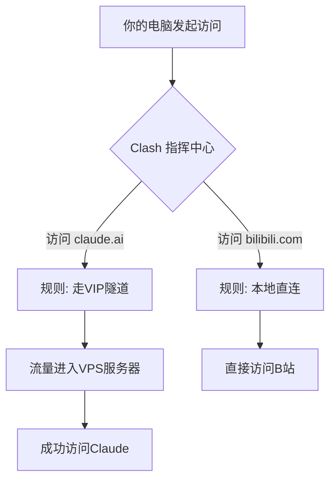

“又被封号了？”

如果你因为使用不稳定的公共代理（机场/VPN）而频繁遭遇 Claude 封号、网络中断的困扰，那么这份指南将彻底解决你的问题。我们将一步步搭建一套专属于你的、稳定且干净的网络环境。

---

## **【你是否需要这份指南？快速诊断】**

在开始之前，请先回答以下几个问题：

*   **[  ]** 我的 Claude 账号被封过，或者朋友的账号被封过。
*   **[  ]** Claude Code/Gemini CLI 非常好用，很想用，又怕被封号
*   **[  ]** 试过多个代理客户端，被规则配置搞晕了
*   **[  ]** 用公共机场/VPN，总是不稳定或突然失效

如果你勾选了**任何一项**，那么请继续阅读。这套方案就是为你量身定制的。

---

#### **💰 预期成本**

本方案需要购买一台云服务器（VPS）。
**每月成本约 ￥30-60 元**，大致相当于一个王者荣耀的普通皮肤，或两张抽卡游戏的月卡。这是一笔为稳定生产力工具支付的、高性价比的投资。

---
**本指南分为两部分：**
*   **第一部分【快速上手操作手册】**：如果你想立刻解决问题，请直接跟随这部分的三个步骤操作。
*   **第二部分【原理解析与进阶】**：如果你想了解“为什么这么做”，可以阅读这部分。

---

### **第一部分：快速上手操作手册 (三步走)**

**目标：** 通过以下三步，搭建一套稳定、私人的网络环境，从此告别封号烦恼。

#### **▶︎ 第一步：在你的电脑上安装“指挥官” (本地代理客户端)**

这个工具负责智能分流网络请求。

1.  **下载并安装 Clash 客户端。**
    *   **Windows 用户**：搜索 `Clash for Windows` 或 `Clash Verge`。
    *   **macOS 用户**：搜索 `ClashX Pro` 或 `Clash Verge`。
2.  **为什么选 Clash？** 说实话，我试过 Shadowsocks 客户端（规则太难配）、最后选了 Clash，因为规则配置直观，一看就懂。
3.  **目的**：先把它装好，我们稍后会来配置它。

#### **▶︎ 第二步：搭建你的专属“高速通道” (自建 VPS)**

这是整个流程的核心，目的是获得一个干净、固定的 IP 地址。

1.  **购买服务器 (VPS)**
    *   **我的选择过程**：说实话，VPS选择的试错成本不高。我是找了个用了2年没被封的朋友直接抄作业。
    *   **服务商**：Lisahost（你也可以选其他家，关键看下面的指标）
    *   **产品对比**：
        *   🏃 **低延迟线路**：`美国顶级精品网9929线路VPS`（200-400ms延迟，Claude Code够用）
        *   📦 **大带宽线路**：`美国4837线路超大带宽VPS`（适合下载需求多的）  
        *   💰 **我的选择**：年付特价VPS（没啥特别理由，就是便宜，一年399）
    
    ⚠️ **踩坑提醒**：这些IP无法使用 Google Gemini（很诡异但确实如此）

2.  **在服务器上部署代理服务 (使用 Docker)**
    *   **技术选型思考**：
        *   为什么选 Shadowsocks？因为够稳定，资料多
        *   为什么选 Rust 版本？性能更好，内存占用更小，官方维护活跃  
        *   为什么用 Docker？方便迁移，不污染系统
    *   **一句话总结**：选最简单稳定的方案，别整花里胡哨的
    *   登录你的 VPS，安装 Docker。
    *   创建一个名为 `docker-compose.yml` 的文件，将以下内容完整复制进去：

    ```yaml
    version: '3.8'
    services:
      shadowsocks:
        image: shadowsocks/shadowsocks-rust:latest
        container_name: shadowsocks-rust
        ports:
          - "8388:8388/tcp"  # 将服务器的 8388 端口映射到容器的 8388 端口
          - "8388:8388/udp"
        environment:
          - METHOD=aes-256-gcm # 加密方法
          - PASSWORD=YOUR_STRONG_PASSWORD # ‼️ 在这里设置一个你自己的强密码
        restart: unless-stopped
    ```
    *   在文件所在目录，运行命令启动服务：`docker-compose up -d`

3.  **部署后关键验证 (非常重要！)**
    *   **① 添加节点与测速**：将你的服务器 IP、端口 (8388)、密码 (YOUR_STRONG_PASSWORD) 和加密方法 (aes-256-gcm) 添加到本地 Clash 客户端中，并使用 **“延迟测试”** 功能，确保网络是通的。
    *   **② 检查 IP 风险**：将 Clash 切换到 **“全局模式 (Global)”**。打开浏览器访问 `ping0.cc`。
    
        > **⚠️ 警告：检查IP风险分**
        > **IP风险分数必须低于 30，最好在 10 以内。**
        > 如果分数过高，**立即联系客服更换 IP**，然后重复此验证步骤。不要抱有侥幸心理，这是账号安全的关键！

    *   **③ 最终测试**：在浏览器的 **“无痕模式”** 下访问 `claude.ai`，确保可以正常打开。

#### **▶︎ 第三步：让你的开发工具“走对路” (配置代理)**

1.  **为命令行工具 (CLI) 配置代理**
    *   在终端执行以下命令 (Clash 默认 HTTP 端口为 `7890`)：
        ```bash
        export HTTPS_PROXY=http://127.0.0.1:7890
        export HTTP_PROXY=http://127.0.0.1:7890
        ```
    *   **提示**：将这两行加到终端配置文件 (`.zshrc` 或 `.bash_profile`) 中可永久生效。

2.  **为代码编辑器 (Cursor / VS Code) 配置代理**
    *   按 `Ctrl/⌘ + Shift + P`，搜索并打开 `Preferences: Open User Settings (JSON)`。
    *   在 `settings.json` 文件中，添加以下配置：
        ```json
        {
          // ... 你的其他设置
          "http.proxy": "http://127.0.0.1:7890",
          "http.proxySupport": "override",
          "cursor.general.disableHttp2": true // 针对 Cursor 的额外优化
        }
        ```

3.  **配置 Clash 规则，确保 Claude 走代理**
    *   在 Clash 配置中添加以下规则（假设你的节点名称是"MyVPS"）：
    ```yaml
    rules:
      # Anthropic (Claude) 相关域名
      - DOMAIN-SUFFIX,anthropic.com,MyVPS
      - DOMAIN-SUFFIX,claude.ai,MyVPS
      - DOMAIN-SUFFIX,claudeusercontent.com,MyVPS
      - DOMAIN-SUFFIX,sentry.io,MyVPS
      # 国内网站直连
      - DOMAIN-SUFFIX,cn,DIRECT
      - GEOIP,CN,DIRECT
      # 其他默认走代理
      - MATCH,MyVPS
    ```
    *   **提示**：将 "MyVPS" 替换为你在 Clash 中添加的节点名称

**至此，所有操作已完成。享受你稳定、流畅的 Claude 吧！**

---

### **第二部分：原理解析与进阶 (The "Why")**

想知道“为什么这么做”？这部分将为你解惑。

#### **▶︎ 话题一：自建 VPS 与“机场”的本质区别**

*   **公共机场/VPN**：像一把几百人共用的公寓大门钥匙。这个 IP 地址行为混杂，极易被 Claude 的风控系统标记为“高风险”。
*   **自建 VPS (原生住宅IP)**：是你的私人别墅钥匙。这个 IP 地址只为你服务，行为干净，在风控系统看来就是个普通的海外家庭用户，因此风险极低。

#### **▶︎ 话题二：“交通枢纽”比喻——理解各组件如何协同工作**

我们可以用一个“城市交通系统”来理解这套方案的运作原理：

*   **你的电脑**：是一座城市。
*   **本地 Clash 客户端**：是城市的**“智能交通指挥中心”**。
*   **自建的 VPS**：是你挖的一条通往海外的**“VIP 专属隧道”**。
*   **Clash 里的规则 (Rule)**：是指挥中心手里的**“交通规则手册”**。

**工作流程如下：**



这个机制实现了**智能分流**，让你在无感的情况下，高效、安全地访问全球网络。

**简单来说**：当你访问 claude.ai 时，Clash 会查看规则，发现需要走 VPS 通道；当你访问国内网站时，Clash 会让你直连，不绕路，保证速度。

#### **▶︎ 话题三：什么是“原生 IP”和“住宅 IP”？**

*   **原生 IP (Native IP)**：指 IP 的注册地和实际使用地一致。它不是通过技术手段“伪装”的。
*   **住宅 IP (Residential IP)**：指这个 IP 是分配给家庭宽带用户的，而不是数据中心的。
*   **组合起来**：一个 **“美国原生住宅 IP”**，在风控系统看来，就是一个“住在美国的真实家庭用户”，信任度最高。

#### **▶︎ 话题四：为什么推荐用 Docker 部署？**

Docker 像一个“软件集装箱”，它将程序和所有依赖打包在一起。
*   **简单**：一条命令就能启动，无需关心复杂的环境配置。
*   **干净**：与服务器系统隔离，不产生任何“垃圾”。
*   **方便**：未来想换服务器，把这个“集装箱”搬过去就能用。

---

### **【常见问题速查 (FAQ)】**

**Q: Clash 里显示节点超时，连接不上？**
**A:** 99% 的可能是服务器防火墙没有放行端口。登录你的 VPS 服务商后台，找到防火墙/安全组设置，确保你 `docker-compose.yml` 中设置的端口（本例中为 `8388`）是开放的。

**Q: IP 风险分超过 30 怎么办？**
**A:** **立即联系 VPS 客服更换 IP！** 不要用这个 IP 去登录你的任何重要账号。高风险 IP 是导致封号的直接原因。

**Q: Cursor 或 VS Code 还是连不上网？**
**A:** 确认 `settings.json` 文件已正确添加配置并**保存**。然后，**完全退出并重启**编辑器，让新配置生效。

**Q: 代理客户端那么多，到底选哪个？**
**A:** 个人建议选 Clash，理由上面说了。如果你已经有其他工具，记住这些端口号：
- Clash: 7890
- V2RayN: 10809  
- Surge: 6152
- Shadowrocket: 1087

**Q: 延迟会不会很高？**
**A:** 说实话，确实有200-400ms延迟，但对于 Claude Code 这类应用完全够用。如果你需要打游戏级别的低延迟，那这个方案不适合你。