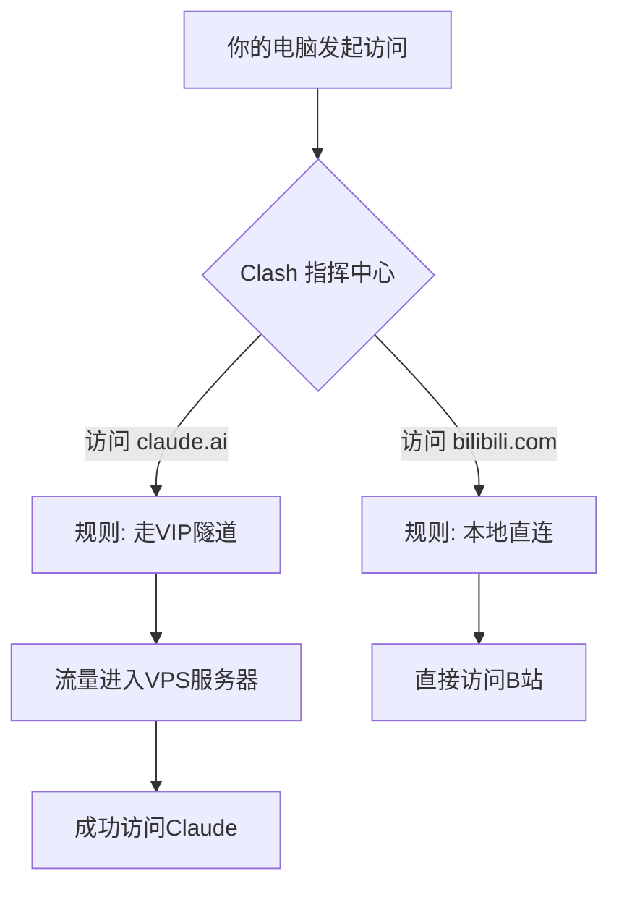

“又被封号了？”

如果你因为公共代理（机场/VPN）不稳定而遇到网络中断，或希望自己管理开发工具使用的网络出口，这份指南会带你搭建个人代理，并完成客户端和开发工具配置。自建 VPS 不能保证 Claude 账号不被封禁。

> **2026-10-08 更新：旧式简单自建方案有快速被封的风险，本文改用 sing-box-yg。** 我与朋友都遇到过自建后 IP 被墙，也有次日就无法使用的情况。需要警惕的不只是 Shadowsocks，而是照搬旧教程、长期不更新、缺少针对流量识别与主动探测防护的简单直连部署。**不要以为第一天搭好、测试能通，就能长期使用；要把几个小时到几天内失联、IP 被封的可能性纳入预算。** 这是风险提醒，不是所有协议都有相同封禁时限的统计结论。
>
> **被封还可能造成真金白银的损失。** 换 IP 未必免费，我建议先按每次 **10–20 美元甚至更多**预留预算；这是预算估计，不是统一报价或最低收费，购买前务必向商家核实被墙后的换 IP 费用和退款条件。
>
> **现在怎么做：用 [sing-box-yg](https://github.com/yonggekkk/sing-box-yg) 作为自建入口，但先让 AI 联网核对当下方案，再选择仍在维护、适配当前网络环境的较新稳定版本，搭好后定期检查更新。** 本文目前以 **VLESS + REALITY + Vision** 为起点，检测与对抗会持续变化，请不要把今天的推荐当成永久答案。脚本和协议都不能保证 IP 永远不被墙；IP 被墙与 Claude 账号风控也要分开看待。

---

## **【你是否需要这份指南？快速诊断】**

在开始之前，请先回答以下几个问题：

*   **[  ]** 我的 Claude 账号被封过，或者朋友的账号被封过。
*   **[  ]** Claude Code/Gemini CLI 非常好用，很想用，又怕被封号
*   **[  ]** 试过多个代理客户端，被规则配置搞晕了
*   **[  ]** 用公共机场/VPN，总是不稳定或突然失效

如果你勾选了**任何一项**，那么请继续阅读。这套方案就是为你量身定制的。

---

#### **💰 预期成本**

本方案需要购买一台云服务器（VPS）。
**每月成本约 ￥30-60 元**，大致相当于一个王者荣耀的普通皮肤，或两张抽卡游戏的月卡。此外还要计算 IP 被封后的更换费用、无法退款的服务器费用，以及迁移和排障时间。上面提到的每次 10–20 美元甚至更多是预留预算，实际以商家报价为准。

---
**本指南分为两部分：**
*   **第一部分【快速上手操作手册】**：如果你想立刻解决问题，请直接跟随这部分的三个步骤操作。
*   **第二部分【原理解析与进阶】**：如果你想了解“为什么这么做”，可以阅读这部分。

---

### **第一部分：快速上手操作手册 (三步走)**

**目标：** 通过以下三步，搭建个人代理出口，并验证浏览器、命令行和编辑器是否按预期使用代理。

#### **▶︎ 第一步：在你的电脑上安装“指挥官” (本地代理客户端)**

这个工具负责智能分流网络请求。

1.  **Windows / macOS 用户**：可使用基于 Mihomo 内核的 [Clash Verge Rev](https://github.com/clash-verge-rev/clash-verge-rev)，从项目 Releases 下载对应系统版本。
2.  **为什么选它？** 后文使用 Clash/Mihomo 格式配置，便于导入脚本生成的节点并设置分流规则。客户端需支持所选协议，旧版 Clash 客户端不能直接视为兼容。
3.  **目的**：先安装客户端，部署完成后再导入配置。

#### **▶︎ 第二步：搭建你的专属“高速通道” (自建 VPS)**

这是整个流程的核心，目的是管理自己的代理服务与出口 IP；IP 的历史信誉仍需另外检查。

1.  **购买服务器 (VPS)**（以下是我当时的选择和价格，供参考）
    *   **我的选择过程**：我最初是照着一个用了两年没被封的朋友购买的。但别人的历史体验不能保证你今天的可用性，换 IP 和重新部署也有成本，购买前先确认售后政策。
    *   **服务商**：Lisahost（你也可以选其他家，关键看下面的指标）
    *   **产品对比**：
        *   🏃 **低延迟线路**：`美国顶级精品网9929线路VPS`（200-400ms延迟，Claude Code够用）
        *   📦 **大带宽线路**：`美国4837线路超大带宽VPS`（适合下载需求多的）  
        *   💰 **我的选择**：年付特价VPS（没啥特别理由，就是便宜，一年399）
    
    ⚠️ **踩坑提醒**：我当时拿到的 IP 无法使用 Google Gemini，不能据此推断同一服务商的所有 IP 都如此。

2.  **在 VPS 上使用 sing-box-yg 部署代理服务**

    本文改用第三方项目 [yonggekkk/sing-box-yg](https://github.com/yonggekkk/sing-box-yg)。它是围绕 sing-box 的部署脚本，并非 sing-box 官方安装器。根据[项目 README](https://github.com/yonggekkk/sing-box-yg/blob/main/README.md)，支持 Vless-reality-vision、Vmess-ws(tls)/Argo、Hysteria-2、Tuic-v5 和 AnyTLS 五种协议，也提供客户端配置与本地订阅生成能力。

    **先核对最新方案，再运行安装命令。** 搭建前把项目链接、VPS 系统、客户端版本和你的网络环境告诉 AI，让它联网查近期维护记录、版本说明和已知问题，给出带日期与来源的建议。可以直接这样问：

    > 我准备使用 https://github.com/yonggekkk/sing-box-yg 自建代理。请联网检查截至今天的 README、近期提交、sing-box 与客户端的版本说明、已知兼容性及封锁反馈。结合我的 VPS 系统、客户端和网络环境，对比现在适合的协议组合与稳定版本，说明流量识别和主动探测方面的设计、局限，以及安装后的验证、升级和回退步骤。请区分官方说明、用户个案与尚未证实的结论，并附日期和来源；信息不足时先问我。

    **选型看的是减少可识别特征、对主动探测的防护和持续维护，不是“流量特征越多越好”。** 多种协议可供选择也不等于流量自动变得难以识别。优先采用项目支持、客户端兼容的较新稳定方案；AI 的建议要对照它引用的原始文档，不要只凭一个“最新推荐”就安装。

    *   **本文先用 VLESS + REALITY + Vision**：安装后选择该节点导入客户端。“五协议共存”不代表必须使用全部协议，也不代表每一种配置的网络表现相同。
    *   **安装位置**：通过 SSH 登录你的 Linux VPS，在服务器终端执行下方命令，不是在自己的 Mac / Windows 终端直接安装。项目推荐使用最新 Ubuntu。
    *   **安装前**：这是下载并执行远程脚本的命令，会修改服务器配置；先阅读[脚本源码](https://github.com/yonggekkk/sing-box-yg/blob/main/sb.sh)，确认信任来源。已有服务的 VPS 先备份配置并检查端口占用。

    ```bash
    bash <(wget -qO- https://raw.githubusercontent.com/yonggekkk/sing-box-yg/main/sb.sh)
    ```

    *   按当前交互菜单完成安装，保存脚本输出的端口和客户端配置。后续可输入 `sb` 打开管理菜单，具体选项以当前项目说明为准。
    *   导出 **Clash/Mihomo 格式配置**并导入 Clash Verge Rev，选中 **VLESS + REALITY + Vision** 节点。使用其他客户端时，导出该客户端支持的格式；不要把 sing-box JSON 直接当作 Clash YAML 使用。
    *   若手动配置 REALITY，需对应服务端的 UUID、端口、服务器名称（SNI）、公钥、short ID 和 flow 等参数，优先使用脚本生成的完整配置，避免漏填。参数含义见 [sing-box TLS / REALITY 文档](https://sing-box.sagernet.org/configuration/shared/tls/#reality-fields)。
    *   在云平台安全组和系统防火墙中放行实际使用的端口。迁移完成、确认新节点可用后，停止旧 Shadowsocks 服务，并关闭旧服务不再使用的端口。

    项目还提供证书切换、Argo 隧道和订阅管理等功能。首次部署先验证一个节点，再按需求添加功能；配置和订阅链接包含访问凭据，请勿公开分享。

3.  **部署后关键验证**
    *   **① 验证连接**：在客户端测试新节点，再实际打开网页。延迟测试成功只说明该次探测成功，不等于长期稳定。
    *   **② 核对出口**：临时切到全局模式，检查出口 IP 是否符合预期。第三方 IP 风险评分只能作参考，不能用某个分数阈值保证账号安全。
    *   **③ 验证工具**：测试你实际使用的浏览器、CLI 和编辑器，确认请求经过预期节点；完成后切回规则模式。
    *   **④ 区分故障**：若突然连接不上，先排查服务状态、端口、防火墙和客户端配置，再从不同网络对照测试。若确认原 IP 已被封锁，重新安装脚本并不会自动恢复这个 IP 的直连可达性。

4.  **定期维护，避免停留在过时方案**
    *   建议每月检查一次脚本、sing-box 内核和客户端的更新；遇到安全公告、兼容性提醒或集中失联反馈时及时复核，不必等到固定日期。这里的“每月”是维护建议，不是安全保证。
    *   升级前阅读项目更新说明及 [sing-box 迁移文档](https://sing-box.sagernet.org/migration/)，备份配置、记录现有版本，并准备回退方式。脚本、内核和客户端分别有版本，不能只更新其中一个就认为全套已经更新。
    *   按项目当前支持的升级方式操作，优先选择相互兼容的稳定版本；升级后重新测试节点、DNS、分流和开发工具请求。检测与对抗会持续升级，必要时重新评估协议组合，而不只是重复安装同一个旧配置。

#### **▶︎ 第三步：让你的开发工具“走对路” (配置代理)**

1.  **为命令行工具 (CLI) 配置代理**
    *   在终端执行以下命令 （以下假设客户端 HTTP / mixed 端口为 `7890`，请以客户端实际设置为准）：
        ```bash
        export HTTPS_PROXY=http://127.0.0.1:7890
        export HTTP_PROXY=http://127.0.0.1:7890
        ```
    *   **提示**：将这两行加到终端配置文件 (`.zshrc` 或 `.bash_profile`) 中可永久生效。

2.  **为代码编辑器 (Cursor / VS Code) 配置代理**
    *   按 `Ctrl/⌘ + Shift + P`，搜索并打开 `Preferences: Open User Settings (JSON)`。
    *   在 `settings.json` 文件中，添加以下配置：
        ```json
        {
          // ... 你的其他设置
          "http.proxy": "http://127.0.0.1:7890",
          "http.proxySupport": "override",
          "cursor.general.disableHttp2": true // 针对 Cursor 的额外优化
        }
        ```

3.  **配置 Clash 规则，确保 Claude 走代理**
    *   在 Clash 配置中添加以下规则（假设你的节点名称是"MyVPS"）：
    ```yaml
    rules:
      # Anthropic (Claude) 相关域名
      - DOMAIN-SUFFIX,anthropic.com,MyVPS
      - DOMAIN-SUFFIX,claude.ai,MyVPS
      - DOMAIN-SUFFIX,claudeusercontent.com,MyVPS
      - DOMAIN-SUFFIX,sentry.io,MyVPS
      # 国内网站直连
      - DOMAIN-SUFFIX,cn,DIRECT
      - GEOIP,CN,DIRECT
      # 其他默认走代理
      - MATCH,MyVPS
    ```
    *   **提示**：将 "MyVPS" 替换为已导入的 REALITY 节点或对应策略组名称。已有 `rules` 时合并规则，将具体域名规则放在最终 `MATCH` 之前，不要新增第二个 `rules` 字段。订阅更新可能覆盖手动修改，可使用客户端的规则覆写功能。

**完成后，请以实际请求验证代理是否生效，并持续观察连接表现。**

---

### **第二部分：原理解析与进阶 (The "Why")**

想知道“为什么这么做”？这部分将为你解惑。

#### **▶︎ 话题一：自建 VPS 与“机场”的本质区别**

*   **公共机场/VPN**：出口可能由多人共享，你通常无法控制其他用户的行为。
*   **自建 VPS**：可以自己管理代理服务和出口，但不自动等于住宅 IP，也不保证 IP 历史信誉良好。网络连通性和目标平台的账号风控需要分开看待。

#### **▶︎ 话题二：“交通枢纽”比喻——理解各组件如何协同工作**

我们可以用一个“城市交通系统”来理解这套方案的运作原理：

*   **你的电脑**：是一座城市。
*   **本地 Clash 客户端**：是城市的**“智能交通指挥中心”**。
*   **自建的 VPS**：是你挖的一条通往海外的**“VIP 专属隧道”**。
*   **Clash 里的规则 (Rule)**：是指挥中心手里的**“交通规则手册”**。

**工作流程如下：**


```mermaid
graph TD
    A[你的电脑发起访问] --> B{Clash 指挥中心};
    B -- 访问 claude.ai --> C[规则: 走VIP隧道];
    C --> D[流量进入VPS服务器];
    D --> E[成功访问Claude];
    B -- 访问 bilibili.com --> F[规则: 本地直连];
    F --> G[直接访问B站];
```

这个机制实现了**智能分流**，让你在无感的情况下，高效、安全地访问全球网络。

**简单来说**：当你访问 claude.ai 时，Clash 会查看规则，发现需要走 VPS 通道；当你访问国内网站时，Clash 会让你直连，不绕路，保证速度。

#### **▶︎ 话题三：什么是“原生 IP”和“住宅 IP”？**

*   **原生 IP (Native IP)**：指 IP 的注册地和实际使用地一致。它不是通过技术手段“伪装”的。
*   **住宅 IP (Residential IP)**：指这个 IP 是分配给家庭宽带用户的，而不是数据中心的。
*   **不要把商家标签当作保证**：即使标注“原生住宅 IP”，也不等于目标平台必然认可，更不能保证账号不被限制。

#### **▶︎ 话题四：为什么更换自建方案？**

**问题不限于 Shadowsocks，也不能仅用“简单协议都有固定指纹”概括。** 未加密的代理容易暴露协议内容；即使内容已经加密，握手、包长、字节分布和服务端对探测的响应仍可能成为识别线索。长期照搬固定模板、忽略协议实现与防护更新，会让旧教程的可用性判断失效。

[USENIX Security 2023 的测量研究](https://gfw.report/publications/usenixsecurity23/en/)记录了针对 Shadowsocks、VMess 等全加密流量的被动识别，也讨论了与主动探测的关系。这说明“加密了就无法识别”并不成立，封锁也不一定需要先扫描确认。该研究解释的是当时测量到的机制，不能直接证明今天每一次 IP 被封的原因或具体时限。

旧版使用 Docker 部署 Shadowsocks Rust。Docker 解决的是安装和运行环境问题，不会因为用了容器就改变代理协议在网络上的表现。此次更换的是部署脚本与实际使用的协议组合。

我的新选择是通过 sing-box-yg 部署 VLESS + REALITY + Vision。协议参数仍需要正确配置，后续维护也要关注脚本、服务端和客户端的版本兼容性。Clash 分流规则只决定哪些请求走哪个出口，修改这些规则本身不能解决代理连接被识别或 IP 被封锁的问题。

---

### **【常见问题速查 (FAQ)】**

**Q: Clash 里显示节点超时，连接不上？**
**A:** 先检查 VPS 上服务是否运行、安全组和系统防火墙是否放行实际端口，再核对客户端配置及 REALITY 参数。若多种网络测试结果不同，继续排查线路或 IP 封锁；不能仅凭“超时”判断原因。

**Q: 换成 sing-box-yg 就不会被墙或封号了吗？**
**A:** 不能保证。它是部署工具，实际效果取决于所选协议、参数、IP 与网络环境。IP 被墙影响连接可达性，账号封禁则是目标平台的判断；两者不能混为一谈。第三方 IP 评分也不是平台公布的账号安全阈值。

**Q: Cursor 或 VS Code 还是连不上网？**
**A:** 确认 `settings.json` 文件已正确添加配置并**保存**。然后，**完全退出并重启**编辑器，让新配置生效。

**Q: 代理客户端那么多，到底选哪个？**
**A:** 本文使用 Clash Verge Rev，并导入 Clash/Mihomo 格式配置。其他客户端需确认协议兼容性。以下端口只是常见配置示例，以客户端实际设置为准：
- Clash: 7890
- V2RayN: 10809  
- Surge: 6152
- Shadowrocket: 1087

**Q: 延迟会不会很高？**
**A:** 说实话，确实有200-400ms延迟，但对于 Claude Code 这类应用完全够用。如果你需要打游戏级别的低延迟，那这个方案不适合你。