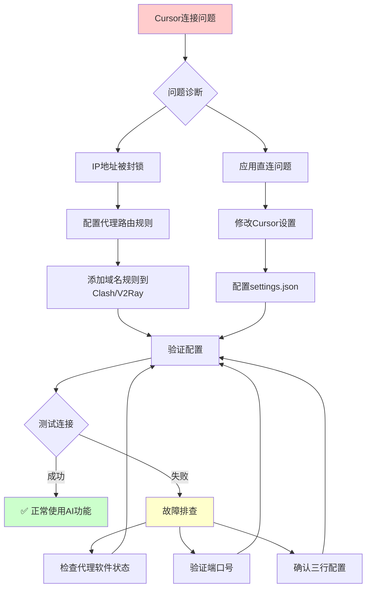
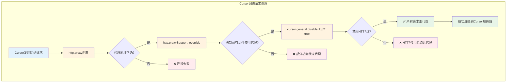
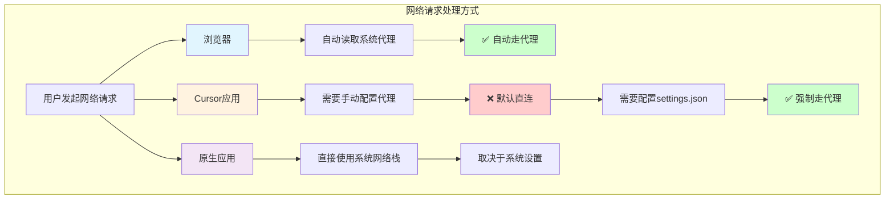
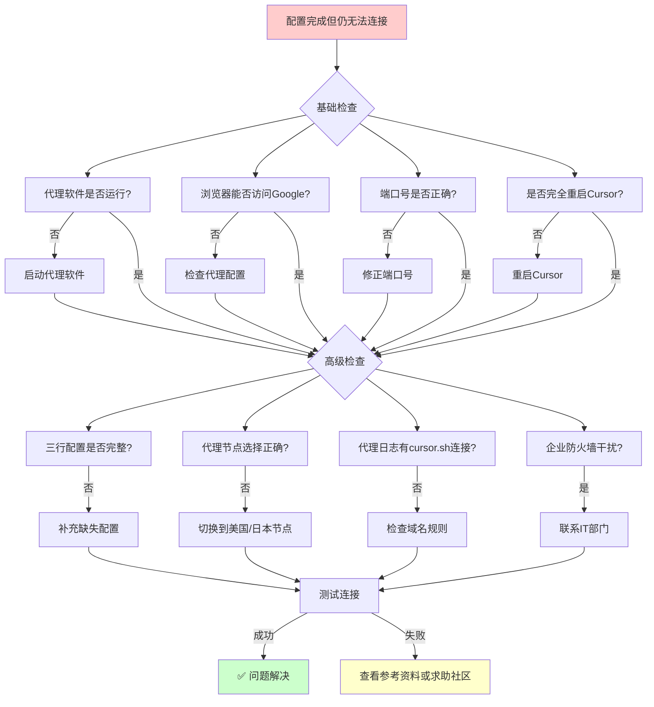

# 解决Cursor AI编程助手"地区不可用"错误：完整的VPN代理配置指南

> **文章摘要**：Cursor AI编程助手显示"Model not available"或"地区不可用"？本文提供详细的代理配置解决方案，包括Clash、V2Ray等工具的具体设置步骤，让你重新使用AI编程功能。

## 解决方案总览



## 1. 问题背景

### 常见的Cursor网络错误现象
如果你在使用Cursor AI编程助手时看到以下错误提示：
- `Model not available`
- `This model provider doesn't serve your region`
- `Connection failed. Please check your internet connection`
- `Request failed with status code 403`

### Cursor地区限制的根本原因
过去 Cursor 并未严格限制中国大陆和香港地区的 IP 访问，但现在开始通过 IP 地址进行地区限制。问题主要有两个：

1. **IP 地址封锁**：Cursor 服务器端检测用户真实 IP，拒绝受限地区的请求
2. **应用直连问题**：Cursor 应用（基于Electron框架）不会自动走系统代理，需要手动配置

> **什么是Electron？** Electron是一个跨平台桌面应用开发框架，Cursor基于此框架开发，具有独立的网络栈。

## 2. 完整解决方案

### 第一步：配置代理路由规则（重要）

#### 操作目的
在你的代理工具中添加域名规则，确保所有 Cursor 相关的网络请求都通过代理服务器转发到海外节点。

#### Clash代理配置（推荐）

**配置位置**：在你的Clash配置文件的 `rules` 部分添加以下规则：

```yaml
# =======================
# Cursor AI 服务路由配置
# =======================
# 核心 API 服务（AI对话）
- DOMAIN,api2.cursor.sh,你的代理策略组
- DOMAIN-SUFFIX,api2.cursor.sh,你的代理策略组

# 代码补全服务
- DOMAIN,api3.cursor.sh,你的代理策略组
- DOMAIN-SUFFIX,api3.cursor.sh,你的代理策略组
- DOMAIN,api4.cursor.sh,你的代理策略组
- DOMAIN-SUFFIX,api4.cursor.sh,你的代理策略组

# 代码库索引服务
- DOMAIN,repo42.cursor.sh,你的代理策略组
- DOMAIN-SUFFIX,repo42.cursor.sh,你的代理策略组

# 全球加速节点
- DOMAIN,us-asia.gcpp.cursor.sh,你的代理策略组
- DOMAIN-SUFFIX,us-asia.gcpp.cursor.sh,你的代理策略组
- DOMAIN,us-eu.gcpp.cursor.sh,你的代理策略组
- DOMAIN-SUFFIX,us-eu.gcpp.cursor.sh,你的代理策略组
- DOMAIN,us-only.gcpp.cursor.sh,你的代理策略组
- DOMAIN-SUFFIX,us-only.gcpp.cursor.sh,你的代理策略组

# 扩展市场和CDN
- DOMAIN,marketplace.cursorapi.com,你的代理策略组
- DOMAIN-SUFFIX,marketplace.cursorapi.com,你的代理策略组
- DOMAIN-SUFFIX,cursor-cdn.com,你的代理策略组

# 客户端更新服务
- DOMAIN,download.todesktop.com,你的代理策略组
- DOMAIN-SUFFIX,download.todesktop.com,你的代理策略组

# 通配符规则（兜底保护）
- DOMAIN-SUFFIX,cursor.sh,你的代理策略组
```

> **重要说明**：
> - 请将`你的代理策略组`替换为实际的策略组名称，如`PROXY`、`美国节点`、`自动选择`等
> - 配置基于2025年1月版本，如遇新域名请及时更新

### 第二步：配置Cursor应用代理设置

#### 操作目的
让Cursor应用知道通过哪个本地端口访问代理服务器。

#### 详细配置步骤

**步骤1：打开Cursor设置文件**
1. 在 Cursor 中按 `Ctrl/⌘ + Shift + P` 打开命令面板
2. 输入`settings json`并选择：`Preferences: Open User Settings (JSON)`

**步骤2：添加代理配置**
在JSON配置中添加以下三行关键配置：

```json
{
  // ... 你的其他设置
  "http.proxy": "http://127.0.0.1:7890",
  "http.proxySupport": "override",
  "cursor.general.disableHttp2": true
}
```

**步骤3：根据代理工具调整端口**
不同代理工具的默认HTTP代理端口：
- **Clash for Windows**: `7890`
- **V2RayN**: `10809`
- **Surge**: `6152`
- **Shadowrocket**: `1087`

> **如何查看端口**：在你的代理软件设置中查看"HTTP代理"或"本地代理"端口号

### 第三步：验证配置是否生效

#### 重启测试流程
1. **保存配置文件**
2. **完全退出Cursor**（不是最小化）
3. **重启代理软件**（确保新规则生效）
4. **重新启动Cursor**
5. **测试AI功能**

#### 成功验证标志
- ✅ 能够正常发起AI对话
- ✅ 代码补全功能正常工作
- ✅ 不再出现"Model not available"错误
- ✅ 代理软件日志显示cursor.sh相关连接

## 另一个思路：让AI助手指导你解决

### 为什么选择AI指导？

如果你对上述技术配置不太熟悉，或者希望获得更个性化的指导，可以使用AI助手来获得一对一的解决方案。

### 专用Prompt模板

将以下prompt复制到任何AI助手（如ChatGPT、Claude、Gemini等）中使用：

```markdown
# Cursor AI编程助手网络问题解决助手

## 角色
你是一位专业的网络配置技术顾问，专门帮助开发者解决Cursor AI编程助手的网络连接问题。你具有丰富的代理配置经验，能够根据用户的具体环境提供精确的解决方案。

## 任务
根据用户提供的信息，为其制定个性化的Cursor网络问题解决方案，并提供详细的步骤指导。

## 用户信息收集
请告诉我以下信息（如果不确定某些信息，我会帮你确认）：

**基础信息：**
- 操作系统：[ ] Windows [ ] macOS [ ] Linux
- 使用的代理工具：[ ] Clash [ ] V2Ray [ ] Surge [ ] Shadowrocket [ ] 其他：_____
- 错误信息：[ ] Model not available [ ] This model provider doesn't serve your region [ ] 其他：_____

**代理配置信息：**
- 代理软件是否正常运行：[ ] 是 [ ] 否 [ ] 不确定
- 浏览器是否能正常翻墙：[ ] 是 [ ] 否
- 代理HTTP端口（如果知道）：_____
- 之前是否尝试过配置Cursor代理：[ ] 是 [ ] 否

## 输出格式要求

请按以下格式输出解决方案：

### 🎯 问题诊断结果
[基于用户信息的问题分析]

### 📋 解决方案概览
- **第一步**：[简要描述]
- **第二步**：[简要描述]  
- **验证步骤**：[简要描述]

### 🔧 详细操作指南

#### 第一步：[具体操作名称]
**目的**：[说明这一步的作用]

**操作步骤**：
1. [具体操作1]
   - 详细说明
   - 注意事项
2. [具体操作2]
   - 详细说明
   - 可能的变化情况

**期望结果**：[这一步完成后应该看到什么]
**如果遇到问题**：[常见问题和解决方法]

---

#### 第二步：[具体操作名称]
[同上格式]

---

#### 验证步骤：确认配置生效
[验证方法和成功标志]

### 🚨 故障排查
如果按照以上步骤仍然无法解决，请检查：
[个性化的故障排查清单]

### 📞 需要更多帮助？
[根据用户情况提供的后续支持建议]

## 特殊要求
1. **个性化配置**：根据用户的具体代理工具和操作系统，提供精确的配置代码
2. **端口自动识别**：如果用户不知道代理端口，提供查看方法
3. **验证机制**：每个步骤都要有明确的成功标志
4. **错误处理**：预测可能的错误情况并提供解决方案
5. **代码可复制**：所有配置代码都要格式化，便于复制粘贴

## 技术背景
Cursor基于Electron框架，不会自动使用系统代理。需要两步解决：
1. 配置代理工具的域名路由规则
2. 配置Cursor应用的代理设置（三行关键配置）

关键域名包括：api2.cursor.sh, api3.cursor.sh, api4.cursor.sh, repo42.cursor.sh, cursor.sh, gcpp.cursor.sh, marketplace.cursorapi.com, cursor-cdn.com, download.todesktop.com
关键配置：http.proxy, http.proxySupport: override, cursor.general.disableHttp2: true

现在请提供你的环境信息，我将为你制定专属的解决方案。
```

## 3. 技术原理深度解析

### 为什么需要三行配置？



#### `"http.proxy": "http://127.0.0.1:7890"`
- **作用**：告诉Cursor代理服务器的地址和端口
- **原理**：Electron应用需要明确指定代理地址，不会自动读取系统代理设置

#### `"http.proxySupport": "override"`
- **作用**：强制所有网络组件使用代理
- **原理**：防止某些内部模块绕过代理设置，确保AI功能也走代理

#### `"cursor.general.disableHttp2": true"`
- **作用**：禁用HTTP/2协议，强制使用HTTP/1.1
- **原理**：HTTP/2在某些代理环境中会绕过代理设置，导致连接失败

### 为什么浏览器能翻墙，Cursor不能？

这是因为**软件网络架构的差异**：



- **浏览器**：自动读取系统代理设置
- **Electron应用**：需要应用内部配置代理参数
- **原生应用**：通常直接使用系统网络栈

## 4. 故障排查指南

### 故障排查流程图



### 配置后仍无法连接的检查清单

**基础检查**：
- [ ] 代理软件是否正常运行？
- [ ] 浏览器是否能正常访问Google？
- [ ] 代理端口号是否正确？
- [ ] 是否完全重启了Cursor？

**高级检查**：
- [ ] 三行配置是否都正确添加？
- [ ] 代理节点是否选择了支持地区？（避免香港节点）
- [ ] 代理软件日志是否显示cursor.sh连接？
- [ ] 是否存在企业防火墙干扰？

### 常见问题解决

**问题1：时好时坏，连接不稳定**
- **原因**：HTTP/2绕过代理
- **解决**：确保添加了`"cursor.general.disableHttp2": true`

**问题2：代理配置无效**
- **原因**：策略组名称错误
- **解决**：检查Clash配置中的实际策略组名称

## 5. 其他代理工具配置

### 代理工具配置对比

```mermaid
graph TB
    subgraph "代理工具配置方法"
        A[Cursor域名列表]
        
        A --> B[Clash]
        A --> C[V2Ray]
        A --> D[Surge]
        A --> E[Shadowrocket]
        
        B --> F[rules 部分<br/>DOMAIN-SUFFIX规则]
        C --> G[routing.rules<br/>domain字段]
        D --> H[[Rule] 部分<br/>DOMAIN-SUFFIX规则]
        E --> I[配置-规则<br/>DOMAIN-SUFFIX规则]
        
        F --> J[策略组名称]
        G --> K[outboundTag: proxy]
        H --> L[Proxy]
        I --> M[PROXY]
        
        J --> N[✅ 流量转发到海外节点]
        K --> N
        L --> N
        M --> N
    end
    
    style A fill:#e3f2fd
    style B fill:#fff3e0
    style C fill:#fff3e0
    style D fill:#fff3e0
    style E fill:#fff3e0
    style N fill:#e8f5e8
```

### V2Ray/V2RayN完整配置
```json
{
  "routing": {
    "rules": [
      {
        "type": "field",
        "domain": [
          "cursor.sh",
          "api2.cursor.sh",
          "api3.cursor.sh", 
          "api4.cursor.sh",
          "repo42.cursor.sh",
          "gcpp.cursor.sh",
          "marketplace.cursorapi.com",
          "cursor-cdn.com",
          "download.todesktop.com"
        ],
        "outboundTag": "proxy"
      }
    ]
  }
}
```

### Surge完整配置
```ini
[Rule]
# Cursor AI 服务
DOMAIN-SUFFIX,cursor.sh,Proxy
DOMAIN-SUFFIX,api2.cursor.sh,Proxy
DOMAIN-SUFFIX,api3.cursor.sh,Proxy
DOMAIN-SUFFIX,api4.cursor.sh,Proxy
DOMAIN-SUFFIX,repo42.cursor.sh,Proxy
DOMAIN-SUFFIX,gcpp.cursor.sh,Proxy
DOMAIN-SUFFIX,marketplace.cursorapi.com,Proxy
DOMAIN-SUFFIX,cursor-cdn.com,Proxy
DOMAIN-SUFFIX,download.todesktop.com,Proxy
```

## 6. 常见问题FAQ

**Q: 为什么浏览器能翻墙，Cursor不能？**
A: 不同软件有不同的网络行为。Cursor基于Electron框架，具有独立的网络栈，不会自动使用系统代理设置。

**Q: 配置后AI功能时好时坏怎么办？**
A: 这通常是HTTP/2协议绕过代理导致的。确保添加了`"cursor.general.disableHttp2": true`配置。

**Q: 如何快速定位settings.json文件？**
A: 不同系统的文件位置：
- **Windows**: `%APPDATA%\Cursor\User\settings.json`
- **macOS**: `~/Library/Application Support/Cursor/User/settings.json`
- **Linux**: `~/.config/Cursor/User/settings.json`

**Q: 企业网络环境如何配置？**
A: 需要考虑企业防火墙政策，建议咨询IT部门获取代理服务器地址，或申请Cursor相关域名的白名单。

## 7. 总结

### 核心解决思路
解决Cursor网络问题的本质是**双重配置**：

🔧 **外部路由配置**：通过代理软件的域名规则，让Cursor流量走海外节点  
🔧 **内部应用配置**：通过三行JSON配置，强制Cursor应用使用代理  

### 关键成功要素
- **完整的域名列表**：确保所有Cursor服务都走代理
- **正确的三行配置**：缺一不可，特别是HTTP/2禁用
- **适当的代理节点**：选择支持地区的稳定节点

记住：**外部路由 + 内部配置，两步缺一不可**

## 8. 长期维护建议

### 应对Cursor更新变化
- **关注官方更新**：定期查看Cursor官方更新日志
- **社区信息跟进**：加入相关技术社群获取最新配置
- **日志监控**：定期检查代理日志，发现新的连接失败域名

### 代理工具迁移指南
更换代理工具时：
1. 将域名规则列表迁移到新工具
2. 更新Cursor中的代理端口号
3. 重新测试所有功能

### 配置备份策略
- 保存有效的配置文件
- 记录工作的代理节点信息
- 定期验证配置是否仍然有效

## 9. 技术思考

解决这个问题的过程揭示了现代软件开发的一个现象：我们习惯了"浏览器能翻墙，所有软件都能翻墙"的简单假设，但现实是**不同的软件有着截然不同的网络行为**。

这提醒我们：在软件开发和使用中，理解底层工作原理比记住表面操作步骤更重要。随着AI工具的普及，培养"在高级抽象失效时，快速深入到底层"的能力变得愈发重要。

---

## 参考资料

1. [This model provider doesn't serve your region - Cursor Community Forum](https://forum.cursor.com/t/this-model-provider-doesnt-serve-your-region/118453) - 官方论坛地区限制讨论
2. [Cursor http/2 requests don't go through proxy setting - Bug Reports](https://forum.cursor.com/t/cursor-http-2-requests-dont-go-through-proxy-setting-in-the-vscode/36594) - HTTP/2绕过代理问题的官方反馈
3. [How to set up a proxy for cursor - How To Guide](https://forum.cursor.com/t/how-to-set-up-a-proxy-for-cursor/83585) - 官方代理配置指南
4. [Cursor – Regions - Official Documentation](https://docs.cursor.com/account/regions) - 官方地区支持文档
5. [Unable to chat when disable http/2 - Community Forum](https://forum.cursor.com/t/unable-to-chat-when-disable-http-2/53805) - 禁用HTTP/2问题讨论

---

*按照以上配置完成后，你就能重新享受Cursor AI编程助手的强大功能了！如有问题，欢迎查阅参考资料或寻求社区帮助。*