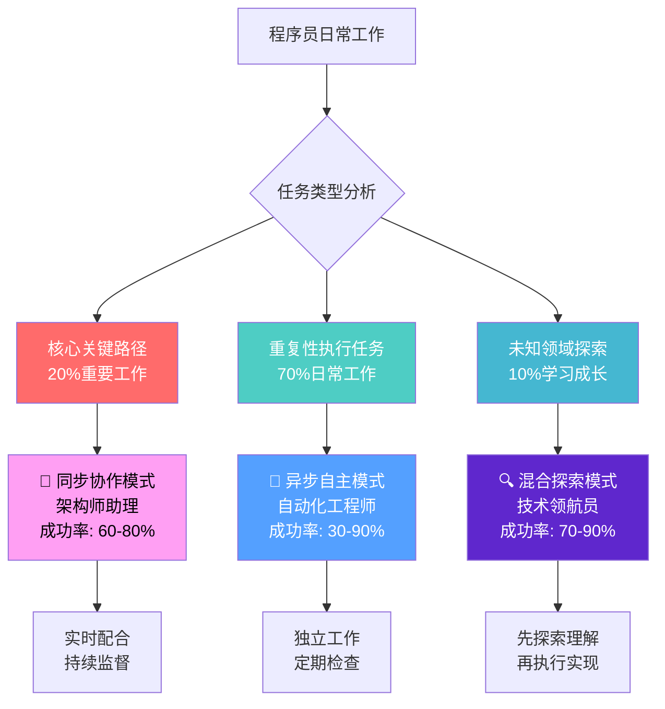
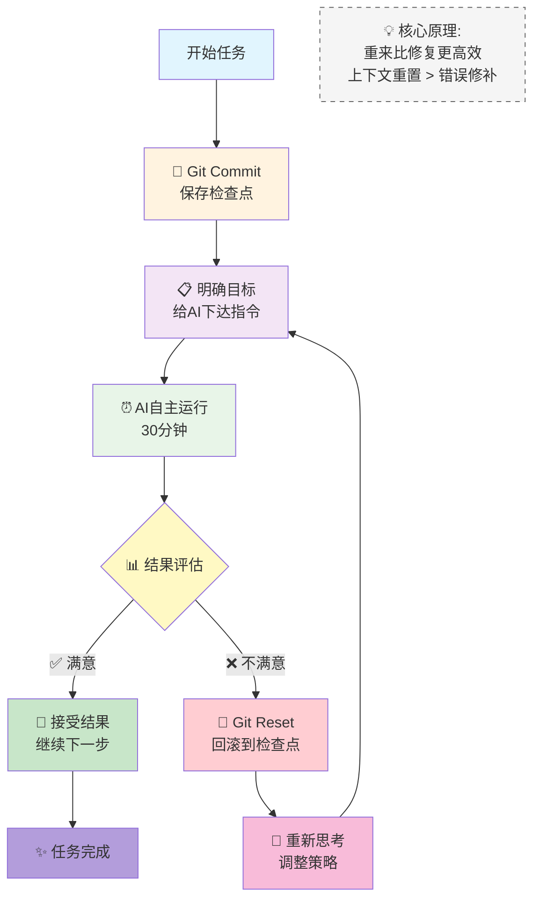
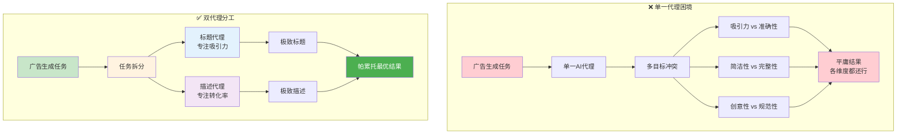
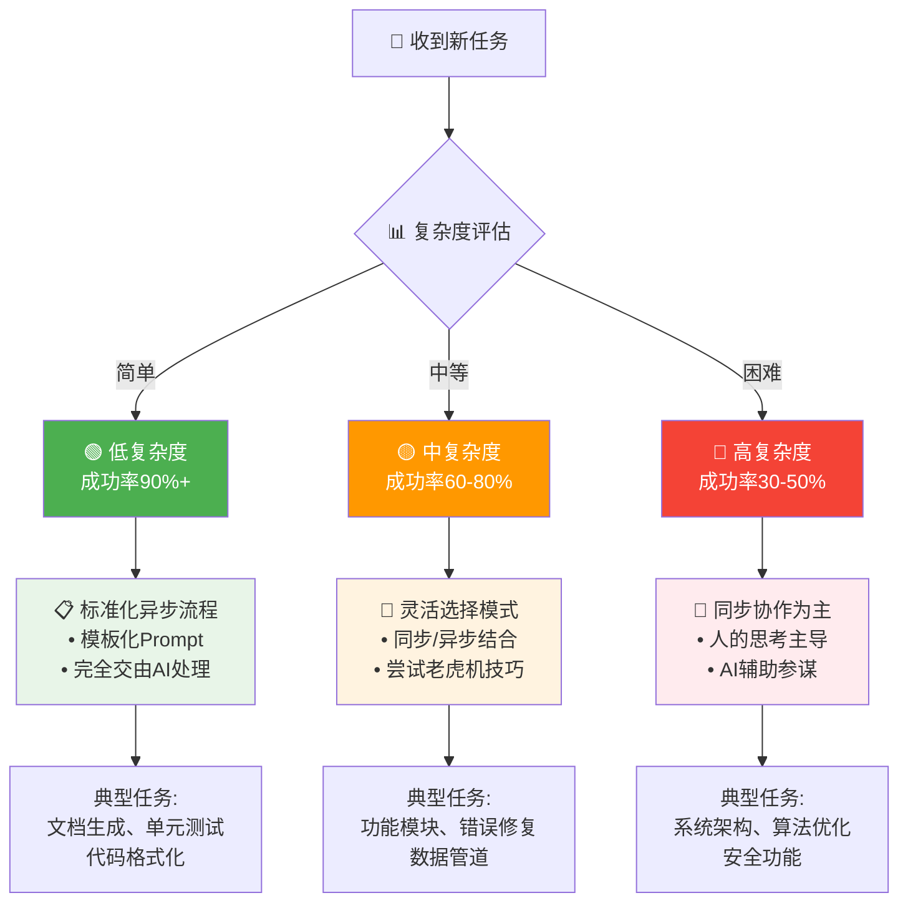

# **从"效率困境"到"场景化解决方案"：我如何吸收Claude官方实践，重塑我的编程工作流**

## **引言：一个程序员的典型一天**

如果我告诉你，一个复杂的前端功能，设计师自己就能上手完成大部分开发，将周期从数周缩短到几小时，你会相信吗？如果我再告诉你，一个非技术背景的营销人员，能独立开发出Figma插件，将广告创意产出提升10倍，你又会作何感想？

这不是虚构的未来，而是正在Anthropic内部发生的真实案例。他们的数据科学团队在重构任务上实现了50-75%的时间节省；安全工程师将基础设施的调试时间缩短了67%；而设计师和法务人员甚至突破了技能边界，独立完成了过去无法想象的应用开发。

这一切的背后，是一种全新的工作方式。本文将结合Anthropic团队的内部实践与我个人的深度思考，为你提供一套全新的AI协作地图，展示如何从"单一工具使用者"进化为"场景化策略大师"，真正将AI从一个"编码助手"变为我们的"开发搭档"。

---

# **第一部分：一套框架，三种场景：程序员日常工作的AI协作地图**

经过对Anthropic内部9个团队、数十个应用场景的分析，我发现成功的AI协作并非依赖于某个单一的"超级技巧"，而是源于一种深刻的洞察：**将工作任务进行场景化分类，并匹配不同的协作模式。**

我将程序员的日常工作归纳为三大核心场景「脑力工作者基本适用」，并对应三种不同的AI协作策略：

| 模式类型 | 特征描述 | 适用场景 | 典型任务 | 成功率 |
| :--- | :--- | :--- | :--- | :--- |
| **同步协作模式** | 人机实时配合，持续监督 | 核心关键路径 (20%重要工作) | 架构设计、核心算法 | 60-80% |
| **异步自主模式** | AI独立工作，人工定期检查 | 重复性执行任务 (70%日常工作) | SQL分析、测试编写 | 30-90% |
| **混合探索模式** | 先探索理解，再执行实现 | 未知领域探索 (10%学习成长) | 新技术学习、代码库理解 | 70-90% |

## **场景一：核心关键路径（同步协作模式）**

这类任务风险高、需要深度思考、不容出错，例如设计一个核心推荐系统的架构。在这里，AI的角色是**"架构师助理"**。

*   **工作方式**：你负责提出核心思路（"我计划设计A、B、C三路召回"），AI则从更广阔的视角提供补充和挑战（"是否考虑过长尾内容的覆盖和新用户的冷启动问题？"）。你始终掌握主导权，利用AI的"思维宽度"来弥补自己可能存在的盲点。
*   **为什么有效**：核心决策需要人类的业务理解和经验判断，而AI的全面性分析能确保方案的健壮性。这是一种1+1>2的深度智力合作。

## **场景二：重复性执行任务（异步自主模式）**

这类任务逻辑清晰、实现繁琐、相对独立，例如编写复杂的SQL查询、生成单元测试或处理数据。在这里，AI的角色是**"自动化工程师"**。

*   **工作方式**：你下达一个明确的指令（"帮我写SQL分析用户曝光分布，检查是否有部分用户曝光过多"），然后就可以投入到其他更重要的工作中。AI会独立完成任务，你只需在最后回来检查和验收结果。
*   **为什么有效**：这类任务是典型的"体力活"，AI的执行速度远超人类。Anthropic的产品开发团队使用这种模式实现了Vim快捷键功能，其中约70%的代码由Claude自主完成。

## **场景三：未知领域探索（混合探索模式）**

当你需要学习一门新技术、理解一个庞大的陌生代码库或快速实现一篇论文的Demo时，AI的角色是**"技术领航员"**。

*   **工作方式**：这是一个由浅入深的探索过程。你先向AI提问以建立宏观理解（"这个代码库的核心架构是什么？"），然后深入细节（"这个模块是如何工作的？"），最后寻求实践指导（"我想实现类似功能，应该如何开始？"）。
*   **为什么有效**：AI将过去需要数天甚至数周才能完成的知识内化过程，压缩到了几小时。Anthropic的推理团队成员通过这种模式，将学习机器学习概念的时间缩短了80%。

---

# **第二部分：三个被低估的高效技巧：来自Anthropic内部实践**

掌握了场景化框架后，我们再来看三个由Anthropic团队在实践中发现的、足以颠覆传统工作流的"反直觉"技巧。这些技巧不仅高效，其背后的原理更值得我们深入思考。

## **技巧1："老虎机模式"——重来比修复更高效**

*   **发现来源**：数据科学团队在处理复杂的重构任务时发现，试图在AI犯错的基础上进行修补，往往会陷入困境。

*   **实践要点**：
    1.  **保存状态**：在让AI开始前，使用Git提交一个检查点。
    2.  **自主运行**：给AI一个明确的目标，让它自主工作一段时间（例如30分钟）。
    3.  **接受或重来**：检查结果。如果满意，接受；如果不满意，**果断放弃，回滚到检查点，然后重新开始**。关键在于克服"沉没成本"心理，不要试图去修复一个糟糕的开局。

*   **深度解析：为什么"重来"比"修复"更有效？**
    这背后是深刻的信息论原理。AI的上下文窗口是有限的，一次错误会像病毒一样"污染"整个对话环境：错误的解法会误导后续的生成方向，而我们为了修正错误进行的讨论本身，又会挤占宝贵的上下文空间。
    **"重新开始"本质上是一次"上下文重置"，它清空了污染，让AI能在一个最大信息熵的干净环境中再次尝试。**
    这就像我们的电脑卡顿时，重启往往比费力查找并结束单个进程更有效。在机器学习中，这也类似于模型训练陷入了糟糕的梯度，有时重新初始化权重比在错误的方向上继续优化要好得多。正如Claude的一位产品经理所分享的，当你在对话中发现AI出错了，别犹豫，新建一个会话往往是最高效的选择。

*   **实战检查清单：老虎机模式**
    - [ ] 任务开始前是否已 `git commit` 建立安全回滚点？
    - [ ] 设定的AI自主运行时间是否合理（建议30-45分钟）？
    - [ ] 失败后，我是否能克服沉没成本心理，抵制住"修补一下"的诱惑，果断重来？

## **技巧2："双代理分工"——专业化协作的威力**

*   **发现来源**：增长营销团队在自动生成Google Ads广告时，发现单一AI难以同时优化标题和描述。

*   **实践要点**：
    1.  **任务拆解**：将一个复合任务分解为多个独立的子任务（如"标题生成"和"描述生成"）。
    2.  **独立优化**：为每个子任务创建一个专门的AI代理（独立的Prompt或会话），让它专注于优化单一目标。
    3.  **结果整合**：最后，由你或另一个AI代理将各个部分的结果整合起来。

*   **深度解析：单一代理的"帕累托困境"**
    让一个AI同时处理"生成吸引人的标题"和"撰写详尽的描述"这两个任务，实际上是在要求它解决一个**多目标优化问题**。问题在于，这些目标往往是相互冲突的：
    *   标题的**吸引力**可能与描述的**准确性**冲突。
    *   内容的**简洁性**可能与信息的**完整性**冲突。
    *   表达的**创意性**可能与品牌的**规范性**冲突。
    在多目标优化中，这必然会导致"帕累托前沿"的出现——你无法在所有维度上同时达到最优。单一代理为了"顾全大局"，会在各个目标之间进行妥协，最终产出的结果可能是所有维度都"还可以"，但没有一个维度真正"卓越"。
    **"双代理分工"则巧妙地绕开了这个困境。** 它将多目标问题分解为多个单目标问题，让每个代理都能在自己负责的维度上做到极致，最终组合出远超单一代理的整体效果。

*   **实战检查清单：双代理分工**
    - [ ] 当前任务是否包含多个（可能冲突的）目标，适合拆分？
    - [ ] 我是否为每个子任务清晰定义了"单一、明确"的成功标准？
    - [ ] 我是否设计好了最后整合各个子代理产出的流程？

## **技巧3："视觉驱动开发"——信息密度的优势**

*   **发现来源**：产品设计、数据基建等多个团队发现，一张截图胜过千言万语。
*   **实践要点**：
    1.  **截图先行**：无论是调试Kubernetes仪表盘的报错，还是实现一个Figma设计稿，都直接将截图粘贴给AI。
    2.  **视觉验证**：让AI生成代码后，立即运行并查看视觉效果，然后再次截图，告诉AI需要调整的地方。
    3.  **快速迭代**：通过"截图 -> 代码 -> 预览 -> 再截图"的循环，实现像素级的精确还原。

*   **深度解析：视觉信息的"无损"传递**
    为什么视觉输入如此高效？我的直觉是，这源于**信息密度的巨大差异和信息传递的"无损"特性**。
    一张截图包含了布局、颜色、间距、状态、文字内容等海量信息，其信息密度远高于我们用自然语言的描述。当我们试图用文字描述一个UI时，实际上是在进行一次"有损压缩"，信息在这个过程中不可避免地会失真和遗漏。
    而对于AI，尤其是端到端训练的多模态模型，它理解图像的方式可能更接近其本质。或许，它的内部处理流程类似于CNN（卷积神经网络）的模式：**从像素 -> 边缘 -> 形状 -> 组件 -> 空间关系 -> 最终形成整体的语义理解**。通过直接输入图像，我们跳过了语言转换的中间环节，实现了从视觉语义到代码语义的直接映射，从而大大减少了沟通成本和理解偏差。

*   **实战检查清单：视觉驱动开发**
    - [ ] 这个任务是否适合用视觉来表达（UI开发、图表复现、流程图理解等）？
    - [ ] 我提供的截图是否清晰、完整，并在必要时进行了标注？
    - [ ] 我是否准备好进入"截图-生成-验证"的快速迭代循环，而不是期望一次搞定？

---

# **第三部分：从理论到实践：可执行的实施路径**

好的理论需要配套的落地指南。以下是成功团队总结出的一套完整的实践方案。

## **第一步：建立基础设施**

1.  **`Claude.md`文档工程**：这是最关键的一步。在你的项目根目录下创建一个`Claude.md`文件，它相当于给AI的"项目说明书"。成功的团队无一不强调它的重要性。
    *   **必备内容**：项目结构说明、编码规范、常见模式与反模式、工具使用偏好（如"直接运行pytest，不要切换目录"）、特定领域知识。
2.  **版本控制策略**：AI协作是实验性的，必须有可靠的安全网。
    *   **核心**：**频繁提交形成检查点**。这是"老虎机模式"和所有异步自主任务的基础。
    *   **实践**：建立清晰的分支管理规范和快速回滚机制。
3.  **团队文化准备**：拥抱实验和失败。
    *   **容错机制**：接受AI并非每次都成功（强化学习团队发现中等任务成功率约为1/3），关注多次尝试后的整体效率提升。
    *   **知识分享**：定期举办团队分享会，交流AI使用技巧和成功案例。

## **第二步：按场景优化工作流**

根据你的任务复杂度，选择合适的策略：

| 复杂度等级 | 成功率范围 | 任务类型 | 推荐策略 |
| :--- | :--- | :--- | :--- |
| 🟢 **低复杂度** | **90%+** | 文档生成、单元测试、代码格式化 | **标准化异步流程**：建立模板化的Prompt，完全交由AI处理。 |
| 🟡 **中复杂度** | **60-80%** | 功能模块、错误修复、数据管道 | **灵活选择模式**：结合同步/异步模式，并大胆尝试"老虎机"等创新技巧。 |
| 🔴 **高复杂度** | **30-50%** | 系统架构、算法优化、安全功能 | **同步协作为主**：以人的思考为主导，AI作为辅助和参谋。 |

## **第三步：量化改进效果**

引入AI协作后，收益是实实在在的：

**时间节省效果：**

| 团队 | 任务类型 | 优化前 | 优化后 | 节省比例 |
| :--- | :--- | :--- | :--- | :--- |
| 安全工程 | 基础设施调试 | 10-15分钟 | 5分钟 | 67% |
| 增长营销 | 广告文案生成 | 2小时 | 15分钟 | 87.5% |
| 产品设计 | 法务协调周期 | 1周 | 1小时 | 95%+ |

**能力边界扩展：**

| 角色 | 原有能力边界 | 扩展后能力 | 典型成果 |
| :--- | :--- | :--- | :--- |
| 设计师 | UI设计、原型 | 前端、状态管理开发 | 直接实现大型状态管理改动 |
| 法务人员 | 法律咨询 | 应用开发 | 1小时构建语音辅助应用 |
| 数据科学家 | Python、模型 | 全栈开发 | 独立构建5000行TypeScript应用 |

## **第四步：避开常见陷阱**

在AI协作的实践中，我们也要学会避开一些常见的陷阱：

**陷阱1：过度依赖AI进行架构决策**
- ❌ 错误：让AI直接设计系统架构
- ✅ 正确：用同步协作模式，人负责核心思路，AI提供补充

**陷阱2：修补AI错误而不是重来**
- ❌ 错误：发现AI代码有问题时，试图逐行修复
- ✅ 正确：果断使用"老虎机模式"，git reset后重新开始

**陷阱3：忽视AI的能力边界**
- ❌ 错误：期望AI一次性完成高复杂度的系统设计
- ✅ 正确：根据任务复杂度选择合适的协作模式

**陷阱4：单打独斗，缺乏团队协同**
- ❌ 错误：个人默默探索，不与团队分享
- ✅ 正确：建立团队AI协作规范，定期分享经验

**陷阱5：忽视数据安全和代码质量**
- ❌ 错误：将敏感数据直接提供给AI，不做安全审查
- ✅ 正确：建立数据安全规范和代码审查流程

---

# **第四部分：更深层的思考：从工具使用到工作方式变革**

如果我们只停留在技巧层面，就低估了这场变革的意义。AI协作带来的，是三个根本性的思维转变。

## **1. 从单一模式到场景化策略**

我们正在告别那个试图用一把锤子（提问-回答）解决所有钉子（工作任务）的时代。取而代之的，是根据任务特性，动态选择**"架构师助理"、"自动化工程师"或"技术领航员"**的场景化协作模式。这标志着我们与AI的关系，从"人与工具"进化到了"人与搭档"。

## **2. 从追求完美到拥抱概率**

一个反直觉但至关重要的发现是：**即使AI只有1/3的成功率，它在某些任务上依然比人类高效。** 传统工程思维追求单次交互的100%正确，而AI时代的工作流则利用其低成本、高速度的优势，通过**"检查点 + 多次尝试"**的概率性方法来达成目标。这是一种从"确定性工程"到"概率性创造"的跃迁。

## **3. 从个人效率到团队协作**

AI协作最深远的影响，是**模糊了专业边界，重塑了团队协作范式**。设计师、法务、营销人员不再仅仅是需求的提出方，他们正变成解决方案的**实现者**。而工程师则从繁琐的执行中被解放出来，更专注于**架构设计、工具链建设和最终的质量把关**。

这最终催生了一种新的、更高效的团队协作模式：非技术人员的能力被前所未有地解放，工程师的价值更多地体现在**赋能他人**和**解决最核心的难题**上。

---

# **结论：重新定义你的工作流**

从痛点出发，我们构建了一套场景化的AI协作框架，学习了三个反直觉的高级技巧，分析了常见陷阱与应对策略，并规划了清晰的落地路径。但最终，这一切都指向一个核心——**思维模式的转变**。

重要的不是AI能为我们写多少行代码，而是它能将我们的工作带到多高的思考层面，将我们的团队协作推向多深的融合程度。现在，是时候审视你自己的工作流，选择一个场景，开始你的变革之旅了。

**你的下一步行动：**
1. **本周内**：为你的主要项目创建一个`Claude.md`文件
2. **选择一个低复杂度任务**：如文档生成或单元测试，体验异步自主模式
3. **尝试"老虎机模式"**：在下一个中等复杂度任务中，prepare好回滚点，大胆实验
4. **团队分享**：将你的实践经验分享给同事，共同探索AI协作的更多可能性

开始行动，而不是继续思考。真正的改变，始于第一次尝试。