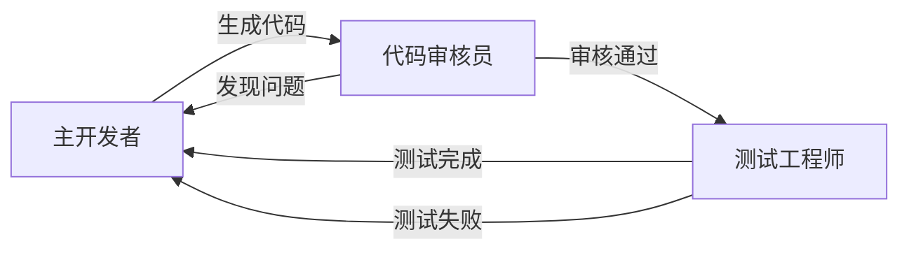

# 附录：Claude Code实用工具箱

> 本附录包含所有实用配置和技巧，可独立查阅使用

## A. CLAUDE.md配置最佳实践

CLAUDE.md是Claude Code自动读取的配置文件，每次对话都会作为上下文加载。这里是我的实战配置模板：

### 基础配置模板

```markdown
# 项目基本信息
项目类型：Go Web API服务
主要框架：Gin + GORM
数据库：PostgreSQL

# 常用命令
- `go run main.go`：启动开发服务器
- `go test ./...`：运行所有测试
- `go mod tidy`：整理依赖
- `golangci-lint run`：代码检查
- `docker-compose up -d`：启动数据库

# 代码规范
- 使用Go标准包优先，避免过度依赖第三方库
- 错误处理必须显式，不允许忽略错误
- 所有导出函数必须有注释
- 使用context.Context传递请求上下文
- 数据库查询必须使用参数化查询

# 测试策略
- 优先运行单个测试：`go test -v ./pkg/user`
- 避免运行完整测试套件（除非必要）
- 使用testify断言库
- Mock外部依赖

# 工作流程
- 完成代码修改后必须运行：`golangci-lint run`
- 提交前运行：`go test ./... -short`
- 重要功能必须有单元测试覆盖

# 项目特殊说明
- 用户认证使用JWT，过期时间24小时
- 所有API响应使用统一的Response结构
- 数据库迁移文件位于：`migrations/`
- 日志使用结构化格式（JSON）
```

### 配置技巧

**1. 分层配置**
- 根目录：项目通用配置
- 子目录：模块特定配置
- 优先级：子目录 > 根目录

**2. 动态更新**
- 随着项目发展及时更新
- 新同事加入后根据反馈调整
- 定期清理过时信息

**3. 实用原则**
- 只写最常用的命令和规范
- 避免写显而易见的内容
- 重点记录项目特殊性

## B. 权限管理策略

### 安全命令（建议默认授权）

```bash
# 查看类命令 - 完全安全
git status
git diff
git log --oneline -10
ls -la
pwd

# 搜索类命令 - 只读操作
grep -r "keyword" .
find . -name "*.go"
rg "pattern" --type go

# 构建测试类 - 不修改文件
go build
go test
npm run build
make test
```

### 危险命令（需要确认）

```bash
# 文件修改类
git add .
git commit
git push
rm -rf
mv
cp

# 系统操作类
sudo 相关
chmod
chown

# 网络操作类
curl -X POST/PUT/DELETE
wget
ssh
```

### 配置方法

在 `~/.config/claude/` 创建权限配置文件：

```yaml
# claude_permissions.yml
allowed_commands:
  - git status
  - git diff
  - git log
  - ls
  - grep
  - find
  - rg
  - go build
  - go test
  - npm run build

confirm_commands:
  - git add
  - git commit
  - git push
  - rm
  - mv
  - cp

blocked_commands:
  - sudo
  - rm -rf /
  - format
```

## C. 模型选择策略

### /model 4 策略详解

**使用场景：**
```
开场设定：/model 4
结果：Opus规划 + Sonnet执行
```

**优势：**
- Opus擅长架构设计和复杂推理
- Sonnet执行效率高，成本低
- 自动切换，无需手动干预

**适用场景：**
- 复杂项目开发
- 架构设计讨论
- 需要深度思考的任务

### 其他模型选择

```bash
# 1. 全程使用Opus - 复杂架构设计
/model opus

# 2. 全程使用Sonnet - 日常开发任务
/model sonnet  

# 3. 默认模式 - 平衡使用
/model default
```

### 成本优化建议

**高成本场景：**
- 反复讨论同一个复杂问题
- 频繁生成大量代码
- 使用ultrathink模式

**优化策略：**
- 重要设计用Opus，执行用Sonnet
- 准备充分后一次性提问
- 合理使用think模式层级

## D. 多实例协作技巧

### 三实例分工模式

**实例1：主开发者**
- 功能：需求分析、代码编写
- 配置：/model 4
- 职责：与用户沟通、编写核心逻辑

**实例2：代码审核员**
- 功能：技术审核、代码review
- 配置：专注技术细节
- 职责：发现bug、优化建议、安全检查

**实例3：测试工程师**
- 功能：单元测试、集成测试
- 配置：关注测试覆盖率
- 职责：编写测试用例、mock数据

### 协作流程



### /clear 使用技巧

**什么时候使用：**
- 切换不同模块开发
- 解决不同类型的问题
- 上下文过于复杂时

**使用策略：**
- 保存重要对话片段
- 清理前确认任务完成
- 重新开始时提供充分背景

## E. 自动化Review命令配置

### review-fast-go 配置

```bash
#!/bin/bash
# ~/.claude/commands/review-fast-go

echo "=== 快速Go代码审查 ==="
echo "检查范围：语法、格式、明显错误"
echo

# Git状态检查
echo "## Git状态"
git status -sb

# 格式检查
echo "## 格式检查"
gofmt -l . | head -10

# 语法检查
echo "## 语法检查"
go vet ./... 2>&1 | head -10

# 构建测试
echo "## 构建测试"
go build ./... 2>&1 | head -5

echo "=== 快速审查完成 ==="
```

### review-deep-go 配置

```bash
#!/bin/bash
# ~/.claude/commands/review-deep-go

echo "=== 深度Go代码审查 ==="
echo "检查范围：调用关系、逻辑复杂度、性能问题"
echo

# 代码复杂度分析
echo "## 复杂度分析"
gocyclo -over 10 . | head -5

# 依赖分析
echo "## 依赖检查"
go list -m all | grep -v "go.mod" | head -10

# 静态分析
echo "## 静态分析"
staticcheck ./... 2>&1 | head -10

# 测试覆盖率
echo "## 测试覆盖率"
go test -cover ./... | grep -E "coverage|FAIL"

echo "=== 深度审查完成 ==="
```

### 使用方法

```bash
# 日常开发后运行
claude review-fast-go

# 重要功能完成后运行
claude review-deep-go

# 提交前全面检查
claude review-fast-go && claude review-deep-go
```

## F. 拓展应用场景速查

### 数据处理场景

**CSV数据分析**
```python
# 示例prompt
请分析这个CSV文件，找出销售趋势和异常数据点：
- 按月统计销售额
- 识别异常的销售记录
- 给出业务建议
```

**SQL查询优化**
```sql
-- 示例场景
EXPLAIN ANALYZE SELECT * FROM orders 
WHERE created_at > '2023-01-01' 
AND status = 'completed';
-- 请分析执行计划，给出优化建议
```

### 工具开发场景

**网页爬虫**
```python
# 场景：爬取产品价格信息
# 要求：
# 1. 尊重robots.txt
# 2. 添加适当延迟
# 3. 错误重试机制
# 4. 数据存储到CSV
```

**API测试工具**
```bash
# 场景：批量测试API接口
# 要求：
# 1. 支持不同环境配置
# 2. 并发请求控制
# 3. 结果统计报告
# 4. 失败重试
```

### 学习研究场景

**新技术调研**
```markdown
# 30分钟技术评估模板
1. 技术概述（5分钟）
2. 核心特性（10分钟）
3. 实际demo（10分钟）
4. 优劣势分析（5分钟）
5. 是否值得深入学习？
```

**开源项目分析**
```markdown
# 项目理解清单
- [ ] 项目目标和定位
- [ ] 核心架构设计
- [ ] 关键代码模块
- [ ] 构建和部署流程
- [ ] 贡献方式和规范
```

## G. 故障排查清单

### 常见问题解决

**1. Claude Code连接失败**
```bash
# 检查网络连接
curl -I https://claude.ai

# 检查配置文件
ls ~/.config/claude/

# 重新登录
claude auth login
```

**2. 权限问题**
```bash
# 检查命令权限
claude permissions list

# 重置权限
claude permissions reset

# 添加安全命令
claude permissions allow "git status"
```

**3. 上下文过长**
```bash
# 清理上下文
/clear

# 查看上下文大小
claude status

# 优化CLAUDE.md文件长度
wc -w CLAUDE.md
```

### 最佳实践检查清单

**开始新项目前：**
- [ ] 创建合适的CLAUDE.md
- [ ] 配置权限管理
- [ ] 设置review命令
- [ ] 选择合适的模型策略

**日常开发中：**
- [ ] 遵循四象限决策模型
- [ ] 使用结构化工作流
- [ ] 及时运行自动化review
- [ ] 适时使用/clear管理上下文

**任务完成后：**
- [ ] 更新相关文档
- [ ] 检查代码质量
- [ ] 提交规范的commit
- [ ] 反思优化协作方式

---

**工具箱使用提示：**
- 这些配置都是可选的，根据需要使用
- 定期更新和调整配置
- 分享给团队成员，统一工作方式
- 持续优化，找到最适合自己的配置