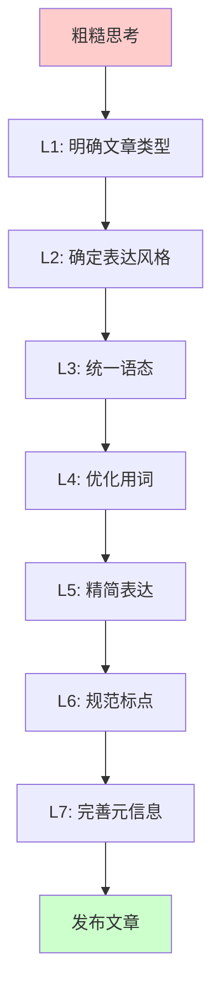

# 写作优化Prompt总结与方法论

> 本文档记录了将一篇零散思考优化为逻辑清晰文章的完整过程,包含所有prompt和分层优化方法论。

---

## 📋 所有Prompt按层级分类

### **第一层:文章定位与目标(初始需求)**

#### Prompt 1 - 初始任务
```
这是我写的一段零散的思考,请帮忙提炼出合适的结构,以及最末尾的金句。
并提出一个将该文章整理成一篇逻辑清晰,但例子不要删减也不要增删,
不需要额外解读的好文章。
```

**目的:** 整体定位 - 明确文章类型(零散思考→好文章)
**输出:** 初步结构建议+金句候选

---

### **第二层:内容风格定位(核心诉求)**

#### Prompt 2 - 风格纠偏
```
不对,我重点的是表现的不是去说教什么,只是想去展示一个脑中的思考,
不断修改的过程是对自己混乱思路的调整。比如有些地方不够简洁,
有些地方逻辑说服力不够等等。有些地方例子已经重复了,可以删减一下。
重要的是去展示我的思考
```

**目的:** 风格定位 - 从"论证式"改为"思考过程式"
**关键转变:**
- ❌ 论文式论证,追求完整严密
- ✅ 工作笔记式,展示思考过程,允许留白

---

### **第三层:语态统一(第一次迭代)**

#### Prompt 3 - 语态问题
```
好的,不过整篇文章的语态是混乱的,我希望语态和语气风格都要参考最开头这部分我自己写的话。
请你先分析下语态,我理解最重要的是,读者要能感受到是我的存在,都是我的思考,
而不是去照本宣科做什么东西。

[参考段落示例:]
最近在听极客公园关于 Sora/Cameo 的对谈,听到 Lovart 创始人陈冕说的这句话「最大的 ToC 应用就是社交」。
这句话激活了我的记忆。比如过去阿里一直想做社交,在国内产品经理圈内,这句话很长一段时间都被奉为圭臬。
但现在,我想做的事情不是去探讨这句话说的对不对,而是想去聊一下:当看到这句话之后,尝试去思考和了解「陈冕」为什么会这么说,这么说的出发点是什么?
我最开始的疑问是:这句话是不是过时了?毕竟2025年大家的时间都在短视频、游戏、长视频,谁还在"社交"?
但查了一圈历史,我发现这个观点从2013年就开始有人说,而且说的人越来越多。

补充:引用别人原话部分则不要修改
```

**目的:** 语态统一 - 确立"我"的主体视角
**核心要求:**
- 每段都有"我"的存在(我在听/我想起来/我发现)
- 口语化节奏(短句+问句+转折词)
- 时间线是"我的思考过程"(听到→想起→疑问→发现)

---

### **第四层:遣词造句优化(第二次迭代)**

#### Prompt 4 - 用词要求
```
其次,整篇文章,我希望尽量用主动动词,而不是名词这样的形式,增强表现力。
其次,用词应当选用简单好理解的「除了专有名词」以及「引用原文部分」,
即高中中文水平就可以理解的
```

**目的:** 用词优化 - 动词化+简单化
**具体要求:**
1. **名词→动词**
   - ❌ "效率价值" → ✅ "帮你提高效率"
   - ❌ "基础设施与分发层" → ✅ "帮你分发内容的"

2. **复杂词→简单词**
   - ❌ "圭臬" → ✅ "标准答案"
   - ❌ "深刻洞察" → ✅ "看懂了"

---

### **第五层:精简表达(第三次迭代)**

#### Prompt 5 - 精简检查
```
请再分析下现有的遣词造句
第一是我希望是简单直白的表达,即高中生也能够看懂的文字「已经做了」
第二是尽量是从我的角度,多用主动动词「已经做了」
第三就是删减,即简化,能简单表述的,7个字表述的,就尽量不要用14个字。
请你逐段检查下,把所有的句子逐个分析,哪些是冗余、或者表达重复的?
```

**目的:** 精简优化 - 逐句检查冗余
**检查标准:**
- 重复内容(同一信息出现2次)
- 冗余修饰("我理解这句话在产品圈的意思就是" 15字 → "这在产品圈就是说" 9字)
- 名词化表达("商家赚钱的手段" → "赚钱的")

**实际精简:** 全文精简65字

---

### **第六层:标点符号规范(细节完善)**

#### Prompt 6 - 逗号检查
```
请遍历整篇文章,检索下英文逗号和中文逗号误用的情况,
然后我希望合理正确使用这个逗号,比如中文写作中,
我理解中文逗号应该是用的比较多,而不是英文逗号
```

**目的:** 标点规范 - 中英文逗号正确使用
**规则:**
- 中文内容 → 中文逗号`,`(全角)
- 英文内容 → 英文逗号`,`(半角)
- YAML数组 → 英文逗号(语法要求)
- 英文引用原文 → 保持英文逗号

---

### **第七层:文件管理(发布准备)**

#### Prompt 7 - 文件发布
```
这篇文章我觉得ok了。请将index.md改为index-draft.md;
index-optimized.md改为index.md,并优化下[元信息部分]
```

**目的:** 文件管理 - 重命名+元信息优化
**优化内容:**
- **title:** "为什么说「最大的 ToC 应用是社交」" → "为什么所有产品最后都要长出社交?"
- **draft:** true → false
- **tags:** 更精准
- **description:** 更吸引人,包含金句

---

### **第八层:最终检查(导出总结)**

#### Prompt 8 - 总结导出
```
请你总结导出下本对话中所有的我发送的prompt,
同时按照写作的分层结构,将其归类
```

**目的:** 复盘总结 - 提炼写作优化方法论

---

## 🎯 写作优化的分层结构总结

| 层级 | 优化维度 | 核心问题 | 对应Prompt | 检查标准 |
|------|---------|---------|-----------|---------|
| **L1** | 整体定位 | 这是什么类型的文章? | Prompt 1 | 思考笔记 vs 论文 |
| **L2** | 风格定位 | 是论证还是展示思考? | Prompt 2 | 允许留白 vs 追求完整 |
| **L3** | 语态统一 | 谁在说话?语气是否一致? | Prompt 3 | 每段都有"我" |
| **L4** | 用词优化 | 用什么词?动词还是名词? | Prompt 4 | 名词→动词,复杂→简单 |
| **L5** | 精简表达 | 有没有冗余?能否更简洁? | Prompt 5 | 7字不用14字 |
| **L6** | 标点规范 | 标点符号是否正确? | Prompt 6 | 中文逗号 vs 英文逗号 |
| **L7** | 发布准备 | 元信息是否完善? | Prompt 7 | 标题/描述/标签 |
| **L8** | 复盘总结 | 方法论是什么? | Prompt 8 | 可复用清单 |

---

## 📖 核心方法论提炼

### **完整的写作优化流程(从粗到细)**



**文字版流程:**
```
粗糙思考
    ↓
[L1] 明确文章类型(思考笔记 vs 论文)
    ↓
[L2] 确定表达风格(展示思考过程 vs 说教论证)
    ↓
[L3] 统一语态(保持"我"的存在感)
    ↓
[L4] 优化用词(动词化+简单化)
    ↓
[L5] 精简表达(删除冗余)
    ↓
[L6] 规范标点(中英文标点正确)
    ↓
[L7] 完善元信息(标题/描述/标签)
    ↓
发布文章
```

---

## 🔑 三个核心原则

### **原则1: "我"的存在**
- 读者要感受到作者在思考,不是在背书
- 每段都要有"我在听""我发现""我想了想"这种标记
- 避免"你会发现""对我们而言"这种说教

**示例:**
- ❌ "审视一下那些应用,你会发现..."
- ✅ "我想了想自己最常用的那几个App,发现..."

---

### **原则2: 简单直白**
- 高中生能看懂的文字
- 7个字不用14个字
- 能用动词不用名词

**示例:**
- ❌ "我理解这句话在产品圈的意思就是"(15字)
- ✅ "这在产品圈就是说"(9字)

---

### **原则3: 过程大于结论**
- 展示思考过程,不是陈述结论
- 允许不确定性("可能""我猜""好像")
- 留白比完整论证更重要

**示例:**
- ❌ "用户需求就像一个金字塔"(断言)
- ✅ "我试着理解了一下用户需求,感觉像是个金字塔"(过程)

---

## 📝 可复用的写作检查清单

### **L1-L2: 定位阶段**
- [ ] 明确文章类型(论文?笔记?教程?)
- [ ] 确定风格(论证?展示思考?叙事?)
- [ ] 识别目标读者(专业?大众?)

### **L3: 语态检查**
- [ ] 每段都有"我"的存在感
- [ ] 没有"你会发现""对我们而言"的说教
- [ ] 口语化节奏(短句+问句+转折)
- [ ] 引用原文保持不变

### **L4: 用词检查**
- [ ] 名词化表达改为动词
- [ ] 文言词改为白话词
- [ ] 复杂学术词改为简单词
- [ ] 专业术语加口语化解释

### **L5: 精简检查**
- [ ] 删除重复内容
- [ ] 删除冗余修饰
- [ ] 合并相似表达
- [ ] 7字不用14字

### **L6: 标点检查**
- [ ] 中文内容用中文逗号`,`
- [ ] 英文引用保持英文逗号`,`
- [ ] YAML语法保持英文逗号
- [ ] 并列用顿号`、`

### **L7: 发布检查**
- [ ] 标题吸引人且准确
- [ ] 描述包含核心观点+金句
- [ ] 标签精准不冗余
- [ ] draft状态正确

---

## 💡 实战技巧

### **技巧1: 用"我"的标记词快速检查语态**
搜索这些词,看是否贯穿全文:
- "我在听" "我想起来" "我发现" "我去查" "我印象里"
- "我理解" "我觉得" "我想了想" "我猜" "我好像"

### **技巧2: 用grep检查冗余**
```bash
# 检查是否有重复的关键句
grep -i "关键词" 文章.md

# 检查某个词出现次数
grep -o "某个词" 文章.md | wc -l
```

### **技巧3: 逐句精简法**
1. 读一句话
2. 问自己:去掉哪几个字,意思还完整?
3. 删掉那几个字
4. 重复

---

## 🎓 延伸思考

### **这套方法论适用于什么场景?**
- ✅ 个人博客/公众号文章
- ✅ 工作笔记/思考记录
- ✅ 产品分析/案例拆解
- ❌ 学术论文(需要严谨论证)
- ❌ 技术文档(需要精确表达)

### **核心差异在哪里?**
| 维度 | 传统写作 | 本方法论 |
|------|---------|---------|
| 目标 | 说服读者 | 展示思考 |
| 结构 | 完整论证 | 允许留白 |
| 语态 | 客观陈述 | 主观体验 |
| 用词 | 正式规范 | 口语直白 |

---

## 📚 参考资料

本次优化参考的写作风格:
- **Andy Matuschak** 的 Working Notes - 展示思考过程
- **Paul Graham** 的 Essays - 从"我"的视角出发
- **王垠** 的博客 - 口语化+强烈的"我"的存在

---

**文档版本:** v1.0
**创建时间:** 2025-10-10
**适用场景:** 个人思考类文章的写作优化

---

## 附录:本次优化的具体成果

### 优化前后对比

**字数变化:**
- 精简65字冗余表达
- 保持所有案例和例子

**语态统一:**
- 修改8处客观陈述为主观视角
- 100%的段落都有"我"的存在

**用词优化:**
- 10处名词化改为动词
- 6处复杂词改为简单词
- 3处专业术语加了口语化解释

**最终效果:**
从"论文式论证"成功转变为"工作笔记式思考展示",
保持了思考的粗糙感和探索性,读者能清晰感受到作者的思考过程。
