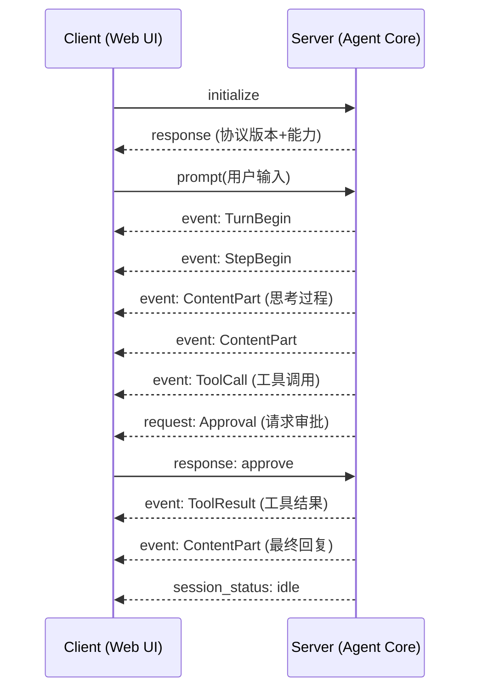

# 用 300 行 Swift 让 iPhone 变成 Kimi CLI 控制台

你在咖啡馆喝完拿铁，突然想起 Mac 上挂着的 Kimi CLI 正在跑一个代码分析任务。你掏出手机，打开一个原生 App，看到 Agent 的输出正在实时滚动，已经跑完三分之二。你追加一条新指令，然后继续刷朋友圈。

这不是科幻场景。只需要约 300 行 Swift 代码，零第三方依赖，就能把 iPhone 变成功能完备的 Kimi CLI 控制台。手机端并不是把 CLI 跑在手机上，而是给 Kimi 已有的 Web UI 套一层原生壳，借助 WebView 直接复用现有界面。这个项目的特点是代码量少，更多时间花在理解架构和拆解任务上。

> **TL;DR — 读完你会得到什么**
>
> 1. 理解 Kimi CLI 的「内核 + 多前端」架构，以及 Web UI 为什么能让移动端封装变得低成本
> 2. 掌握 `useSessionStream` 中两个关键设计：wsRef 连接守卫 + Ref 流式累积
> 3. 知道 `WKWebView` 封装的三个必踩坑：ATS 权限 / JS 弹窗 / 真机网络
> 4. 获得一个可复用的工程模式：「本地 Web 服务 + WebView」
> 5. 学到一套面对不确定目标的拆解方法：把大问题拆成可验证的小实验

**阅读路线**：如果你只想 30 分钟做一个 iOS 壳，直接跳到第 4 节 + 第 5 节 + Quick Start。如果你想理解 Web UI 的通信机制或基于 Wire 协议做自定义客户端，重点读第 2 节。

---

## 1. 背景与需求

### 1.1 为什么需要手机操控 CLI

CLI 工具的生产力很高，但它们被锁在终端里。坐在地铁上想看看刚才让 Kimi 分析的日志有没有跑完，通常只能掏出笔记本。

更麻烦的是，很多 CLI Agent 任务是长时运行的，代码审查、日志分析、测试报告生成动辄几分钟，随时查看进度、调整策略就变得很有价值。

这个需求一直存在，但合适的方案不多。Remote Desktop 太重，SSH + tmux 太原始，第三方面板又引入信任和部署成本。理想方案：原生、轻量、无侵入，让手机成为 CLI 的第二块屏幕。

### 1.2 Kimi Web UI 是什么

Kimi CLI 在 v1.4（2026-01-30）引入了 `kimi web` 命令。执行后，本地 Web 服务在 `127.0.0.1:5494` 启动，浏览器打开即可看到控制台界面，支持实时对话、文件上传、会话管理、流式响应，体验接近终端版。

Kimi CLI 采用「内核 + 多前端」架构：终端 Shell、Web UI、IDE 侧边栏都是前端壳，背后是同一个 Agent 内核，通过统一的 Wire 协议通信。

这套架构的优势在于解耦，Web UI 只需做好展示数据、接收输入、管理连接三件事，也为移动端封装打开了入口。

---

## 2. Web UI 核心代码解析

### 2.1 三层架构总览

```text
┌─────────────────────────────────────────┐
│  Frontend: React + TypeScript + Vite   │
│  浏览器中运行的 UI 界面                  │
└──────────────────┬──────────────────────┘
                   │ WebSocket
                   ↓
┌─────────────────────────────────────────┐
│  Backend: FastAPI + WebSocket          │
│  Python 后端，消息转发层                │
└──────────────────┬──────────────────────┘
                   │ Wire 协议 (JSON-RPC 2.0)
                   ↓
┌─────────────────────────────────────────┐
│  Agent Core: Kimi CLI Wire Mode        │
│  AI Agent 运行时内核                    │
└─────────────────────────────────────────┘
```

内核通过 Wire 协议对外暴露能力，任何客户端都能接入。

### 2.2 Wire 协议通信机制

Wire 协议基于 JSON-RPC 2.0 规范，当前版本 1.3。它定义了四种核心消息类型：

| 消息类型 | 方向 | 用途 |
|----------|------|------|
| `initialize` | Client → Server | 握手协商，确认协议版本和能力 |
| `prompt` | Client → Server | 发送用户输入，启动新对话轮次 |
| `event` | Server → Client | 推送内容片段，流式响应的关键 |
| `request` | Server → Client | 请求审批或工具调用确认 |

一次典型的交互流程：



`event` 是流式输出的核心：Agent 每生成一小段内容就推送一个 `ContentPart` 事件，前端逐步累积渲染，呈现打字机效果。

值得注意的是，这里的实时通信走的是 WebSocket，而非 HTTP 轮询。WebSocket 提供了全双工通道，适合 Agent 这种「持续推送 + 偶尔上行」的交互模式。前端通过 WebSocket 接收 Wire 事件流，同时也能随时发送取消、审批等控制消息，不必等服务端回复完毕。

### 2.3 `useSessionStream`：实时通信的心脏

`useSessionStream` 管理 WebSocket 连接、解析 Wire 消息、更新状态，对外接口简洁：

```typescript
useSessionStream({ sessionId })
├── messages: LiveMessage[]          // UI 消息列表
├── status: ChatStatus               // 流状态
├── sendMessage(text)                // 发送消息
├── respondToApproval(id, decision)  // 响应审批
└── cancel()                         // 取消当前流
```

上层组件只用这五个成员，不必关心 WebSocket 和 Wire 协议细节。

**WebSocket 生命周期管理**

Hook 用 `useLayoutEffect` 监听 `sessionId` 变化：切换会话时先关闭旧连接、重置状态，再延迟 50ms 建立新连接，避免快速切换时堆积无效连接。

**关键设计一：wsRef 身份验证**

用户快速从 Session A 切换到 Session B 时，A 的 WebSocket `onmessage` 回调可能仍在事件队列中。如果不加控制，B 的界面会显示 A 的消息。

解法是给每个回调加一道守卫：

```typescript
const ws = new WebSocket(url);
wsRef.current = ws;               // 将当前连接注册为「活跃连接」

ws.onmessage = (e) => {
  // 如果当前活跃连接已不是这个 ws，直接忽略
  if (wsRef.current !== ws) return;
  handleMessage(e.data);
};
```

`wsRef.current` 始终指向最新的活跃连接，过期连接的回调会被守卫拦截。时间线上看：

```text
T1: 点击 Session A → wsRef.current = A
T2: 点击 Session B → 关闭 A, wsRef.current = B
T3: A 的 onmessage 延迟到达 → wsRef.current(B) !== A → 忽略
```

所有回调（`onmessage`、`onclose`、`onerror`）都带有这个守卫。

**关键设计二：流式状态累积（Ref vs State）**

`ContentPart` 事件每秒可能推送几十次。每次都调用 `setState` 会触发同等次数的重渲染。

解法是用 Ref 累积中间状态，在合适的时机统一更新 State：

```typescript
const currentThinkingRef = useRef("");   // 累积思考内容，不触发渲染
const currentTextRef = useRef("");       // 累积回复文本，不触发渲染

case "ContentPart": {
  if (type === "think") {
    // 追加到 Ref 而非 State，避免高频 setState
    currentThinkingRef.current += event.payload.think ?? "";
  } else if (type === "text") {
    currentTextRef.current += event.payload.text ?? "";
  }
}
```

Ref 的修改不触发重渲染，只在需要更新 UI 时才同步到 State。

**事件分发**

`processEvent` 用 `switch` 路由所有 Wire 事件：`TurnBegin` 创建消息、`StepBegin` 重置步骤、`ContentPart` 累积内容、`ToolCall`/`ToolResult` 处理工具调用、`ApprovalRequest` 弹审批框、`StatusUpdate` 更新上下文用量。

### 2.4 状态分层与性能优化

Web UI 将状态按更新频率和共享范围分为三层：

```text
Layer 3: 全局状态 (Zustand)     → 消息队列、工具事件
Layer 2: 共享状态 (Hooks)       → 会话列表、消息流、配置
Layer 1: 组件状态 (useState)    → UI 开关、折叠状态
```

分层的目的是控制重渲染的波及范围，高频变化的状态下沉到最小作用域，避免牵连无关组件。

第一个优化手段是 Container/Presentational（容器/展示）分离。`ChatWorkspaceContainer` 订阅 `useSessionStream` 的高频更新，重渲染不会波及 `App.tsx` 和侧边栏。消息流式更新时，只有聊天区域重渲染，其余部分保持静止。

第二个手段是虚拟列表。`react-virtuoso` 只渲染可见区域的消息（约 10-20 条），即使会话中有上万条历史消息也不会卡顿：

```typescript
<Virtuoso
  data={messages}
  computeItemKey={(index, msg) => msg.id}
  followOutput="smooth"
  key={conversationKey}
  itemContent={(index, msg) => <MessageItem message={msg} />}
/>
```

`computeItemKey` 用 `message.id` 保证列表项稳定，`followOutput="smooth"` 自动滚动到底，`conversationKey` 在切换会话时强制重新挂载，避免滚动位置残留。

---

## 3. 任务拆解：从想法到可执行步骤

### 3.1 面对不确定性的拆解策略

理解了 Web UI 的架构后，我决定在手机上复现它。但我面对两个不确定性：不懂 iOS 开发，也不知道 `WKWebView` 能否完整承载 Web UI。

策略是把目标拆成三个小实验，每个只回答一个问题，失败代价控制在半天以内。

### 3.2 三阶段实验设计

**阶段一：找到 Kimi Web 服务**

要回答的问题：Kimi Web UI 到底跑在哪里，我能直接访问吗？

我在终端执行 `kimi web` 启动服务后，用 `lsof | grep kimi` 找不到端口。卡了一会儿才想起来，Kimi CLI 是 Python 编写的，进程名是 `python` 而不是 `kimi`。换成 `lsof -i -P | grep python | grep LISTEN` 就定位到端口 5494。

浏览器打开 `http://127.0.0.1:5494`，Web UI 完整可用。可行性确认。耗时约 30 分钟。

**阶段二：验证 iOS 开发门槛**

要回答的问题：作为零 iOS 经验的人，我能不能在 Xcode 里写出一个能运行的 App？

我用 SwiftUI 写了一个 Hello World App，不到 100 行代码，在模拟器和真机上都跑通了。SwiftUI 的声明式语法和 React 很像，学习成本比预期低。门槛可接受。耗时约 2 小时（含环境搭建）。

**阶段三：WebView 封装**

要回答的问题：`WKWebView` 能不能正常加载 Kimi Web UI，所有交互功能是否可用？

用 `WKWebView` 加载本地 Web 服务，遇到三个问题：HTTP 被 ATS 拦截、JS 弹窗不显示、真机连不上。逐一解决后，3 个 Swift 文件，287 行代码，功能完整可用。耗时约 3 小时。

### 3.3 拆解的价值

每步成本低（最长 3 小时），且有明确的成败标准。每步边界清楚，出问题时容易定位。

---

## 4. iOS 封装核心实现

### 4.1 项目结构

整个项目只有四个文件：

```text
KimiWebUI/
├── KimiWebUIApp.swift       # App 入口
├── ContentView.swift        # 主界面（地址栏 + WebView）
├── WebView.swift            # WKWebView 封装
└── Info.plist               # 权限配置（ATS + 本地网络）
```

完整源码见 [GitHub 仓库](https://github.com/user/kimi-webui-ios)（TODO: 替换为实际地址）。

### 4.2 权限配置

**ATS（App Transport Security）**

iOS 默认禁止 HTTP 明文传输，而 Kimi Web UI 用的是 HTTP。我们不必全局禁用 ATS，只需开启本地网络例外：

```xml
<key>NSAppTransportSecurity</key>
<dict>
    <!-- 仅允许本地网络的 HTTP 请求，不影响公网 HTTPS 策略 -->
    <key>NSAllowsLocalNetworking</key>
    <true/>
</dict>
```

相比 `NSAllowsArbitraryLoads`（全局放开），[`NSAllowsLocalNetworking`](https://developer.apple.com/documentation/bundleresources/information-property-list/nsapptransportsecurity/nsallowslocalnetworking) 只对本地/局域网 IP 生效，是 Apple 推荐的更窄例外。如果需要对特定域名单独放行，可以用 [`NSExceptionDomains`](https://developer.apple.com/documentation/bundleresources/information-property-list/nsapptransportsecurity/nsexceptiondomains)。

**本地网络访问权限**

真机访问局域网 IP 时，iOS 会弹出「本地网络」权限弹窗。需要在 `Info.plist` 中声明用途，否则用户可能拒绝授权：

```xml
<key>NSLocalNetworkUsageDescription</key>
<string>需要访问本地网络以连接 Mac 上运行的 Kimi CLI Web 服务</string>
```

详见 Apple [TN3179: Understanding local network privacy](https://developer.apple.com/documentation/technotes/tn3179-understanding-local-network-privacy)。

### 4.3 `WKWebView` 封装

SwiftUI 没有原生 WebView 组件，需要通过 `UIViewRepresentable` 协议桥接 UIKit 的 `WKWebView`。核心在 `makeUIView` 方法中完成配置：

```swift
func makeUIView(context: Context) -> WKWebView {
    let config = WKWebViewConfiguration()
    config.preferences.javaScriptEnabled = true  // React 应用必须启用 JS
    config.websiteDataStore = .default()         // 持久化存储，保持登录态

    let webView = WKWebView(frame: .zero, configuration: config)
    webView.allowsBackForwardNavigationGestures = true   // 支持左右滑动导航
    webView.navigationDelegate = context.coordinator
    webView.uiDelegate = context.coordinator             // 桥接 JS 弹窗（见 4.4）

    if let url = URL(string: urlString) {
        webView.load(URLRequest(url: url))
    }
    return webView
}
```

各配置项的作用：

| 配置项 | 作用 | 必要性 |
|--------|------|--------|
| `javaScriptEnabled` | 启用 JS 执行 | 必须（React 依赖） |
| `websiteDataStore` | 持久化 Cookie / LocalStorage | 推荐（保持会话状态） |
| `allowsBackForwardNavigationGestures` | 左右滑动前进后退 | 体验优化 |
| `uiDelegate` | 处理 JS 弹窗 | 关键（见下节） |

### 4.4 JavaScript 弹窗桥接

`WKWebView` 默认静默忽略 JS 弹窗（`alert`/`confirm`/`prompt`）。Kimi Web UI 用 `confirm()` 做删除确认，忽略后用户点删除按钮毫无反应。

解法是实现 `WKUIDelegate` 的三个方法，把 JS 弹窗桥接到原生 `UIAlertController`。以 `confirm()` 为例：

```swift
func webView(_ webView: WKWebView,
             runJavaScriptConfirmPanelWithMessage message: String,
             initiatedByFrame frame: WKFrameInfo,
             completionHandler: @escaping (Bool) -> Void) {
    // 从当前 window scene 获取根视图控制器（兼容多窗口）
    guard let windowScene = UIApplication.shared.connectedScenes
              .first(where: { $0.activationState == .foregroundActive }) as? UIWindowScene,
          let vc = windowScene.windows.first?.rootViewController else {
        completionHandler(false)
        return
    }
    let alert = UIAlertController(title: nil, message: message,
                                  preferredStyle: .alert)
    alert.addAction(UIAlertAction(title: "取消", style: .cancel) { _ in
        completionHandler(false)   // 用户点取消 → JS confirm() 返回 false
    })
    alert.addAction(UIAlertAction(title: "确定", style: .default) { _ in
        completionHandler(true)    // 用户点确定 → JS confirm() 返回 true
    })
    vc.present(alert, animated: true)
}
```

三个弹窗方法模式相同，区别仅在 `completionHandler` 的参数类型：`alert()` 传 `Void`，`confirm()` 传 `Bool`，`prompt()` 传 `String?`。

> 注：早期写法常用 `UIApplication.shared.windows.first?.rootViewController`，但 `windows` 属性[已被标记 deprecated](https://developer.apple.com/documentation/uikit/uiapplication/windows)。上面的写法通过 `UIWindowScene` 获取活跃窗口，兼容多 Scene 场景。

### 4.5 网络差异处理

模拟器和真机访问本地服务的网络路径不同：

```text
模拟器：                        真机：
┌────────────┐                ┌────────────┐
│ Simulator  │                │  iPhone    │
│ 127.0.0.1  │                │ 127.0.0.1  │
└─────┬──────┘                └─────┬──────┘
      │ 共享网络栈                    │ 指向自己
      ↓                             ↓
┌────────────┐                ┌────────────┐
│ Mac 本机   │                │  路由器    │
│ :5494      │                │            │
└────────────┘                └─────┬──────┘
                                    ↓
kimi web                      ┌────────────┐
                              │ Mac :5494  │
                              └────────────┘
                              kimi web --network
```

模拟器与 Mac 共享网络栈，`127.0.0.1` 指向 Mac 本机，直接用 `kimi web` 就能访问。真机是独立设备，`127.0.0.1` 指向自己，必须用 `kimi web --network` 绑定 `0.0.0.0`，然后用 Mac 的局域网 IP 访问。

App 中设计了地址切换功能，提供预设地址列表（`127.0.0.1` + 常见局域网网段），用户可以快速切换或手动输入。

### 4.6 安全模型与部署建议

用 `--network` 暴露 Web 服务到局域网时，需要考虑安全边界。Kimi CLI 的 Agent 具备文件读写、命令执行、工具调用等能力，如果控制面暴露给同网段的其他人，后果不可控。

Kimi CLI 从 v1.6（2026-02-03）起引入了基于 Token 的认证和访问控制：

| 参数 | 作用 |
|------|------|
| `--auth-token <token>` | 启用 Token 认证，客户端需携带 Token 才能访问 |
| `--lan-only` | 仅允许局域网访问（拒绝公网流量） |
| `--allowed-origins <origins>` | 限制允许的请求来源（CORS 白名单） |
| `--restrict-sensitive-apis` | 限制敏感 API（文件操作、命令执行等） |

推荐的部署姿势：

- **仅本机调试**：默认 `kimi web`，服务只绑定 `127.0.0.1`，不出本机
- **局域网真机**：`kimi web --network --auth-token <你的token>`，加 Token 认证
- **不要在不可信网络暴露服务**，即使加了 Token，当前方案走的是 HTTP 明文，同网段可被嗅探

详见 [Kimi CLI 变更记录](https://moonshotai.github.io/kimi-cli/zh/release-notes/changelog.html) 中 v1.6 的安全更新。

---

## 5. 踩坑速查

| 现象 | 根因 | 解法 |
|------|------|------|
| 模拟器正常，真机白屏 | 真机是独立设备，`127.0.0.1` 指向自己 | `kimi web --network` + Mac 局域网 IP |
| 删除会话等操作无反应 | `WKWebView` 默认静默忽略 JS 弹窗 | 实现 `WKUIDelegate` 三个方法桥接弹窗 |
| `lsof \| grep kimi` 查不到端口 | Kimi CLI 是 Python 程序，进程名是 `python` | `lsof -i -P \| grep python \| grep LISTEN`，默认 5494，占用时顺延至 5503 |
| 真机弹「是否允许访问本地网络」后被拒绝 | 缺少 `NSLocalNetworkUsageDescription` | 在 `Info.plist` 中添加本地网络用途说明（见 4.2） |
| 弹窗代码编译有 deprecation 警告 | `UIApplication.shared.windows` 已废弃 | 改用 `UIWindowScene` 获取活跃窗口（见 4.4） |

---

## 6. 小结

### 6.1 核心要点回顾

回到开篇的场景：在咖啡馆能用手机操控 Kimi CLI 吗？可以，实现成本远低于预期。

1. **架构**：Kimi Web UI 三层设计（React 前端 + FastAPI 后端 + Agent 内核）通过 Wire 协议解耦 UI 与 Agent，Web UI 只是 Agent 内核的一种「壳」。
2. **代码机制**：`useSessionStream` 用 `wsRef` 守卫解决多连接竞态，用 Ref 累积流式状态避免高频渲染，`processEvent` 路由十几种 Wire 事件。
3. **封装三要素**：`WKWebView` 封装需要处理 HTTP 权限（ATS 配置）、JS 弹窗桥接（`WKUIDelegate`）、网络差异（模拟器 vs 真机）三个关键问题。
4. **方法论**：面对不确定目标，拆成可验证的小步骤（找进程 → iOS 入门 → WebView 封装），每步只回答一个问题，失败代价控制在半天以内。

### 6.2 架构局限与演进方向

当前方案有几个值得正视的限制：

**网络边界**：手机和 Mac 必须在同一局域网。离开咖啡馆的 Wi-Fi，连接就断了。如果需要远程访问，可以考虑通过 Cloudflare Tunnel 或 ngrok 把本地服务暴露到公网，但这会引入额外的延迟和安全配置。

**传输安全**：当前方案走 HTTP 明文，局域网内理论上可被同网段设备嗅探。对于个人开发场景风险可控，但如果 Agent 处理敏感代码或执行高权限操作，建议配合 `--auth-token` 使用，或在前端加一层 TLS（比如用 mkcert 生成本地证书）。

**通信模型**：Kimi Web UI 的通信是 WebSocket 全双工，不是传统的 HTTP 请求-响应。这其实是正确的选择。Agent 的输出是持续的流式推送（每秒几十个 `ContentPart` 事件），HTTP 轮询在这个场景下延迟高、开销大。WebSocket 保持一条长连接，服务端可以随时推送，客户端也能随时发送取消或审批，双向实时。如果未来需要处理离线场景（比如手机断网后重连），可以在 WebSocket 之上加消息队列和断点续传，形成 WebSocket（实时）+ HTTP（补偿）的混合架构。

**可复用的工程模式**：「本地 Web 服务 + WebView」适用于任何提供 Web 界面的 CLI 工具。后端有 HTTP 接口就能跨平台复用，代价是性能和体验不如原生。对于 AI Agent 这种交互密度不高的场景，WebView 够用。当交互复杂度上升（比如需要原生手势、离线缓存、推送通知），就需要考虑原生 UI + Wire 协议直连的方案了。

### 6.3 快速开始

**前置条件**：

- Kimi CLI >= v1.4（推荐 >= v1.6，支持 Token 认证）
- Xcode >= 15.0，iOS >= 16.0
- Mac 和 iPhone 在同一 Wi-Fi 网络下

**30 分钟部署清单**：

1. 启动服务：`kimi web --network --auth-token mytoken`
2. 获取 Mac 局域网 IP：`ipconfig getifaddr en0`
3. 用 Xcode 新建 iOS 项目，将本文第 4、5 节的代码添加进去
4. 在 `ContentView.swift` 中修改 `serverAddress` 为 `http://<Mac-IP>:5494`
5. 连接 iPhone，在 Xcode 中选择真机目标，点击 Run

**命令速查表**：

| 场景 | 命令 |
|------|------|
| 默认启动（仅本机） | `kimi web` |
| 局域网 + Token 认证 | `kimi web --network --auth-token <token>` |
| 指定端口 | `kimi web --port 8080` |
| 获取 Mac IP | `ipconfig getifaddr en0` |
| 查找 Kimi Web 端口 | `lsof -i -P \| grep python \| grep LISTEN` |

**进阶资源**：

- [Kimi CLI Wire 模式文档](https://moonshotai.github.io/kimi-cli/zh/customization/wire-mode.html)：协议细节和扩展开发
- [Kimi CLI 变更记录](https://moonshotai.github.io/kimi-cli/zh/release-notes/changelog.html)：各版本安全功能演进
- [Apple WKWebView 文档](https://developer.apple.com/documentation/webkit/wkwebview)：API 参考和最佳实践
- [Apple: Preventing Insecure Network Connections](https://developer.apple.com/documentation/security/preventing-insecure-network-connections)：ATS 配置最佳实践

---

回头看，这个项目的大部分时间花在理解系统边界上，真正动手写代码反而很快。
