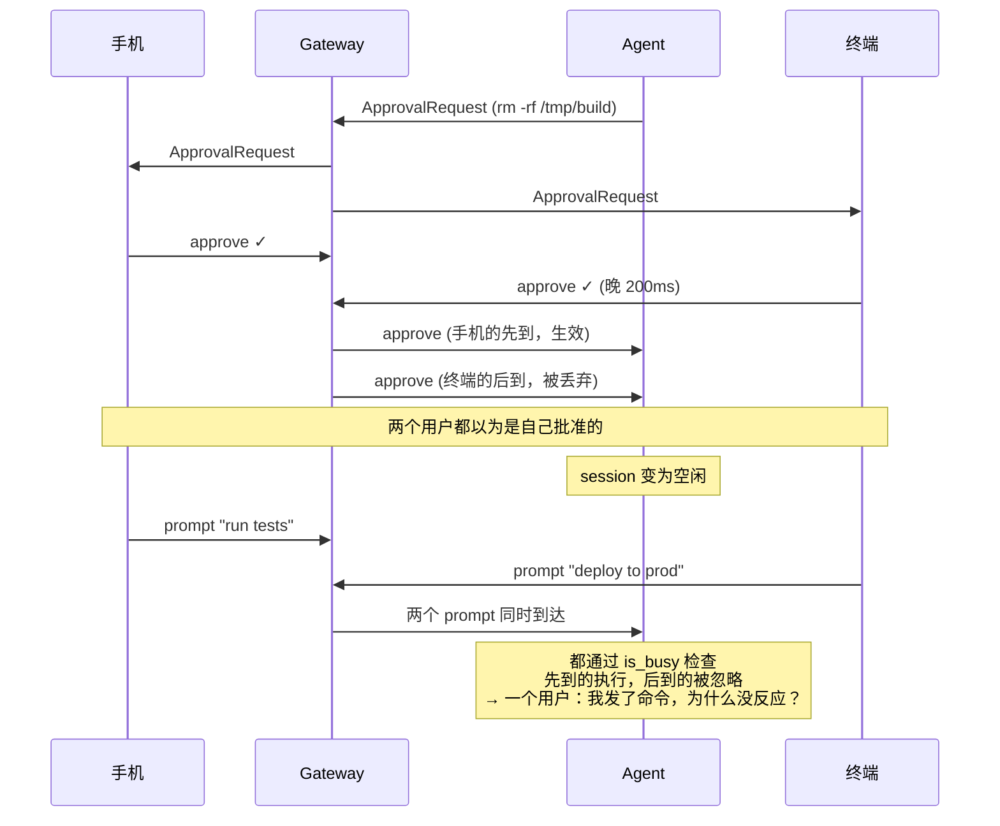
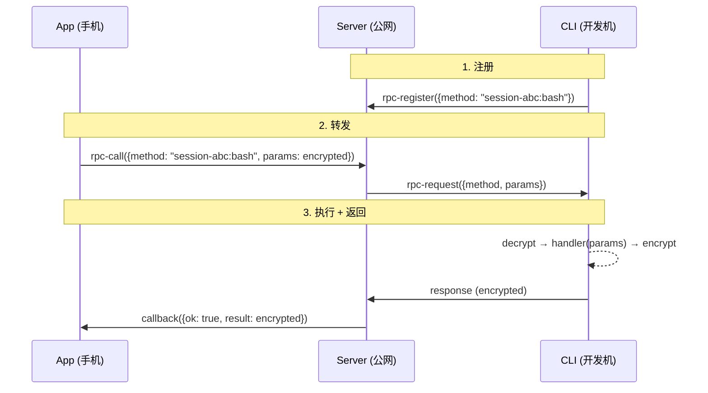
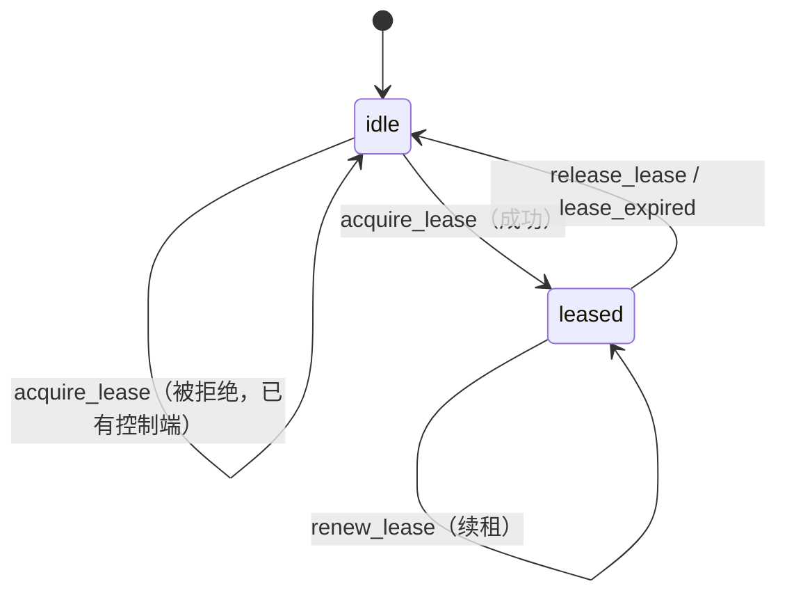
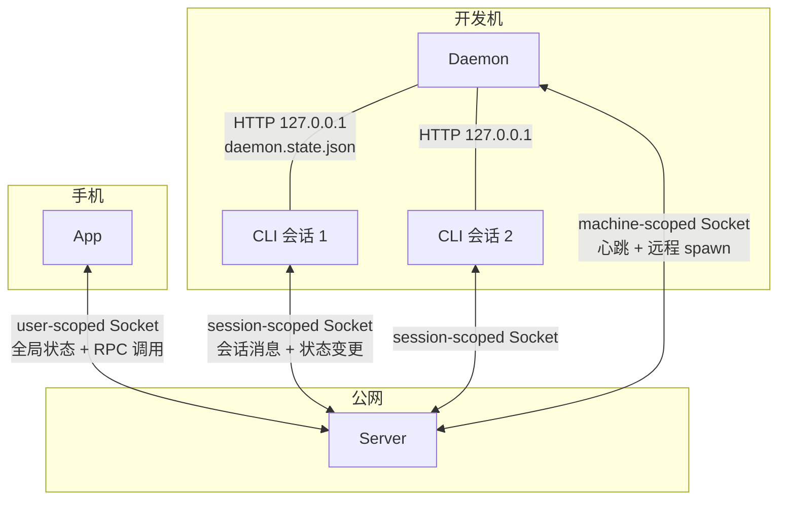
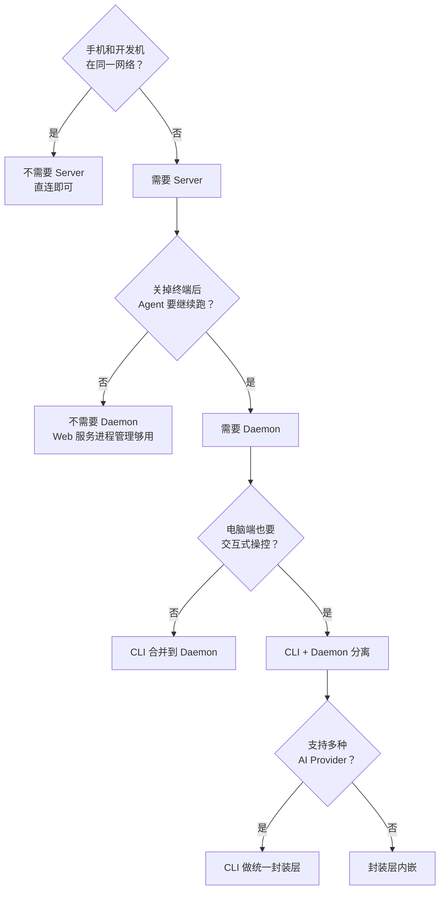

# 从一个 WebSocket 到四个组件：多端操控 AI Coding CLI 的架构演化

手机远程操控电脑上的 AI Coding CLI，直觉上只需一个 WebSocket。CLI 在电脑上跑着，手机连上去，发消息，收输出，结束。

Kimi CLI 的 Web UI 做到了这一步。执行 `kimi web`，本地起一个 HTTP + WebSocket 服务，浏览器打开就能用。底层 Wire 协议（JSON-RPC 2.0）支持多个 WebSocket 客户端同时接入，消息通过 `BroadcastQueue` 广播给所有订阅者。手机套个 WebView 就行了？

但 Happy 项目把同样的需求拆成了四个独立组件：CLI、Daemon、Server、App。四个进程，三种 Socket 连接类型，一套 RPC 转发机制，外加端到端加密（E2EE）。

为什么？

这篇文章用两个真实项目的源码回答。从最简的直连方案开始，每遇到一个绕不过去的约束就加一个组件。四层方案逐层淘汰，最终会发现：四组件不是过度设计，而是五个硬约束逐层叠加的必然结果。

读完后能得到：

1. 每个组件存在的「不可替代的理由」，以及没有它会怎样
2. Happy 和 Kimi CLI 在消息路由、进程管理、控制权协调上的关键设计细节
3. 一棵决策树，根据自己的场景判断需要几个组件、哪些可以省
4. 现有 Wire 协议哪些能复用、哪些必须新增的分层分析

**阅读路线**：

- 只想知道为什么不是一个 WebSocket → 第 1 节 + 小结
- 想理解 Happy 的核心机制 → 第 4 节（scope / RPC / 租约 / E2EE）+ 第 5 节（Daemon）
- 想设计自己的远程操控系统 → 第 6.3 节（五维度扫描）+ 小结决策树
- 想做协议复用 / 迁移评估 → 第 7 节

---

## 1. 五个硬约束

拆解方案之前，先定义检验标准。「手机远程操控电脑上的 AI Coding CLI」拆成五个约束：

| # | 约束 | 含义 |
|---|------|------|
| C1 | 跨网可达 | 手机在 4G/5G，开发机在 NAT 后面，两者能通信 |
| C2 | 多端一致 | 手机和电脑看到的会话状态完全一致 |
| C3 | 控制权互斥 | 同一时刻只有一个终端控制 Agent |
| C4 | 会话独立于前端 | 关掉手机或终端，Agent 继续跑，重新打开能接上 |
| C5 | 安全 | 至少有认证，理想情况下 E2EE |

### 为什么是这五个

这张表是**逐步证伪**得到的，从最简方案开始，每一步找一个打破它的场景，被迫加一个组件，直到没有场景能打破：

```
起点：手机直连电脑（一个 WebSocket）
  │
  ├─ "手机 4G，电脑在家 WiFi" → 连不上 → 需要公网中继
  │
  ├─ "手机和电脑同时连上" → 消息顺序不一致 → 中继要理解协议、做排序
  │
  ├─ "两个客户端同时发 prompt" → 谁算数？→ 要有人仲裁控制权
  │
  ├─ "关掉终端窗口" → Agent 跟着死了 → 需要独立的常驻进程
  │
  └─ "在电脑上也想交互式操作" → 常驻进程没有 TTY → 需要额外的交互前端
```

这个拆解有三个性质：

1. **每个约束都有反例**。删掉任何一个，都能构造一个具体的故障场景，后面四节逐一展示。
2. **约束之间有依赖序**。讨论「控制权互斥」的前提是「多端已连上」，讨论「多端连接」的前提是「网络可达」。链条是：网络可达 → 多端共存 → 多端冲突 → 进程生命周期 → 交互模式分离。每一层的问题，只有前一层解决后才会暴露。
3. **每个约束恰好淘汰一种方案**。没有两个约束淘汰同一种方案，没有冗余。

「从最简开始，被失败逼着加组件」的方法有一个跨越八百年的同构案例：英国普通法。不是一次性写出完美法典，而是每次新型案件暴露旧规则的不足，法官被迫创造新判例。每条规则指向一次真实的失败，和每个组件指向一个具体的约束是同一套逻辑。更贴身的版本：搬进新家三个月，家里每件东西都对应一个真实的不便，没有一件多余。

后面每种方案都用这五个约束打分。

---

## 2. 第一层：App 直连 Web UI

### 2.1 Kimi CLI 的现有能力

Kimi CLI 已具备外部 UI 接入的基础设施。执行 `kimi web`，本地起一个 FastAPI 服务，浏览器通过 WebSocket 连接 Wire 协议与 Agent 内核交互。

底层消息分发采用 SPMC（Single Producer, Multiple Consumer）广播队列：

```python
# kimi-cli/src/kimi_cli/utils/broadcast.py
class BroadcastQueue[T]:
    def __init__(self) -> None:
        self._queues: set[Queue[T]] = set()

    def subscribe(self) -> Queue[T]:
        queue: Queue[T] = Queue()
        self._queues.add(queue)
        return queue

    def publish_nowait(self, item: T) -> None:
        for queue in self._queues:
            queue.put_nowait(item)
```

每个 WebSocket 客户端调用 `subscribe()` 获得自己的队列，Agent 内核每产生一条消息就通过 `publish_nowait` 广播给所有订阅者。多个客户端可以同时观看同一个会话的输出。

新客户端中途加入时，`SessionProcess` 用缓冲机制衔接历史回放和实时消息：

```python
# kimi-cli/src/kimi_cli/web/runner/process.py:526-538
async def _broadcast(self, message: str) -> None:
    async with self._ws_lock:
        to_send: list[WebSocket] = []
        for ws in self._websockets:
            buffer = self._replay_buffers.get(ws)
            if buffer is not None:
                buffer.append(message)   # 正在回放历史：缓冲实时消息
            else:
                to_send.append(ws)       # 已进入实时：直接发送
    for ws in to_send:
        await ws.send_text(message)
```

正在回放 `wire.jsonl` 历史的客户端，实时消息暂存到 `_replay_buffers`。回放结束后 flush 缓冲区，无缝切到实时流，保证中途加入不丢消息。

### 2.2 卡在哪里

**C1 跨网失败**。Web 服务默认绑定 `127.0.0.1`，加 `--network` 后绑 `0.0.0.0`，但开发机仍在 NAT 后面。手机在 4G 网络上找不到这台机器。用户需要自己搞 Tailscale 或 ngrok，不是产品化方案。

**C3 控制权失败**。Wire 协议的请求响应是 1:1 的。Agent 发出 `ApprovalRequest` 时，请求放进一个全局字典：

```python
# kimi-cli/src/kimi_cli/wire/server.py:75-76
self._pending_requests: dict[str, Request] = {}
"""Maps JSON RPC message IDs to pending Requests."""
```

这正是 C3 失败的根源：字典没有客户端隔离。两个 WebSocket 同时连接时，都能看到同一个 `ApprovalRequest`，都能响应，谁先回复谁生效。两个客户端还可以在会话空闲时同时发 prompt，`is_busy` 检查不起作用。

**C4 会话独立失败**。Worker 子进程的生命周期绑定在 FastAPI 服务上：

```python
# kimi-cli/src/kimi_cli/web/app.py:168-186
@asynccontextmanager
async def lifespan(app: FastAPI):
    runner = KimiCLIRunner()
    app.state.runner = runner
    runner.start()
    try:
        yield
    finally:
        await runner.stop()  # Web 服务关闭 → 所有 Worker 子进程被杀
```

关掉终端窗口，Web 服务退出，`runner.stop()` 杀死所有 Worker 子进程，会话丢失。

| 约束 | 直连方案 |
|------|:---:|
| C1 跨网 | ❌ |
| C2 多端一致 | ⚠️ 广播可用，无协调 |
| C3 控制权 | ❌ |
| C4 会话独立 | ❌ |
| C5 安全 | ⚠️ Token，无 E2EE |

---

## 3. 第二层：Web UI + Gateway

最直觉的补救：在 Web UI 前加一层反向代理（Caddy、nginx、Cloudflare Tunnel），解决网络可达和 TLS 终止。

```
iPhone ──HTTPS/WSS──▶ Gateway（公网） ──HTTP/WS──▶ 开发机 kimi web
```

C1 跨网解决了，C5 传输层加密有了。但 Gateway 只是管道，不理解 Wire 协议语义：

- **C2 多端一致**：Gateway 透明转发，没有人协调消息顺序
- **C3 控制权**：Gateway 不知道谁是控制端，两个客户端仍可同时发 prompt
- **C4 会话独立**：Worker 仍绑在 Web 服务进程上，Gateway 管不了进程生命周期

两个客户端通过 Gateway 同时连接时的冲突场景：



Gateway 忠实转发了每条消息，但它不知道谁该说话、谁该等待。

Gateway 部署在第三方时，它作为中间人能看到所有明文，代码、对话、工具调用参数对第三方完全透明。

| 约束 | 直连 | +Gateway |
|------|:---:|:---:|
| C1 跨网 | ❌ | ✅ |
| C2 多端一致 | ⚠️ | ❌ |
| C3 控制权 | ❌ | ❌ |
| C4 会话独立 | ❌ | ❌ |
| C5 安全 | ⚠️ | ⚠️ TLS only |

**常见替代方案为什么不够**：

| 方案 | 解决了什么 | 没解决什么 | 代价 |
|------|-----------|-----------|------|
| SSH 隧道 + tmux | C1 跨网、C4 会话独立 | C2 多端协调、C3 控制权仲裁 | 手机上没有 SSH 终端体验；需暴露 SSH 端口 |
| VPN（Tailscale） | C1 跨网 | C2-C5 全部 | 退回直连方案，只解决网络层 |
| WebRTC P2P | C1 跨网（打洞） | C4 无常驻进程管理 | 打洞成功率不稳定；TURN fallback 等于回到 Server 方案 |

每种方案都只解决约束链的一两环，剩下的约束不会消失，只是被推迟。

---

## 4. 第三层：有状态的 Server

把 Gateway 升级为「理解业务语义的 Server」。这是 Happy 架构中最重量级的组件。

### 4.1 三种 Socket Scope

Happy Server 不是简单地广播消息给所有连接。每个 Socket.IO 连接在握手时声明类型，Server 按类型分发：

```typescript
// happy-server/sources/app/api/socket.ts:37-40
const clientType = socket.handshake.auth.clientType
    as 'session-scoped' | 'user-scoped' | 'machine-scoped' | undefined;
const sessionId = socket.handshake.auth.sessionId as string | undefined;
const machineId = socket.handshake.auth.machineId as string | undefined;
```

验证通过后，Server 按 `clientType` 构建连接对象并注册到 `eventRouter`：

```typescript
// happy-server/sources/app/api/socket.ts:78-100
if (metadata.clientType === 'session-scoped' && sessionId) {
    connection = { connectionType: 'session-scoped', socket, userId, sessionId };
} else if (metadata.clientType === 'machine-scoped' && machineId) {
    connection = { connectionType: 'machine-scoped', socket, userId, machineId };
} else {
    connection = { connectionType: 'user-scoped', socket, userId };
}
eventRouter.addConnection(userId, connection);
```

三种 scope 各有职责：

| Scope | 使用者 | 接收 | 发送 |
|-------|--------|------|------|
| user-scoped | App / Web | 全局更新（会话列表、机器状态） | ping、usage 上报 |
| session-scoped | CLI 会话进程 | 特定会话的消息更新 | 消息、状态变更 |
| machine-scoped | Daemon | 机器级指令、RPC 请求 | 心跳、在线状态 |

手机打开某个会话时只订阅该会话的流，不会收到其他会话的消息。比 Kimi Web UI 的「所有消息广播给所有客户端」精细得多。

### 4.2 RPC：为什么消息流不够

消息流是 fire-and-forget 的，Server 推 update 给订阅者，不等回复。但有些操作需要同步等待响应：中止当前 turn、批准权限请求、远程执行 bash 命令并拿到输出。

Happy 在 Socket.IO 上实现了一套 RPC 转发，核心链路三步：



Server 全程只做 socket 到 socket 的盲转发，看不到 `params` 和 `result` 的明文。

**注册**。CLI 会话启动时，通过 `RpcHandlerManager` 向 Server 注册能处理的方法：

```typescript
// happy-cli/src/api/rpc/RpcHandlerManager.ts:36-47
registerHandler<TRequest, TResponse>(
    method: string, handler: RpcHandler<TRequest, TResponse>
): void {
    const prefixedMethod = this.getPrefixedMethod(method);
    this.handlers.set(prefixedMethod, handler);
    if (this.socket) {
        this.socket.emit('rpc-register', { method: prefixedMethod });
    }
}
```

方法名带 `sessionId` 前缀（如 `session-abc:bash`），Server 用它路由。

**转发**。App 发 `rpc-call`，Server 查找目标 socket 并转发：

```typescript
// happy-server/sources/app/api/socket/rpcHandler.ts:67-114（简化）
socket.on('rpc-call', async (data, callback) => {
    const { method, params } = data;
    const targetSocket = rpcListeners.get(method);
    if (!targetSocket || !targetSocket.connected) {
        callback({ ok: false, error: 'RPC method not available' });
        return;
    }
    if (targetSocket === socket) {
        callback({ ok: false, error: 'Cannot call RPC on the same socket' });
        return;
    }
    const response = await targetSocket.timeout(30000)
        .emitWithAck('rpc-request', { method, params });
    callback({ ok: true, result: response });
});
```

**执行**。CLI 侧解密参数、调用 handler、加密响应返回：

```typescript
// happy-cli/src/api/rpc/RpcHandlerManager.ts:55-79（简化）
async handleRequest(request: RpcRequest): Promise<any> {
    const handler = this.handlers.get(request.method);
    const decryptedParams = decrypt(this.encryptionKey,
        this.encryptionVariant, decodeBase64(request.params));
    const result = await handler(decryptedParams);
    return encodeBase64(encrypt(this.encryptionKey,
        this.encryptionVariant, result));
}
```

`params` 和返回值都是加密的 base64 字符串，即使 Server 被攻破，攻击者拿到的也只是密文。

**E2EE 的保护边界**：

| | 被保护 | 未被保护 |
|---|--------|---------|
| 内容 | 对话文本、代码、工具调用参数、Agent 输出 | — |
| 元数据 | — | 谁连了谁、`session` ID、消息时间戳和大小 |
| 前提 | 密钥由客户端生成，不经过 Server | 设备被入侵后密钥泄露；登录凭证被盗后的会话劫持 |

E2EE 保护的是「Server 被攻破时的内容机密性」，不保护客户端本身被攻破的场景，也不隐藏流量模式。

### 4.3 乐观并发控制

多个客户端同时修改会话状态时，Happy 用乐观并发防止互相覆盖：

```typescript
// happy-cli/src/api/apiSession.ts:553-575（简化）
const answer = await this.socket.emitWithAck('update-state', {
    sid: this.sessionId,
    expectedVersion: this.agentStateVersion,
    agentState: encodeBase64(encrypt(this.encryptionKey,
        this.encryptionVariant, updated))
});
if (answer.result === 'version-mismatch') {
    this.agentStateVersion = answer.version;
    throw new Error('version mismatch'); // 触发 backoff 重试
}
```

客户端更新时带上 `expectedVersion`，Server 检查版本一致性，不一致就拒绝，客户端拿到最新版本后重试。

Happy 追求**观察一致**（observational consistency）：所有端在任意时刻查询同一个会话，看到的 `agentState` 相同。不是最终一致（不容忍短暂不一致窗口），也不是强一致（不需要分布式事务）。OCC 的 `expectedVersion` 是实现手段，写操作带版本号，Server 做单点仲裁，冲突时拒绝而非合并。选观察一致而非最终一致，是因为 AI Coding 场景下，两个用户看到不同的 Agent 状态会直接导致操作冲突。

### 4.4 控制权租约

多端连上 Server 后，谁发 prompt、谁批准 `ApprovalRequest`？Happy 用控制权租约解决。

**状态机**：



**规则**：

- 同一会话同一时刻只有一个 `lease` 控制端
- `lease` 有超时，靠心跳续租。控制端断线后自动过期
- 非控制端只能观看输出，不能发 prompt 或响应 `ApprovalRequest`
- 控制端可主动释放，让另一个客户端获取控制权

**客户端行为**：

| 场景 | 控制端 | 非控制端 |
|------|--------|-----------|
| Agent 输出 | 正常显示 | 正常显示 |
| ApprovalRequest | 弹出批准 UI | 显示「等待控制端批准」 |
| 想发 prompt | 正常发送 | 提示「先获取控制权」 |
| 断线 | `lease` 超时后自动释放 | 不影响 |

**边界情况：split-brain**。网络分区时，控制端和 Server 断连，但本地仍认为自己持有 `lease`。Server 侧 `lease` 超时后释放，另一个客户端可以获取。原控制端重连后发现 `lease` 已失效，需重新获取。关键原则：**Server 是唯一仲裁者**，客户端本地的 `lease` 状态只是缓存，Server 的判定才算数。

### 4.5 Server 还缺什么

Server 解决了 C1（跨网）、C2（单一数据源 + 版本化）、C3（控制权租约）、C5（E2EE + 盲转发）。

但 C4 仍然失败。问题在开发机那端：谁管 Agent 进程？用户关掉终端窗口，CLI 退出，会话断了。Server 协调了多端通信，但管不了远端机器上的进程生命周期。需要一个在开发机上**常驻**的进程。

---

## 5. 第四层：Daemon + CLI 分离

### 5.1 Daemon 的三个职责

Daemon 是 Happy 在开发机上的常驻后台进程，不做 AI 推理，只做三件事：

1. **管理会话子进程**。维护 `pidToTrackedSession` Map，跟踪每个会话的 PID、`sessionId`、启动方式。
2. **接收远程 spawn**。手机点「新建会话」，Server 转发，Daemon 启动 CLI 子进程。
3. **维护机器身份**。通过 machine-scoped Socket 保持心跳，上报在线状态。

Daemon 启动时的初始化逻辑体现了这三个职责：

```typescript
// happy-cli/src/daemon/run.ts:145-168
const daemonLockHandle = await acquireDaemonLock(5, 200);
if (!daemonLockHandle) {
    process.exit(0); // 已有 Daemon 在运行
}
const { credentials, machineId } = await authAndSetupMachineIfNeeded();
const pidToTrackedSession = new Map<number, TrackedSession>();
```

先获取排他锁（唯一性），再建立机器身份（职责 3），最后初始化会话跟踪表（职责 1）。

### 5.2 排他锁

一台机器只能有一个 Daemon。Happy 用文件系统原子操作实现排他锁：

```typescript
// happy-cli/src/persistence.ts:556-597（简化）
async function acquireDaemonLock(maxAttempts, delayIncrementMs) {
    for (let attempt = 1; attempt <= maxAttempts; attempt++) {
        try {
            const fileHandle = await open(configuration.daemonLockFile,
                constants.O_CREAT | constants.O_EXCL | constants.O_WRONLY);
            await fileHandle.writeFile(String(process.pid));
            return fileHandle;
        } catch (error) {
            if (error.code === 'EEXIST') {
                const lockPid = readFileSync(configuration.daemonLockFile, 'utf-8');
                try {
                    process.kill(Number(lockPid), 0); // 信号 0：只检查进程是否存在
                } catch {
                    unlinkSync(configuration.daemonLockFile); // 进程已死，清理
                    continue;
                }
            }
            await new Promise(r => setTimeout(r, attempt * delayIncrementMs));
        }
    }
    return null;
}
```

`O_CREAT | O_EXCL` 在文件系统层面原子，不存在 TOCTOU 竞态。锁文件写 PID，用 `kill(pid, 0)` 检测死进程，信号 0 不杀进程，只验证是否存在。

### 5.3 Control Server：本地 IPC

Daemon 在 `127.0.0.1` 上起一个 HTTP 服务，端口号写入 `daemon.state.json`。CLI 读取这个文件找到 Daemon：

| 端点 | 用途 |
|------|------|
| `POST /session-started` | CLI 会话启动后上报 `sessionId` |
| `POST /list` | 列出所有活跃会话 |
| `POST /spawn-session` | 创建新会话（手机远程触发） |
| `POST /stop` | 优雅关闭 Daemon |

CLI 和 Daemon 通过 HTTP 解耦，不共享内存，不做进程间直接调用。

### 5.4 为什么 CLI 和 Daemon 不能合并

这是最容易引发困惑的拆分。根源在于进程模型不兼容：

| 特征 | CLI | Daemon |
|------|-----|--------|
| 生命周期 | 敲一次命令，跑完退出 | 开机启动，永久常驻 |
| stdio | 需要 TTY（键盘输入 + 终端渲染） | 无 TTY（detached, stdio: ignore） |
| 并发 | 一次一个会话 | 同时管理多个会话 |
| 启动方式 | 用户手动执行 | 自动启动（launchd / systemd） |
| Socket scope | session-scoped | machine-scoped |

让 CLI 常驻意味着放弃 TTY，但本地交互需要 TTY 读键盘、渲染 UI。让 CLI 后台 fork 自己，stdin/stdout 断裂，本地交互无法继续。

Happy 让 CLI 首次运行时自动 spawn Daemon：

```typescript
// happy-cli/src/index.ts:327-334
if (!(await isDaemonRunningCurrentlyInstalledHappyVersion())) {
    const daemonProcess = spawnHappyCLI(['daemon', 'start-sync'], {
        detached: true,    // 独立于 CLI
        stdio: 'ignore',   // 不继承 TTY
        env: process.env
    });
    daemonProcess.unref(); // CLI 退出后 Daemon 继续活着
}
```

`detached: true` + `stdio: 'ignore'` + `unref()`：三行配置把 Daemon 变成独立后台进程。CLI 保持「敲一次命令跑完就退」的 Unix 哲学。

### 5.5 全部满足

| 约束 | 直连 | +Gateway | +Server | +Daemon |
|------|:---:|:---:|:---:|:---:|
| C1 跨网 | ❌ | ✅ | ✅ | ✅ |
| C2 多端一致 | ⚠️ | ❌ | ✅ | ✅ |
| C3 控制权 | ❌ | ❌ | ✅ | ✅ |
| C4 会话独立 | ❌ | ❌ | ❌ | ✅ |
| C5 安全 | ⚠️ | ⚠️ | ✅ | ✅ |

四组件的完整拓扑：



三种 Socket scope 各走各的通道：App 通过 user-scoped 看全局、发 RPC，CLI 通过 session-scoped 收发会话消息，Daemon 通过 machine-scoped 维持心跳和接收远程 spawn。CLI 和 Daemon 之间通过本地 HTTP 解耦。

---

## 6. 架构师视角：从零设计会怎样

### 6.1 三组件方案

只针对 Kimi CLI（单一 Provider）时，四组件可以缩减为三个：

```
Client（iOS / Web）
    ↕ WSS + E2EE
Relay Server（路由 + 认证 + 存储）
    ↕ WSS + E2EE
Agent（开发机常驻 = Daemon + Provider Wrapper）
```

把 CLI 和 Daemon 合并成一个二进制：

- `kimi-remote agent start` → 常驻进程（Daemon 角色）
- `kimi-remote agent attach` → 终端 attach 到某个会话（CLI 角色）

Happy 拆出独立 CLI 是因为要统一封装 Claude Code、Codex、Gemini 三种 Provider，每种输出格式不同，需要映射层转成统一的 9 种事件。Kimi CLI 只有一个 Provider，这层封装可以内嵌。

### 6.2 不可省略的部分

无论怎么简化：

- **Server 不可省**。它解决物理约束：NAT 穿透和多端一致性。只要手机和开发机不在同一网络，就需要双方都能访问的中继。
- **Daemon 不可省**。它解决进程约束：会话生命周期独立于前端。只要「关掉终端后 Agent 继续跑」是需求，就需要常驻进程。

组件数量是约束数量的函数。放宽约束可以减少组件：

| 放宽的约束 | 可省略 | 代价 |
|-----------|--------|------|
| 不需要跨网 | Server | 失去公网可达 |
| 不需要本地终端交互 | CLI（合并到 Agent） | 回到电脑时无法在终端继续 |
| 只有一个 Provider | Provider 封装层 | 不影响功能 |
| Server 自己部署 | E2EE | 安全性自己负责 |

### 6.3 约束推导方法：五维度扫描

上面的约束列表怎么推导出来的？靠一个固定的扫描清单。

面对任何远程操控场景，画出最简架构（两个节点一条线），按五个维度依次提问：

| 维度 | 问的问题 | 答案为「是」时产生的约束 |
|------|---------|----------------------|
| 网络 | A 能直接找到 B 吗？ | 跨网可达 |
| 一致性 | 多个观察者看到的状态一样吗？ | 多端状态一致 |
| 并发 | 多个操作者同时动手会冲突吗？ | 控制权互斥 |
| 生命周期 | UI 挂了，后台任务也死吗？ | 会话独立于前端 |
| 交互模式 | 所有用户用同一种界面吗？ | CLI / Daemon 分离 |

五个维度从物理层到应用层排列，先解决低层问题再考虑高层。每个维度用同一个问题检验：**不处理的话，能构造出什么灾难场景？** 能构造出来 → 硬约束。构造不出来 → 软偏好，可以延后。

以「控制权互斥」为例：多端连上后，能不能不做互斥，让用户先后操控？可以，`lease` 机制本质上就在实现「先后操控」。但**谁来保证先后**？没有 Server 维护 `lease`，两个客户端都认为自己是控制端，同时发 prompt，Agent 收到矛盾指令。约束不是「要不要互斥」，而是「谁来仲裁」。

这个方法的原型是航空业的起飞前检查清单。1935 年，波音 Model 299（B-17 原型）试飞坠毁，原因是试飞员忘记释放升降舵锁，飞机太复杂，超出了一个人的记忆力极限。波音发明了检查清单。五维度扫描解决同一个问题：不是给新手用的拐杖，是给专家用的认知外骨骼。

日常版本：旅行前拍脑袋收拾行李，带三件外套却忘充电器。架构设计中「WebSocket 能不能连上」是外套，「关掉终端后会话还在不在」是充电器。

### 延伸练习

把这个方法用在一个新场景上：**设计一个「手机远程操控家里电脑 Docker 容器」的系统**，手机上启动/停止容器、查看日志、执行命令。

1. 画出最简架构
2. 按五个维度扫描，每个维度构造一个灾难场景
3. 对每个灾难场景决定加什么组件
4. 和 Happy 的四组件对比：哪些一样？哪些不需要？为什么？

写不出灾难场景的维度，恰好说明那个约束在这个场景下不存在，这本身就是有价值的结论。

---

## 7. Wire 协议能复用吗：分层拆解

Kimi CLI 的 Web UI 已有 Wire 协议（JSON-RPC 2.0）和 `BroadcastQueue`，远程方案能直接复用还是推翻重来？

答案是**按层看**。

### 7.1 三层拆解

把 Wire 协议拆成三层，逐层评估：

| 层 | 包含什么 | 能复用吗 | 理由 |
|----|---------|---------|------|
| 应用语义层 | 17 种事件类型 + 2 种请求类型 + WireMessageEnvelope 格式 | ✅ 100% 复用 | 消息的含义不因传输方式改变 |
| 会话管理层 | 客户端身份、消息排序、请求匹配、控制权、心跳 | ❌ 需要新增 | 本地方案没有这一层 |
| 传输层 | stdio 管道、localhost WebSocket | ⚠️ 替换 | 从本地换成公网 WSS + 中继 |

关键发现：Wire 协议目前**只有两层**（应用语义 + 传输），会话管理层是空的。这不是设计缺陷，本地场景不需要，但远程场景必须补上。

### 7.2 应用语义层：直接搬

Wire 定义的事件类型是纯业务语义，不绑定传输假设：`TurnBegin`/`TurnEnd` 标记对话边界，`ContentPart` 承载流式输出，`ToolCall`/`ToolResult` 处理工具调用，`ApprovalRequest` 请求用户批准。无论走 stdio、localhost WebSocket 还是公网 WSS 中继，这些消息格式都不需要改。

`BroadcastQueue` 的 SPMC 模式也可复用。Server 收到 Agent 消息后，用同样的「一个生产者、多个消费者」模式广播给同一会话的所有订阅者。

### 7.3 会话管理层：必须新增

这是最大的工作量。本地方案有三个隐含假设，远程场景下全部失效：

**假设 1：只有一个客户端**。`_pending_requests` 是全局字典，没有客户端隔离：

```python
# wire/server.py — 当前
self._pending_requests: dict[str, Request] = {}
```

远程场景需要按会话隔离，同一个 `ApprovalRequest` 只能由当前控制端响应。

**假设 2：消息天然有序**。stdio 是单流，到达顺序就是发送顺序。公网 WebSocket 经中继后可能乱序。需要在每条消息上加 `seq`：

```python
# 远程方案需要
{"seq": 42, "session_id": "abc", "message": {...}}
```

Happy 的 `CoreUpdateContainer` 正是这样做的，每条 update 带 `id`（去重）和 `seq`（排序）。

**假设 3：连接不会断**。stdio 管道在进程活着时永远不断。公网连接随时可能断（WebSocket 断开、App 后台挂起、Server 重启），需要心跳检测和断线重连后的状态同步。

**最小可用的重连策略**：客户端维护 `lastSeenSeq`，重连后发送 `{"resume": true, "lastSeenSeq": 41}`，Server 从事件日志中找到 `seq` > 41 的消息重放。事件日志已滚动时，回退到全量快照 + 从快照版本订阅增量。去重靠 `seq` 单调递增，客户端忽略 `seq` ≤ `lastSeenSeq` 的消息。Wire 的 JSONL 文件格式可以作为回放源，Kimi CLI 的 `_replay_buffers` 机制可以复用。

「会话管理层」工作量最大的原因在此：不只是加几个字段，而是一套完整的断线恢复协议。

### 7.4 传输层：整体替换

从 stdio 管道换成 WSS + 中继 Server，这是基础设施变更。`asyncio.Future`（本地等待请求响应）不能跨网络传递，需要替换为带超时的回调机制。Happy 的 `emitWithAck` + 30 秒超时就是一种实现。

### 7.5 结论：六成复用，四成新增

| 工作项 | 工作量 | 复用率 |
|--------|--------|--------|
| 消息类型定义（17 + 2） | 零 | 100% |
| 序列化格式（JSON-RPC 2.0） | 零 | 100% |
| `BroadcastQueue` / 回放机制 | 小 | 80% |
| 会话管理（身份 / 排序 / 心跳） | 大 | 0%（新增） |
| 控制权租约 | 中 | 0%（新增） |
| 传输层替换（stdio → WSS） | 中 | 0%（替换） |

不需要推翻重来，也不能原样照搬。应用语义层完整复用，会话管理层从零新增，传输层整体替换。

### 7.6 分层复用的 mindset

上面的分析用的思维方式是**按层拆解，逐层判断**。面对「现有系统迁移到新环境」，不陷入「推翻重来」和「原样复用」的二元争论，而是拆成层，每层独立评估。

这个方法有一个跨越 150 年的同构案例：明治维新。不是全盘西化，也不是完全拒绝。伊藤博文按层拆解：军事技术层→全面引进西方模式（传输层替换）。行政制度层→选择性改造，学普鲁士而非英法，因为普鲁士的君主立宪更兼容天皇制（会话管理层重新设计）。文化认同层→保留天皇制和神道教（应用语义层复用）。

日常版本：换城市工作。衣服直接搬，不绑定城市。健身房重新办卡，会员绑定旧的地理位置。朋友关系继续维护，但方式从线下聚餐变为线上联系，复用关系本身，替换承载渠道。

---

## 小结

回到开篇：手机远程操控 AI Coding CLI，为什么不是「一个 WebSocket」就能搞定？

五个约束逐层叠加，每个淘汰一种更简单的方案：

1. **NAT 穿透**淘汰了直连。手机找不到 NAT 后面的开发机，必须有公网中继（Server）
2. **多端一致性**淘汰了无状态 Gateway。Gateway 只转发不协调，两端状态可能不一致
3. **控制权互斥**要求 Server 理解协议语义。Gateway 不知道谁是控制端
4. **会话独立于前端**要求常驻进程。关掉终端不能杀死 Agent（Daemon）
5. **本地 + 远程并存**让 CLI 和 Daemon 无法合并。TTY 需求和 detached 后台进程模型冲突

Happy 的四组件恰好对应这五个约束。场景更简单时可以缩减到三组件，但 Server 和 Daemon 不可省，它们解决的是物理约束，不是设计偏好。

**判断自己需要几个组件**：



协议层面，Wire 协议不需要推翻：应用语义层 100% 复用，会话管理层从零新增，传输层整体替换。

文章用了三个可迁移的思维方法：

| 方法 | 核心动作 | 远镜类比 | 近镜类比 |
|------|---------|---------|---------|
| 逐步证伪法 | 从最简方案出发，用失败场景逼出组件 | 英国普通法：每条判例对应一次真实失败 | 搬新家：每件物品对应一个具体不便 |
| 五维度扫描法 | 按固定清单逐层检查「不处理会怎样」 | B-17 坠毁催生飞行检查清单 | 旅行打包：显眼物品挤占注意力 |
| 分层复用分析法 | 按层拆解，逐层判断复用/扩展/新增 | 明治维新按层判断西化程度 | 换城市：衣服搬走、健身房重办、朋友维护 |

三个方法对应架构设计的三个阶段：发现约束、梳理约束、迁移方案。
