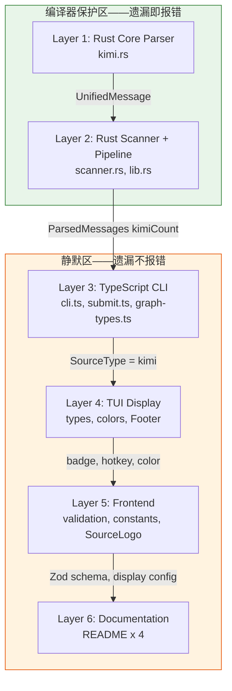
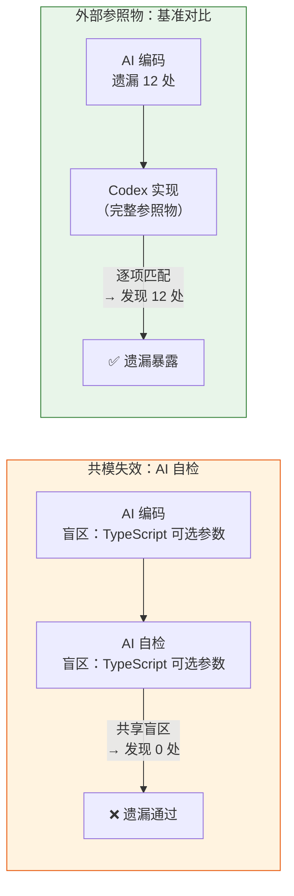
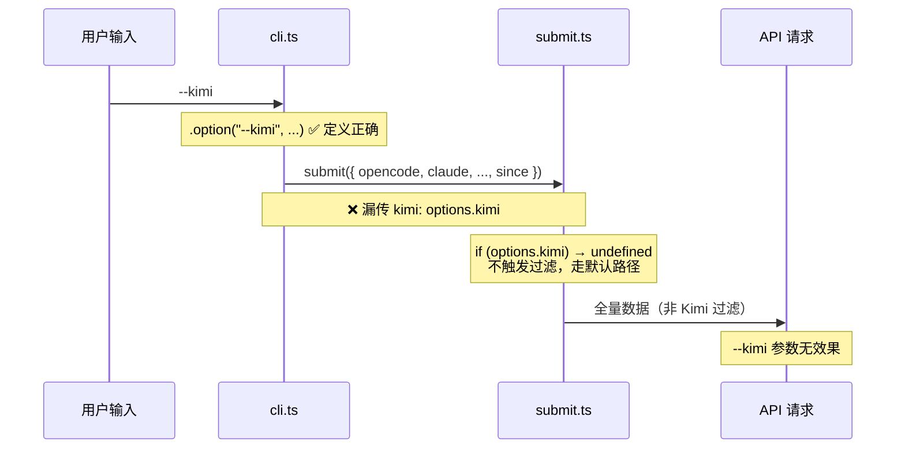
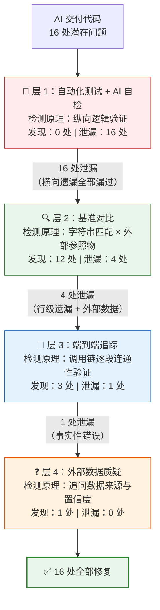

# 不要让 AI 批改自己的试卷 —— 一次 16 处遗漏的协作复盘

> [Tokscale](https://github.com/synaptic-dev/tokscale) 是一个开源的 AI 编程助手用量统计工具。它扫描本地各 AI 编程助手（Claude Code、Codex CLI、Gemini CLI 等）的会话文件，解析每次对话的 token 消耗量并汇总成本。技术上，Rust Core 负责解析各家助手的本地会话格式并提取 token 数据，TypeScript CLI/TUI/Frontend 负责过滤、展示和提交统计结果。

TypeScript 编译零错误，`clippy` 零 warning，CLI 返回正确数据。AI 报告「代码完成」。

`submit` 功能完全失效。前端校验拒绝含新数据源的提交请求。文档多处描述与代码不一致。这些问题在首轮验收中全部隐形——不是检查者忽略，而是现有验证手段从结构上无法触及。

测试全绿只证明覆盖了多少，不证明质量。一个新增枚举值需要在 26 个触点注册，约 8 个缺失会触发编译错误，剩余 18 个全部遗漏也编译照过、测试照绿，功能链路静默断裂在中间层。遗漏是一种 absence——在缺乏穷尽匹配约束的代码层中，absence 不报错。

本文解剖一个真实任务：为 Tokscale 添加第 10 个数据源（Kimi），28 个文件修改、约 300 行新增 Rust 代码、横跨 6 个架构层。AI 首轮交付后，第一轮验收发现 0 个问题，第二轮发现 12 处遗漏，第三轮追出 3 处——每一层用不同的验证方法捕获前一层的盲区。

本文同时复盘了每一轮验收背后的 Prompt——人类如何提问，直接决定了 AI 能暴露多少盲区。同一个 AI，面对不同的提问方式，交出的答案质量天差地别。

**读完本文你会了解**：测试全绿为什么不等于功能完整；四层互补的验收手段如何系统性地捕获遗漏；哪些 Prompt 策略有效、哪些无效；以及如何在设计阶段就预防大部分问题。

**各章节速览**：

- **多层架构中的「枚举值传播」问题**——问题是什么：26 个触点、6 层架构、编译器只保护其中 8 个
- **实现 Prompt 复盘**——AI 的完成度为什么跟着编译器走而非计划走，以及基准对比应前置到设计阶段
- **第一层 ~ 第四层**——四种验收手段的原理、实际 Prompt、发现了什么、漏掉了什么
- **从验收兜底到设计预防**——工作流和代码架构两个层面的预防策略
- **闭环**——三条可复述的原则 + 可直接复用的 Prompt 模板

---

## 多层架构中的「枚举值传播」问题

Tokscale 的架构分为 6 层，从底层的 Rust Core 解析器一直延伸到最上层的文档：



每新增一个数据源，6 层中共 26 个触点需要添加对应逻辑。以 `scanner.rs` 中的 `ScanResult` 为例，每个数据源各有一个文件列表字段：

```rust
#[derive(Debug, Default)]
pub struct ScanResult {
    pub opencode_files: Vec<PathBuf>,
    pub opencode_db: Option<PathBuf>,
    pub claude_files: Vec<PathBuf>,
    pub codex_files: Vec<PathBuf>,
    pub gemini_files: Vec<PathBuf>,
    pub cursor_files: Vec<PathBuf>,
    pub amp_files: Vec<PathBuf>,
    pub droid_files: Vec<PathBuf>,
    pub openclaw_files: Vec<PathBuf>,
    pub pi_files: Vec<PathBuf>,
    pub kimi_files: Vec<PathBuf>,    // ← 第 10 个数据源
}
```

这种模式下，`kimi_files` 需要出现在 `ScanResult` 的定义、`total_files()` 的求和、`all_files()` 的遍历、`scan_all_sources()` 的扫描和聚合等多处。仅 `scanner.rs` 一个文件就占 5 个触点。

26 个触点中，约 8 个遗漏会导致编译失败——`ScanResult` 缺字段、`SessionType` 缺枚举值（报 `non-exhaustive pattern`）、`ParsedMessages` 缺计数字段，编译器直接拦截。剩余约 18 个触点，遗漏后编译通过、测试通过，功能却不完整：`submit.ts` 的 `hasFilter` 不检查 `options.kimi`，`--kimi` 参数定义了但不生效；前端 `z.enum` 不包含 `"kimi"`，含 Kimi 数据的提交被校验拒绝。

26 个触点在各层的分布：

| 架构层 | 触点数 | 编译器保护 | AI 首轮完成 | 遗漏 | 发现层 |
|--------|-------|-----------|-----------|------|--------|
| Rust Core (L1-L2) | 8 | 全部强制 | 8 | 0 | — |
| TypeScript CLI (L3) | 6 | 部分（可选参数不强制） | 3 | 3 | 层2 + 层3 |
| TUI (L4) | 4 | 无 | 2 | 2 | 层2 |
| Frontend (L5) | 5 | 无 | 1 | 4 | 层2 |
| Docs (L6) | 3 | 无 | 0 | 3 | 层2 |
| **合计** | **26** | **~8** | **14** | **12** | |

加上第三层 3 处行级遗漏和第四层 1 处外部数据错误，总计 16 处修复。Rust 层零遗漏，TypeScript/Frontend/Docs 层遗漏集中。

---

## 实现 Prompt 复盘：计划的覆盖范围 ≠ 实现的覆盖范围

实现阶段的核心 Prompt 是一条探索性指令：

```
实现以下计划：为 Tokscale 添加 Kimi CLI 支持
[附带详细的技术方案、任务清单、验收标准]
```

Prompt 包含完整修改范围、6 层触点清单、可执行验收标准。但计划覆盖范围和实现覆盖范围是两回事——AI 实际交付中，Rust Core 层 8 个触点全部正确完成（`kimi.rs`、`scanner.rs`、`lib.rs`、`aliases.rs`），TypeScript/Frontend/Docs 层约 18 个触点只完成 6 个，遗漏 12 个。

分布并非随机——探索性 Prompt 的结构性局限在此：AI 的完成判定依赖环境反馈，而非计划清单。编译器在 Rust 端充当「隐形验收官」，`ScanResult` 缺字段就编译不过，`SessionType` 少枚举值就报 `non-exhaustive pattern`，AI 被迫补齐。TypeScript 端的可选类型（`kimi?: boolean`）和运行时校验（`z.enum`）不在编译期发出信号，遗漏照样通过，AI 停在「编译通过」的节点上。计划说「修改 28 个文件」，编译器只强制 8 个，AI 做到 14 个——多出 6 个靠上下文理解完成，但编译器反馈的有无仍是 Rust 100% vs TypeScript 大量遗漏的最显著分界。剩余 12 个触点靠人类验收发现。

回头看，这是最值得反思的决策点。第二轮验收用基准对比一次性发现 12 处遗漏——但同样的方法完全可以前移到方案设计阶段。新增 provider 本质上是「在已有 provider 的所有出现位置添加新值」，`grep` 穷举出现位置就能生成触点清单。前移这一步，12 处遗漏大部分根本不会发生。具体做法见「工作流预防」一节。

---

## 第一层：自动化测试的天花板

AI 完成首轮实现后，跑完全套自动化验证，6 项检查全部通过：

```
$ cargo build          ✅  无 error
$ cargo test           ✅  169 passed, 0 failed
$ cargo clippy         ✅  0 new warning
$ bun run build:cli    ✅  TypeScript 编译通过
$ bun run cli -- sources
                       ✅  显示 Kimi CLI（674 messages）
$ bun run cli -- models --kimi --json
                       ✅  返回正确数据
```

这 6 项检查为什么没有发现 12 处遗漏？

编译器检查纵向的类型一致性，而非横向的传播完整性。`cargo build` 能检测 `ScanResult` 缺 `kimi_files`（引用不存在的字段则编译失败），但无法检测 `submit.ts` 的 `hasFilter` 是否包含 `options.kimi`——因为 `kimi` 在 `SubmitOptions` 中是可选的：

```typescript
interface SubmitOptions {
  opencode?: boolean;
  claude?: boolean;
  codex?: boolean;
  // ... 省略其他 source
  kimi?: boolean;      // ← 可选参数，不传 = undefined
  since?: string;
}
```

`cli.ts` 调用 `submit({...})` 时不传 `kimi: options.kimi`，TypeScript 不报错——不传等于 `undefined`，`hasFilter` 不触发，走默认路径。`--kimi` 参数存在但无效果，零运行时错误。

前端类似。`z.enum` 是运行时校验，只在提交 `source: "kimi"` 时触发。测试只走读取路径（`models --kimi --json`），不走提交路径，enum 少一项也不会发现。

```typescript
// source 字段的合法值全部硬编码在此——列表残缺即校验失败
source: z.enum(["opencode", "claude", "codex", "gemini", "cursor",
                "amp", "droid", "openclaw", "pi"]),
// ↑ 缺少 "kimi"，测试只走读取路径，从未触发这条校验
```

### SOP 自检 Prompt 的失效

测试全绿后，第一个直觉是让 AI 自检：

```
1. 代码完成了吗？
2. 你列的验收列表这里，完成情况如何，包括存量用例运行，以及新增的单元测试等等
3. 现在还有哪些没完成呢？请你检查下
```

AI 随后启动两个并行 Subagent 跑全量验证：`cargo test` + `cargo clippy` + 6 条 CLI 集成测试。结果：0 个结构性遗漏。

这个 Prompt 为什么失效？AI 的自检逻辑和实现逻辑共享同一个盲区——两者都沿纵向路径检查（能编译吗？测试能跑吗？），而不沿横向路径检查（`"kimi"` 是否出现在所有 26 个触点？）。用工程术语说，这是「共模失效」（common-mode failure）：审计者和被审计者共享同一套假设。但这不是 AI 能力的上限——换一种 Prompt（基准对比），同一个 AI 就能发现全部 12 处遗漏。问题不在 AI「看不到」，而在于没有外部参照物时，它不知道往哪里看。

两种模式的对比：



可选参数默默缺席、运行时校验从未触发——这两类遗漏需要不同的检测手段。自动化测试和 AI 自检都沿纵向工作：验证已有代码的行为，而非审计应有代码的存在。

---

## 第二层：基准对比法——以 Codex 为镜

Codex 已完整实现，Codex 出现的每个位置，Kimi 也需要出现：

```bash
# Rust 侧由编译器保证，遗漏集中在 TypeScript/Frontend 层
$ grep -rn '"codex"' packages/cli/src/ packages/frontend/src/
```

结果：一次性暴露 12 处遗漏。以 `validation/submission.ts` 为例，修复前后的对比：

```typescript
// 修复前——z.enum 缺少 "kimi"
source: z.enum([
  "opencode", "claude", "codex", "gemini", "cursor",
  "amp", "droid", "openclaw", "pi"
]),

// 修复后
source: z.enum([
  "opencode", "claude", "codex", "gemini", "cursor",
  "amp", "droid", "openclaw", "pi", "kimi"   // ← 修复点
]),
```

文件中两处 `z.enum`（`SourceContributionSchema` 和 `DataSummarySchema`）都遗漏了 `"kimi"`——用户提交含 Kimi 数据的报告时，Zod 校验在 `source` 字段失败，拦截请求或触发 400。其余遗漏分布在 `submit.ts`（4 处：类型定义、过滤逻辑、数组填充）、前端 `types.ts`、`constants.ts`、`SourceLogo.tsx` 和 README。

### 基准对比 Prompt 的设计逻辑

触发这轮发现的 Prompt：

```
以 Codex 作为基准，逐项列出所有修改点：
1. Core 解析链路：模块注册、扫描、计数、汇总
2. CLI 源类型与过滤：--codex、source union、默认 source 列表
3. TUI 交互与显示：source 类型、底部来源 badge、快捷键映射
4. Submit/社交链路：提交侧 source 过滤 + 服务端 schema 验证
5. 前端展示链路：frontend source type、名称/图标/颜色映射
6. 文档：来源列表、功能描述、筛选说明、Windows 路径表

反推 Kimi 是否一一对应。
```

这条 Prompt 是全流程中 ROI 最高的验收手段（一条指令发现 12 处遗漏）。它引入了外部参照物——Codex 的已有实现——绕过共模失效。「代码完整吗？」是主观判断题，AI 只能依赖自己的认知回答；「Codex 出现在这 6 个位置，Kimi 是否也出现？」是客观匹配题，AI 只需字符串搜索和逐项比对。

另一个设计细节：预先按功能域划分 6 个类别，而非「搜一下 codex 和 kimi 的对比」。分类框架引导 AI 在每个架构层逐项比对，避免找到几处后就停止搜索。12 处遗漏分布在 Submit、Frontend、Docs 三个功能域——没有分类框架，AI 可能发现 Submit 的 4 处后就报告「已修复」。

基准对比检测的不是「代码对不对」，而是「代码全不全」——参照物提供了「全」的标准。但它隐含一个假设：Kimi 在某个文件中出现了，就认为该文件完整。下一层打破了这个假设。

### 无基准可对照时的替代方案

没有同类功能可对照时，三种替代思路：

- **触点清单驱动**：预先列出新增功能需要出现的所有结构位置（类型定义、枚举值、配置映射、校验规则、文档），要求 AI 对每个位置给出文件路径 + 行号 + 修改片段。清单本身充当参照物。
- **结构位搜索**：`grep` 结构标记——`SourceType`、`z.enum`、`.option(`、`Record<`——找到所有需要包含新值的代码结构，逐个检查。
- **契约对比**：用 OpenAPI schema、TypeScript 接口定义或 Zod schema 作为完整性标准，对齐契约而非实现。

共同点：为 AI 提供外部参照，避免 AI 用自己的认知定义完整性。

---

## 第三层：端到端调用链追踪

基准对比修复 12 处后，`submit.ts` 内部已补齐。但追踪 `--kimi` 的完整数据流——调用链在中间断了：



两端各自正确，中段断裂：`cli.ts` 调用 `submit({...})` 时未传 `kimi: options.kimi`。

```typescript
// cli.ts submit 命令的 action（修复前）
await submit({
  opencode: options.opencode,
  claude: options.claude,
  codex: options.codex,
  gemini: options.gemini,
  cursor: options.cursor,
  amp: options.amp,
  droid: options.droid,
  openclaw: options.openclaw,
  pi: options.pi,
  // kimi: options.kimi,    ← 缺失
  since: options.since,
  until: options.until,
  year: options.year,
  dryRun: options.dryRun,
});
```

`kimi` 在 `SubmitOptions` 中是可选参数，不传就是 `undefined`。`hasFilter` 得到 `undefined`，不触发过滤，走全量提交路径。功能表面正常，数据能提交，但 `--kimi` 过滤完全无效。

为什么基准对比没发现？检查者看到 `cli.ts` 中已存在 `"kimi"`（在 `.option("--kimi", ...)` 中），就认为文件已覆盖，没有追踪同一文件内的其他触点。这是执行粒度问题：`grep` 退化为文件级扫描（「有 kimi 就算过」）时，行级遗漏漏网。捕获这类问题需要沿数据流逐段追踪，验证每段连通。

---

## 第四层：质疑外部数据

前三层解决的都是代码问题，但还有一类问题藏在代码引用的外部事实中。Tokscale 需要模型定价来计算成本。Kimi CLI 使用 `kimi-for-coding` 作为模型标识，AI 在 `aliases.rs` 中映射到定价模型：

```rust
// 推断值——未经官方定价文档核实
m.insert("kimi-for-coding", "kimi-k2-thinking");
```

`kimi-k2-thinking` 的 output 定价 $2.50/M tokens。不追问的话，没有理由怀疑它。

### 一句 Prompt 切换 AI 的认知模式

追问的 Prompt 是：

```
代码修改中，像是 kimi 模型成本这种比较细节的问题，
你是如何获取的呢？你应该只能通过联网的方式获取到这个数据吧？请你自检下
```

AI 坦承这是根据模型命名推断的。联网核实后，实际对应 `kimi-k2.5`，output 定价 $3.00/M tokens——偏差 20%。

```rust
// 官方定价页核实：kimi-for-coding → kimi-k2.5，$3.00/M output
m.insert("kimi-for-coding", "kimi-k2.5");
```

改动只有一行，但漏过则所有 Kimi 用户的成本计算偏低 20%。

这条 Prompt 在四轮验收中单位字数的 ROI 最高——一句话逼出一个隐蔽的事实性错误。

它没有问「定价对不对？」——那样问，AI 会发现 `$2.50` 在合理范围内，回答「对的」。它问「你是如何获取的？」——迫使 AI 从「给答案」切换到「评估置信度」：我是从官方文档查到的，还是根据命名规律推断的？一旦进入这个模式，AI 主动暴露推理中的不确定性，而非把不确定性包装成确定答案。

后半句「你应该只能通过联网的方式获取到这个数据吧？」收窄退路——预设了判断标准：这类数据的唯一可靠来源是联网查询。AI 无法在此前提下声称推断可靠，只能转向联网验证。

AI 面对不确定的事实时倾向于给出「合理推断」而非拒绝回答。`kimi-k2-thinking` 和 `kimi-k2.5` 都属 K2 系列，$2.50 和 $3.00 差距不大，不触发直觉警报。对于定价、API endpoint、版本号等外部事实，追问来源和验证「值合不合理」是两件独立的事。

---

## 从验收兜底到设计预防

前四层解决「如何发现遗漏」。能不能让遗漏更难发生？

### 工作流预防：基准对比前置到设计阶段

对于「新增同类实体」类任务（新增 provider、权限角色、支付方式），写技术方案前先跑两条命令：

```bash
$ grep -rn '"codex"' packages/
$ grep -rn '"claude"' packages/
```

两个已有实体的全部出现位置就是新实体的触点清单。用两个参照而非一个，因为不同实体的实现路径不完全重叠——codex 在 submit 路径有触点而 claude 没有，交叉比对更广。清单写进技术方案，AI 拿到的就不是「添加 Kimi 支持」这样的模糊目标，而是精确到文件和行号的 26 个触点清单。编译器保护 8 个，清单保护剩余 18 个，验收漏斗的压力从 12 处降到接近 0。

同样的 `grep`，方案阶段跑一次是预防，验收阶段跑一次是修补，成本差一个数量级。不改代码架构，只改工作流顺序。

### 代码架构预防：让类型系统拦截遗漏

差异的根源不在 AI 的注意力，而在类型系统对 absence 的容忍度。Rust 的 `match` 穷尽检查把「缺失」变成编译错误；TypeScript 的可选参数让「缺失」静默通过。在 TypeScript 侧建立类似的强制约束，编写阶段就能拦截部分遗漏。三个方向：

**单一事实源（Single Source of Truth）**。当前 `SourceType` 合法值分散在 CLI union、前端 `z.enum`、`constants.ts`、`submit.ts` 等多处，各自独立维护。集中到一个常量，其他位置从常量派生，新增 source 只改一处。26 个触点不会变成 1 个，但字符串字面量收敛为一个源头。

**穷尽映射（Exhaustive Mapping）**。`Record<SourceType, T>` 或 `satisfies` 可以强制映射每个 source。把颜色配置从 `if-else` 链改为 `Record<SourceType, string>`，缺一个 source 就类型报错——在 TypeScript 侧复现 Rust `match` 的穷尽检查，把「横向传播遗漏」从运行时问题变成编译期问题。

**关键路径 E2E 冒烟测试**。本案例中测试只覆盖读取路径（`sources`、`models --kimi`），未覆盖提交路径（`submit --kimi`）。为「新增数据源」建立固定冒烟用例——`parse → cli filter → submit → frontend validate`——第三层「人工追链」的成本就能转化为自动化测试。

工作流预防和代码架构预防不替代四层验收漏斗，而是从源头减少漏斗拦截的问题数量。前者改变做事的顺序，后者改变代码的结构——两者共同降低兜底压力。

---

## 闭环：四层漏斗模型与 Prompt 策略

每一层用不同的检测原理过滤不同类型的问题，前一层的假阴性恰好落在后一层的检测范围内。



各层 Prompt 策略与耗时：

| 层级 | 验证手段 | Prompt 策略 | 发现 | 耗时（估） |
|------|---------|------------|------|-----------|
| 0 | 实现指令 | 探索性 Prompt + 详细计划 | — | ~40 min |
| 1 | 自动化测试 + AI 自检 | 「完成了吗？请你检查下」 | 0（假阴性） | ~5 min |
| 2 | 基准对比 | 以 Codex 为参照物，分 6 域逐项比对 | 12 | ~10 min |
| 3 | 端到端追踪 | 人工逐段追踪调用链 | 3 | ~15 min |
| 4 | 外部数据质疑 | 「这个数据你是如何获取的？」 | 1 | ~2 min |

各层检测原理不同，形成互补：纵向逻辑验证 → 字符串匹配 → 调用链追踪 → 数据源头验证。理论上某一层粒度足够细时可以覆盖下一层的部分范围，但实际操作中每层倾向于在自身的抽象粒度上工作，层间互补因此成立。

ROI 最高的是层 2（10 分钟，12 处）和层 4（2 分钟，1 处致命错误）。层 1 投入产出为零但仍是必要的准入门槛。层 3 耗时最长、发现最少，却捕获了跨文件参数传递断裂。

### 三条原则

1. **不要让 AI 批改自己的试卷**。自检 Prompt 导致共模失效——审计者和被审计者共享盲区。你写完文章自己检查三遍看不到错别字，朋友 30 秒就圈出来——不是朋友更仔细，而是你的大脑在用写作时的同一套预期做审查。AI 自检同理。验收引入外部参照物（已有实现、触点清单、官方文档），把主观判断题转换为客观匹配题。
2. **问「怎么来的」而非「对不对」**。前者攻击推理链条，迫使 AI 暴露不确定性；后者让 AI 辩护结果。古罗马验收石桥不审查图纸，而是让工程师站在桥下——追问过程比审查结论有效得多。涉及外部事实的代码（定价、API、版本号），这是唯一可靠的检测手段。
3. **absence 不报错，所以要主动搜索 absence**。测试验证「已有代码做了什么」，而非「应有代码是否存在」。泰坦尼克号的检查员逐项核查了锅炉、铆钉、电报机，全部通过——但没有检查表要求核验「救生艇数量是否匹配乘客总数」。遗漏的检查项不会自己举手。在弱约束语言层中，`grep` + 参照物主动搜索「应出现但没出现」的值，比等运行时报错高效得多。

### 实践清单

**层 1：自动化验证做基线**

运行全量测试和 `lint`，确认未引入回归。绿色结果 = 已有功能未被破坏。

**层 2：基准对比做横向覆盖**

选同类功能作参照，按功能域逐项比对：

```
以 [已有功能] 作为基准，逐项列出所有修改点：
1. [功能域1]：[具体检查项]
2. [功能域2]：[具体检查项]
...
对每个位置，给出：文件路径、行号、当前代码片段。
反推 [新增功能] 是否一一对应。未对齐的逐条列出。
所有功能域检查完毕后再给出总结。
```

按功能域分类避免 AI 过早停止搜索；要求「文件路径 + 行号」防止文件级扫描退化。

**层 3：端到端追踪做连通性**

沿调用链从用户输入追踪到最终输出，逐段验证参数传递。重点关注可选参数（`?` 和 `Option<T>`）。每个新增参数追踪三段：定义处 → 传递处 → 使用处。

**层 4：外部数据追问来源**

对涉及外部事实（定价、API endpoint、版本号）的代码：

```
[具体代码位置] 中的 [具体值]，你是如何获取的？
是从官方文档查到的，还是根据命名规律推断的？
如果是推断，请联网核实后给出修正。
```

---

169 个测试、0 个失败——这是起点。三条原则、四层漏斗、16 处修复——这是设计预防、验收手段和提问策略共同填补的距离。
