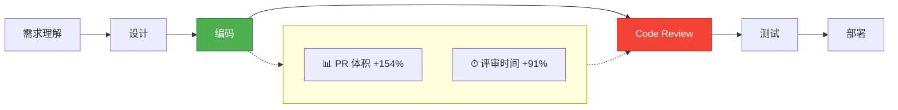
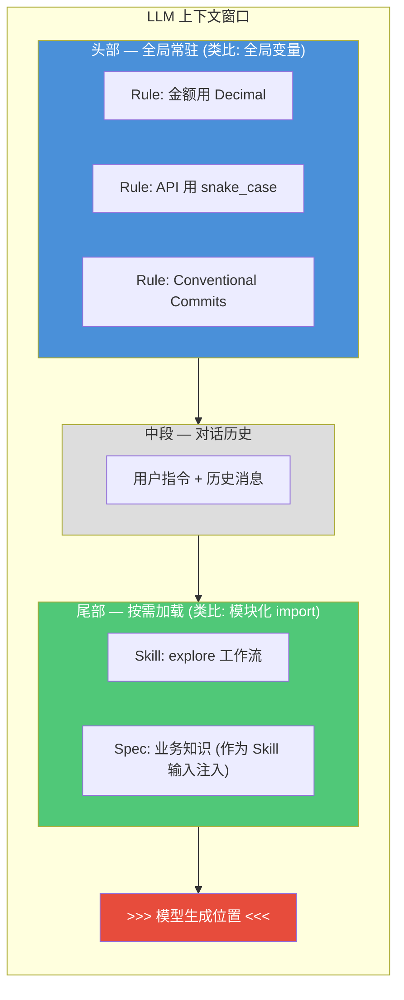
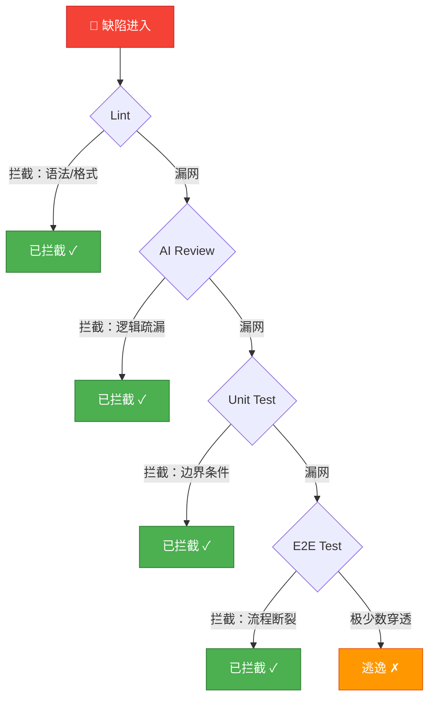
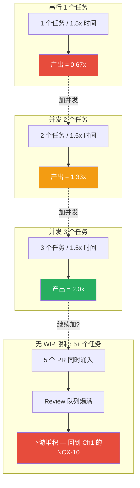
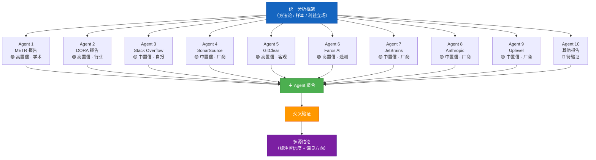

```mermaid
flowchart LR
    A["需求理解"] --> B["设计"]
    B --> C["编码"]
    C --> D["Code Review"]
    D --> E["测试"]
    E --> F["部署"]

    style C fill:#4CAF50,stroke:#2E7D32,color:#fff
    style D fill:#F44336,stroke:#C62828,color:#fff

    subgraph bottleneck [" "]
        direction TB
        G["📊 PR 体积 +154%"]
        H["⏱ 评审时间 +91%"]
    end

    C -.-> bottleneck
    bottleneck -.-> D
```

```mermaid
flowchart TB
  subgraph CTX["LLM 上下文窗口"]
    direction TB

    subgraph HEAD["头部 — 全局常驻 (类比: 全局变量)"]
      R1["Rule: 金额用 Decimal"]
      R2["Rule: API 用 snake_case"]
      R3["Rule: Conventional Commits"]
    end

    subgraph MID["中段 — 对话历史"]
      M1["用户指令 + 历史消息"]
    end

    subgraph TAIL["尾部 — 按需加载 (类比: 模块化 import)"]
      SK["Skill: explore 工作流"]
      SP["Spec: 业务知识 (作为 Skill 输入注入)"]
    end

    GEN[">>> 模型生成位置 <<<"]

    HEAD --> MID --> TAIL --> GEN
  end

  style HEAD fill:#4A90D9,color:#fff
  style MID fill:#DDD,color:#333
  style TAIL fill:#50C878,color:#fff
  style GEN fill:#E74C3C,color:#fff
```

```mermaid
flowchart TB
    defect["🐛 缺陷进入"]

    defect --> lint{"Lint"}
    lint -- "拦截：语法/格式" --> caught1["已拦截 ✓"]
    lint -- "漏网" --> review{"AI Review"}

    review -- "拦截：逻辑疏漏" --> caught2["已拦截 ✓"]
    review -- "漏网" --> unit{"Unit Test"}

    unit -- "拦截：边界条件" --> caught3["已拦截 ✓"]
    unit -- "漏网" --> e2e{"E2E Test"}

    e2e -- "拦截：流程断裂" --> caught4["已拦截 ✓"]
    e2e -- "极少数穿透" --> escape["逃逸 ✗"]

    style defect fill:#F44336,stroke:#C62828,color:#fff
    style caught1 fill:#4CAF50,stroke:#2E7D32,color:#fff
    style caught2 fill:#4CAF50,stroke:#2E7D32,color:#fff
    style caught3 fill:#4CAF50,stroke:#2E7D32,color:#fff
    style caught4 fill:#4CAF50,stroke:#2E7D32,color:#fff
    style escape fill:#FF9800,stroke:#E65100,color:#fff
```

```mermaid
flowchart TB
  subgraph SERIAL["串行 1 个任务"]
    S1["1 个任务 / 1.5x 时间"]
    S1R["产出 = 0.67x"]
    S1 --> S1R
  end

  subgraph CON2["并发 2 个任务"]
    C2["2 个任务 / 1.5x 时间"]
    C2R["产出 = 1.33x"]
    C2 --> C2R
  end

  subgraph CON3["并发 3 个任务"]
    C3["3 个任务 / 1.5x 时间"]
    C3R["产出 = 2.0x"]
    C3 --> C3R
  end

  subgraph OVER["无 WIP 限制: 5+ 个任务"]
    O1["5 个 PR 同时涌入"]
    O1R["Review 队列爆满"]
    O1 --> O1R
    O1R --> O1X["下游堆积 — 回到 Ch1 的 NCX-10"]
  end

  S1R -. "加并发" .-> C2
  C2R -. "加并发" .-> C3
  C3R -. "继续加?" .-> O1

  style S1R fill:#E74C3C,color:#fff
  style C2R fill:#F39C12,color:#fff
  style C3R fill:#27AE60,color:#fff
  style O1X fill:#E74C3C,color:#fff
```

```mermaid
flowchart TB
    framework["统一分析框架<br/>（方法论 / 样本 / 利益立场）"]

    framework --> a1["Agent 1<br/>METR 报告<br/>🟢 高置信 · 学术"]
    framework --> a2["Agent 2<br/>DORA 报告<br/>🟢 高置信 · 行业"]
    framework --> a3["Agent 3<br/>Stack Overflow<br/>🟡 中置信 · 自报"]
    framework --> a4["Agent 4<br/>SonarSource<br/>🟡 中置信 · 厂商"]
    framework --> a5["Agent 5<br/>GitClear<br/>🟢 高置信 · 客观"]
    framework --> a6["Agent 6<br/>Faros AI<br/>🟢 高置信 · 遥测"]
    framework --> a7["Agent 7<br/>JetBrains<br/>🟡 中置信 · 厂商"]
    framework --> a8["Agent 8<br/>Anthropic<br/>🟡 中置信 · 厂商"]
    framework --> a9["Agent 9<br/>Uplevel<br/>🟡 中置信 · 厂商"]
    framework --> a10["Agent 10<br/>其他报告<br/>🔴 待验证"]

    a1 --> main["主 Agent 聚合"]
    a2 --> main
    a3 --> main
    a4 --> main
    a5 --> main
    a6 --> main
    a7 --> main
    a8 --> main
    a9 --> main
    a10 --> main

    main --> cross["交叉验证"]
    cross --> insight["多源结论<br/>（标注置信度 + 偏见方向）"]

    style framework fill:#1565C0,stroke:#0D47A1,color:#fff
    style main fill:#4CAF50,stroke:#2E7D32,color:#fff
    style cross fill:#FF9800,stroke:#E65100,color:#fff
    style insight fill:#7B1FA2,stroke:#4A148C,color:#fff
```

