# 为什么 AI 写代码更快但交付没变，以及我怎么把它扳回来的

## 一、你以为快了 20%，实验说你慢了 19%

16 个资深开源开发者，预注册随机对照实验，使用 AI 辅助编码后客观测量完成时间慢了 19%。但这些开发者自己觉得快了 20%。主客观偏差达 39 个百分点。

这不是某个科技博主的体感分享，而是 METR（一家专注于 AI 模型能力评估的研究机构）做的目前唯一一项预注册 RCT（随机对照实验）。预注册意味着实验设计提前锁定、不能事后改假设。随机对照意味着有控制组和实验组、不是自选分组。

16 个人确实不多。但这些都是在自己长期维护的开源项目上工作的资深开发者，不是实习生在做玩具项目。一个人在自己最熟悉的代码库上，用 AI 写代码，客观上变慢了，主观上还觉得快了。这个认知偏差比「慢了 19%」本身更值得警惕。

如果只有 METR 一份数据，完全可以归为噪声。但 Faros AI 用 10,000 多名开发者的遥测数据讲了同一个故事。

Faros 按 AI 采纳程度分组，高采纳团队的个体指标全面飘红：任务完成数 +21%，PR 合并数 +98%。但组织级的 DORA（Google Cloud 旗下的 DevOps 效能研究团队）四大交付指标（部署频率、前置时间、MTTR（平均恢复时间）、变更失败率）无一改善。

个体全面提升，组织纹丝不动。这个悖论怎么解释？

答案藏在另外两个数字里：PR 体积 +154%，评审时间 +91%。

AI 帮你写了两倍的代码，打包成两倍大的 PR，然后扔给了同一个 reviewer。reviewer 的带宽没有翻倍，评审时间自然翻倍。上游加速产生的所有增量，被下游瓶颈原封不动地吃掉了。

再看信任层。三份大规模调查（DORA、Stack Overflow、JetBrains）交叉验证：90% 的开发者在用 AI，但只有 7% 总是使用，只有 3.1% 高度信任。不信任率 46%，首次超过了信任率 33%。

90% 都在用，3.1% 真信。这个漏斗的衰减速度比任何销售转化率都吓人。

1984 年，以色列物理学家 Eliyahu Goldratt 出版了商业小说《目标》。书中有个经典案例：一家工厂花重金引进了 NCX-10 数控机器人，该工位效率提升 36%，但整个工厂的交付周期和利润反而恶化了。原因很简单：NCX-10 不是瓶颈。瓶颈在热处理炉。让一个非瓶颈工位加速运转，唯一的效果是它前面堆积更多在制品，而瓶颈工位依然以同样的速度消化。系统的产出由瓶颈决定，不由最快的环节决定。

这就是约束理论的核心：局部效率的提升，如果不在瓶颈上，对系统产出为零甚至为负。

AI 就是今天的 NCX-10。它把 coding 这个工位的效率拉到了极致，但对大多数团队而言，SDLC（软件开发生命周期，从需求到交付的完整流程）的瓶颈不在 coding。瓶颈在需求理解、在兼容性分析、在 Code Review、在测试验证。PR 体积 +154%，评审时间 +91%，这就是 Goldratt 四十年前预言的「非瓶颈加速导致下游堆积」。

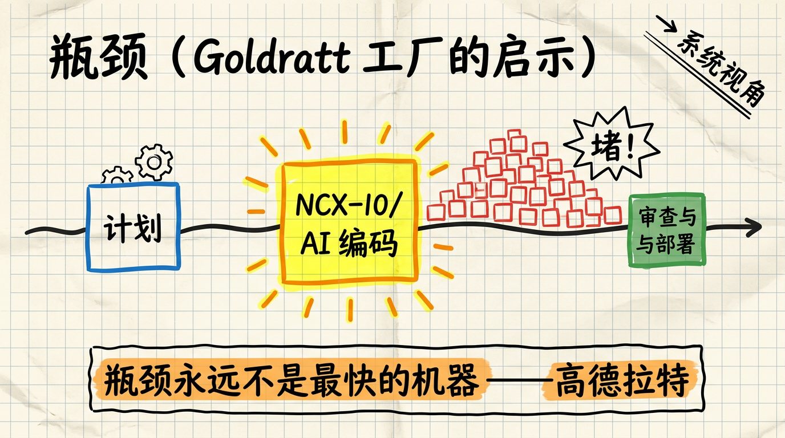

> 绿色 = AI 加速的环节（编码），红色 = 实际瓶颈（Code Review）。加速非瓶颈环节，唯一的效果是下游堆积。

把这个理论拉回你的日常。周一上午你精力最好，用 AI 一口气写了 3 个 feature，提了 3 个 PR。然后呢？tech lead 在开会，另一个 reviewer 在处理线上问题。3 个 PR 排了两天队。

等 review 意见回来，你已经在做别的事了。切换回来要重新加载上下文：这个需求的边界条件是什么来着？为什么当时这样设计？AI 帮你写代码只用了 2 小时，但 review 加返工加上下文切换花了 2 天。

用 AI 之前，你一天写 1 个 PR，reviewer 也只需要 review 1 个，节奏是匹配的。现在你一天产出 3 个，reviewer 的带宽没变。你以为自己快了 3 倍，其实整个系统的吞吐量可能一点没变。

所以问题不是「AI 有没有用」，而是「AI 加速了哪个环节，这个环节是不是瓶颈」。

本文接下来要做的事：从 SDLC 的完整视角拆解这个问题，搞清楚瓶颈在哪里，然后找到真正的杠杆点。不是选工具指南，而是拆清楚为什么现在的用法效果不好，以及怎么调整结构让 AI 真正产生价值。

但在拆解之前，先处理一个绕不开的前置问题：框架选哪个。因为第三章要拆解的 Spec、Rule、Skill，就是从这些框架中抽象出来的。不先理解框架在做什么，后面的概念会悬在空中。

---

## 二、别焦虑选框架，它们在做同一件事

过去半年你可能反复看到这些名字：OpenSpec、Superpowers、BMAD、Spec Kit。每隔两周就有人写一篇「我用 XX 框架重构了 AI 工作流」的帖子，然后你点进去看了半小时，关掉浏览器，焦虑了一晚上。

别焦虑。它们在做同一件事。

先看一个映射表：

| OpenSpec | Superpowers | 做什么 |
|----------|-------------|--------|
| explore | Brainstorm | 理解需求、分析兼容性、探讨方案 |
| new | Writing Plan | 写设计文档、拆任务 |
| apply | Executing Plan | 按计划实现代码 |
| verify | Verification | 跑测试、做验收 |

左边是 OpenSpec 的 Skill，右边是 Superpowers 的 Skill，中间是它们做的事。命名不同，步骤数不同，封装粒度不同，但映射关系几乎一一对应。

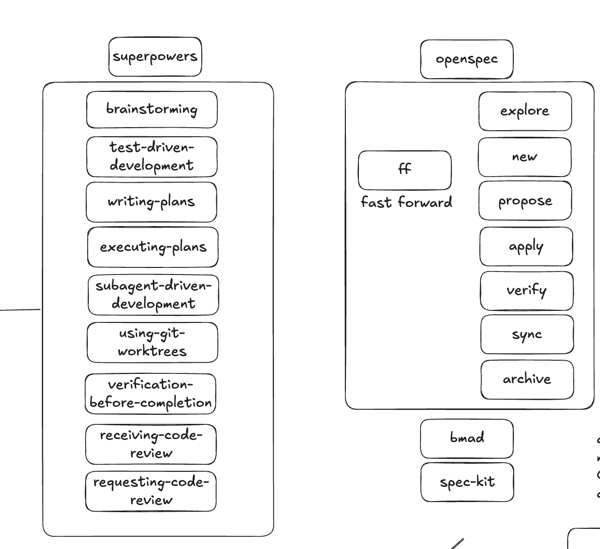

2015 年前后，前端社区经历过一次「JavaScript Framework Fatigue」。Backbone、Angular、React、Vue、Ember，每隔几天就有一个新框架诞生。开发者焦虑选错框架，社区争论哪个才是正确答案。十年后回头看，这些框架本质都在解决同一个问题：如何在浏览器中高效管理状态和更新 DOM。形式千差万别，核心问题只有一个。竞争的终局是趋同。

AI Coding 框架正在重演这个故事。OpenSpec（学院派，以功能特性为单位组织开发流程，2.6 万 Star）、Superpowers（实战派，灵活技巧集合，6.6 万 Star）、BMAD（流程派）、Spec Kit（模板派），看起来理念各异，拆到底层都在做同一件事：将 SDLC 中重复度高的 prompt 沉淀为可复用的 Skill。

就像 JS 框架都在管理状态和 DOM，AI Coding 框架都在管理上下文和工作流。

差异是什么？是风格偏好，不是对错之分。OpenSpec 更系统化，每个 Skill 对应明确的 SDLC 阶段，Spec 文档作为 source of truth 贯穿始终，适合喜欢结构和流程的团队。Superpowers 更灵活，单个技巧可以独立使用也可以组合，适合渐进式采纳的个人开发者。

实际使用中完全可以混搭：框架层用 OpenSpec 的流程，实现层自己写具体业务的 Skill。可混用恰恰证明了底层同构。

就像团队里总有人用 shell、有人用 Python、有人用 Makefile 做部署，统一之后你发现它们本来就是同一套流程。AI Coding 框架也一样。别纠结选哪个，先理解它们在解决什么问题。

理解了框架在做什么之后，接下来拆框架里最重要的三个概念：Spec、Rule 和 Skill。它们不是同义词，搞混了代价很大。

---

## 三、Spec、Rule、Skill 不是同义词

所有主流框架最终都收敛到同一个底层模式：将 SDLC 流程沉淀为可复用的 Skill。理解这个模式比选框架更重要。

但当你打开一个 AI Coding 框架的文档，会看到三个高频概念反复出现：Spec、Rule、Skill。很多人默认它们是同一个东西的不同叫法。

这个误解的代价比想象的大。

### 3.1 三者的区别

一个普遍现象：大量团队的 Rule 文件动辄上千行。打开一看，里面既有业务背景介绍（「我们的订单系统分为三个模块...」），也有编码规范（「使用 Decimal 处理金额字段」），还塞了完整的工作流程（「第一步创建分支，第二步...」）。

这不是 Rule 文件。这是 Spec + Rule + Skill 的大杂烩。

与此同时，很多人写 Skill 只会写线性 SOP：第一步做 A，第二步做 B，第三步做 C。结果 explore 和 Brainstorm 这类需要发散思考的能力被硬塞进了流水线模板，丢掉了最有价值的部分。

根本原因是没搞清这三者的本质区别。

**Spec = 业务知识。** 描述「做什么」加上「当前状态」：这个功能要实现什么需求、现有系统长什么样、哪些接口需要兼容。Spec 是被消费的对象，Skill 在执行时读取它，就像函数读取参数。

**Rule = 工程规范。** 约束条件，短而明确。「所有金额字段使用 Decimal 类型」「API 返回统一使用 snake_case」「commit message 遵循 Conventional Commits 格式」。始终加载在上下文头部，像一份随身携带的团队公约。经验值是不超过 300 到 500 行。超过这个长度，模型开始出问题。

**Skill = 工作流。** 按需加载的完整工作流。可以很长，可以包含 SOP 步骤、具体示例（few-shot）、甚至嵌入 CLI 脚本调用。只在你需要时出现在上下文中，用完就走。

| 维度 | Spec | Rule | Skill |
|------|------|------|-------|
| 本质 | 业务知识 | 工程规范 | 工作流 |
| 回答的问题 | 做什么 | 约束是什么 | 怎么一步步做 |
| 加载方式 | 被 Skill 消费 | 始终加载在头部 | 按需加载到尾部 |
| 长度 | 视业务复杂度 | 短，300-500 行上限 | 可长，不受限制 |
| 生命周期 | 随业务迭代更新 | 相对稳定 | 按需加载，用完释放 |

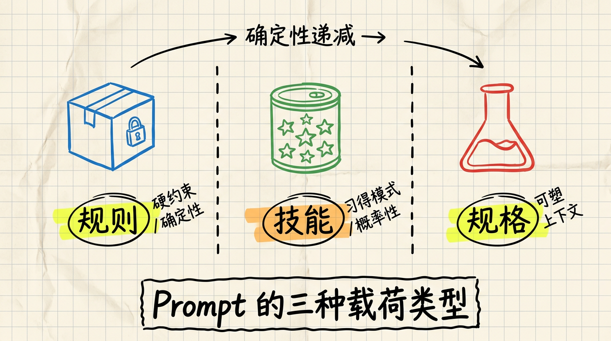

**关键洞察：区别不在语义标签，在加载机制。**

三者在大模型上下文中的物理位置和生命周期完全不同。Rule 始终驻留在上下文头部。Skill 按需加载到上下文尾部，靠近模型即将生成内容的位置。Spec 作为 Skill 的输入数据被注入。

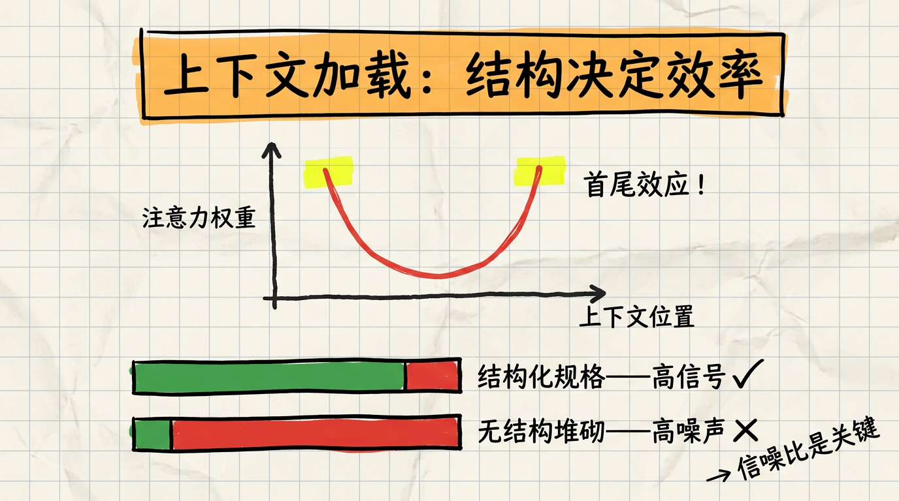

> 蓝色 = Rule（头部常驻），灰色 = 对话历史（注意力薄弱区），绿色 = Skill（尾部按需加载），红色 = 模型生成位置。Skill 靠近生成位置，天然享受近因效应优势。

搞混三者的代价是具体的。

Rule 文件塞到 1000 行，大量内容落入模型的注意力薄弱区，模型开始「忘记」中间的规则。你明明写了「不要在 controller 层写业务逻辑」，它就是给你在 controller 里塞了一堆 if-else。不是它不听话，是它真的没注意到那条规则。

Skill 只写线性 SOP，丢掉了 explore 和 Brainstorm 这类慢思考能力。这些 Skill 的核心价值不是「第一步第二步第三步」，而是多维度的发散探索：字段可扩展性怎么样？和现有接口兼容吗？产品经理没说的隐含需求是什么？只写 SOP 模板，就等于自废武功。

换句话说：Skill 的能力边界大于 SOP。大部分 Skill 确实是 SOP 形式的流程指令，但 explore 和 Brainstorm 这类 Skill 的核心是多维度发散探索，不是线性流水线。

### 3.2 「写 Spec 太重了，直接让 AI 写不就行了？」

这是最常见的反驳。需求文档已经有了，直接扔给 AI 写代码，省掉中间环节，不是更快？

2009 年，WHO 在全球 8 家医院推行了 19 项手术安全检查清单。外科医生的反应和你一样：我们还需要一张纸提醒检查病人是谁？结果：并发症下降 36%，死亡率下降 47%。两分钟的「多余工序」，省掉的是术后几天甚至几周的并发症处理。

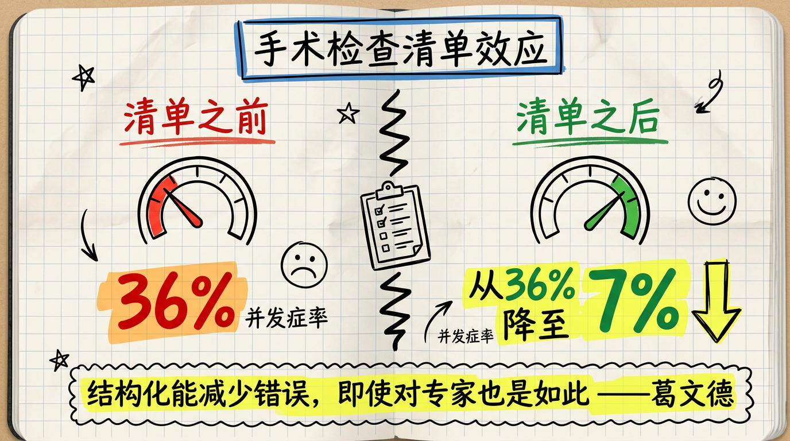

程序员对这个逻辑不陌生。需求看起来不复杂，不写设计文档直接开干，写到一半发现要兼容三个历史接口，推翻重来。「先想清楚再动手」谁都会说，赶进度的时候谁都不做。

我踩过完整的坑。一个需求，文档两三百行，修改点极细，技术难度不高但兼容性要求很高。跳过 Spec 直接让 AI 写，方案完全不达标：没复用现有逻辑，兼容性全靠硬编码，改一处坏两处。补了 Spec 和 Brainstorm，让 AI 先理解现有业务状态、梳理接口依赖再输出方案，精准度明显上了一个台阶。

Spec 的本质是把你做方案设计时的隐性思维显性化。现有接口长什么样、调用方有哪些、改动影响范围多大，这些你脑子里会过一遍的检查项，AI 不会自动去想。Spec 不是给 AI 加负担，是让它的起点从「面对代码猜意图」变成「理解业务做决策」。

有人会说：「我用 AI 工具自带的 Plan 模式做方案不就行了？」区别在于：Plan 模式的方案是临时的，关掉对话就消失了，且作为厂商黑盒无法团队共享和二次定制。Spec 沉淀为文件，团队成员和未来的你都能直接读取。

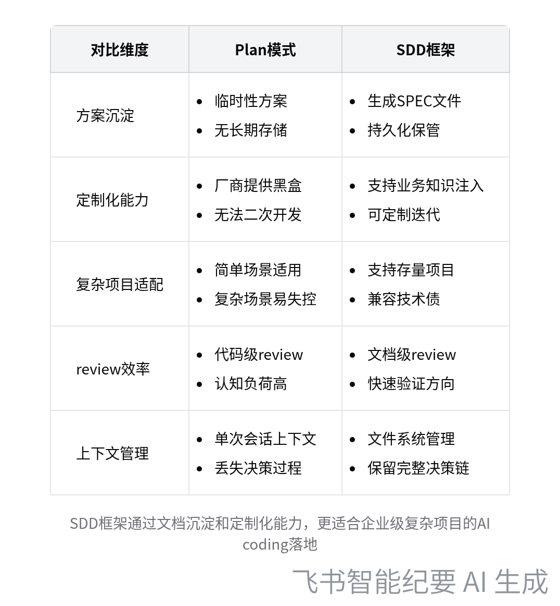

也不需要每次都写一份完整的设计文档。最小可行的 Spec 只需要回答四个问题：现在的行为是什么、期望改成什么、哪些行为必须保持不变、边界条件有哪些。这四个问题你做方案时脑子里本来就会过一遍，写下来只是十几分钟的事。而且 Spec 不是写一次就丢掉的文档，它随业务迭代持续更新，多个功能的变更可以合并回最新的业务定义，AI 看到的始终是当前系统状态而不是代码里过时的注释。

画清边界。全新项目没有历史包袱，探索性 spike 本身就是在试错，极小改动上下文一目了然，这些场景不需要完整 Spec。Spec 真正值钱的地方是存量系统、多接口兼容、业务规则复杂，也就是 AI 最容易猜错的地方。

### 3.3 为什么 Skill 指令遵循性更好

用过 AI Coding 的人大概都有这个体感：写在 Rule 里的规则，AI 经常「选择性遗忘」。但通过 Skill 下发的指令，遵循性明显更好。

这不是玄学。

**核心原因：按需加载带来的高信噪比。**

想象你的 Rule 文件有 50 条规则。你正在让 AI 写一个 React 组件。50 条规则里可能有 Go 的命名规范、Python 的类型标注要求、数据库迁移的注意事项。和当前任务真正相关的可能只有 3 条：组件命名规范、状态管理方式、样式方案选择。

剩下 47 条是噪声。

模型需要从 50 条中自行判断哪些相关，这个筛选过程消耗注意力资源，而且经常判断错误。

Skill 不一样。触发「写 React 组件」的 Skill 时，上下文中只出现相关的指令、示例、脚本。信噪比从 3/50 变成接近 1:1。

程序员很熟悉这个道理。全局变量和全局 CSS 的问题，软件工程几十年前就证明了。50 个全局变量散落各处，你不知道哪个在当前函数里有用，最后要么全部检查（浪费精力），要么漏掉关键的那个（出 Bug）。模块化 import 和 Scoped CSS 解决的就是同一个问题：只让你看到需要看到的东西。

Rule 是全局变量。Skill 是模块化 import。

**注意力机制的佐证：大模型对上下文中不同位置的信息，利用效率并不均匀。**

2023 年 Liu 等人发表的 Lost in the Middle 研究（正式发表于 TACL 2024）量化了这个现象：LLM 对上下文的利用呈 U 型曲线，开头和结尾的信息被最好地利用，中间位置的性能下降超过 20 个百分点。这就是首因效应和近因效应。

两年后情况有变化吗？有，但没有根本改变。Tian 等人 2025 年的 LongPiBench（ACL 2025）发现：经典 U 型绝对位置偏差在现代大模型上已大幅缓解。但相对位置偏差（相关信息之间的间距造成的性能影响）仍然导致 20% 到 30% 的性能波动，且增大模型参数也无法缓解。

Rule 作为全局常驻内容，始终占据上下文的中前段。当 Rule 越写越长，后半部分的规则就越可能落入注意力薄弱区。更要命的是，50 条 Rule 中大量不相关的内容把少数相关规则「冲散」了，相关信息间距被拉大，恰好触发了相对位置偏差。

Skill 则按需加载到上下文尾部，天然享受近因效应的注意力优势，且内容高度聚焦，不存在被冲散的问题。

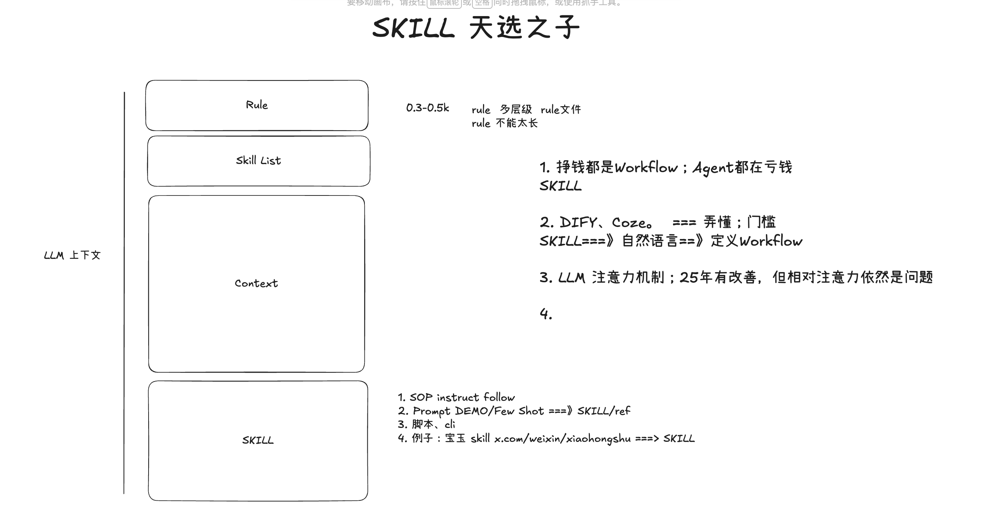

需要说准确的三点：第一，Lost in the Middle 问题没有完全解决，经典 U 型偏差大幅缓解，但位置相关偏差仍在。第二，U 型曲线是统计趋势，不同模型和任务差异很大。第三，绝对位置偏差可以通过增大模型参数缓解，相对位置偏差目前无法 scale up 解决，可能是 Transformer 的结构性限制。

一句话总结：Skill 遵循性更好，根本原因是按需加载带来的高信噪比加上尾部位置的注意力优势。「只给相关指令」vs「从50条里自己筛」，执行质量差距显著。

**Skill 的三个能力维度。**

一个设计良好的 Skill 通常包含三个维度：

SOP 流程指令。定义执行流程，因为 Skill 按需加载且高度聚焦，遵循性天然比散落在 Rule 中的规则更好。

Reference 目录。few-shot 示例，附带「好的输出长什么样」的具体案例。给模型看一个好例子，比告诉它十条抽象规则更有效。

CLI 和脚本集成。内嵌 shell 命令或脚本调用，比如 verify 类 Skill 直接调用 `npm run test` 和 `npm run lint`，而不是告诉 AI「记得跑测试」然后祈祷它真的会跑。

三个维度叠加，Skill 不只告诉 AI 该做什么，还给它看了该做成什么样，以及提供了做事的工具。

---

## 四、给 AI 一根安灯绳

1924 年，丰田佐吉发明了一种自动织布机。这台机器有个当时看来很奇怪的设计：缝针折断时，织机自动停机。在此之前，织机会在针断之后继续运行，生产出大量次品布料。这个「自动停机」的理念后来被称为 Jidoka（自働化），成为丰田生产系统的两大支柱之一。

大约 25 年后，大野耐一将这个理念发展为「安灯绳」系统。丰田装配线上每个工位旁悬挂着一根绳子，任何工人发现质量问题都可以拉动它，生产线亮起信号灯，团队组长立即赶来。如果问题无法在节拍时间内解决，整条生产线停止。丰田的逻辑是：现在花 100 万修复，好过把缺陷传递到下游花 1000 万。

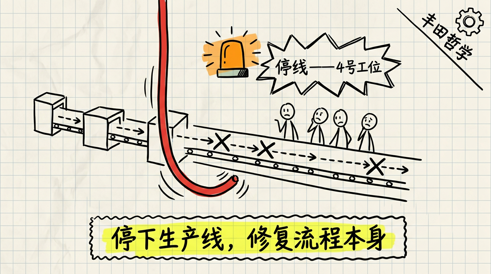

现在把镜头拉回来。

AI 生成代码就像高速运转的织布机。速度极快，但不会自己发现缝针断了。你让它写一个函数，它 10 秒钟写完，看起来结构清晰、命名规范，你扫了一眼觉得差不多对，直接提交了。两天后 QA 报了个边界条件的 Bug，传入空数组时抛异常。打开代码一看，AI 根本没处理空数组的 case。

数据也在说同一件事。Stack Overflow 调查显示 66% 的开发者遇到过「几乎正确但不完全对」的 AI 代码。GitClear 的 Code Review 数据更直接：AI 生成的 PR 平均问题 10.83 个，人工编写的平均 6.45 个，差距 1.7 倍。而仅 48% 的开发者在提交前「总是」检查 AI 代码。超过一半的人至少有时候扫一眼就提交了。

这就是缺了安灯绳的织布机。

给 AI 加上 Lint、Unit Test、E2E 验证，就是给它装安灯绳。测试失败时，AI 停下来、定位问题、自我修复，而不是继续生产次品代码。闭环很简单：generate, verify, fix/log。不需要复杂的架构，你现有的测试基础设施就够了（前端可以用本地 dev server 做实时验证；后端可以打通日志通道，让 AI 读运行日志自行判断结果）。关键是把验证接入 AI 的工作流，让它成为生成之后的自动步骤，而不是你想起来才手动跑一次的事情。

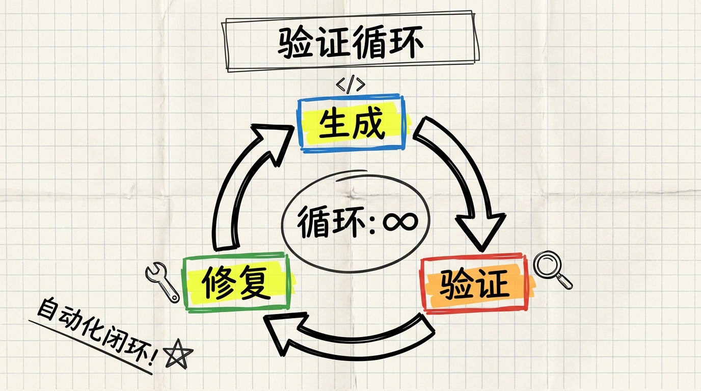

这里需要诚实地画一条边界。

验证不是万能的。Lint 只能捕获格式和简单错误，Unit Test 只能验证你已经想到的行为，E2E 只能覆盖预设的用户路径。真正棘手的问题（逻辑缺陷、架构不当、性能退化、安全漏洞）大部分不在自动验证的覆盖范围内。

但即使验证只能覆盖大部分低级问题，把这些问题从人工发现变成自动发现，体感质量提升就是巨大的。低级错误从人工筛查变成自动拦截，可以聚焦到自动验证覆盖不到的深层问题：设计方案是不是合理、抽象层次对不对、边界条件有没有遗漏。

**你不需要更聪明的 AI，你需要一根能让它自己停下来的绳子。**

但安灯绳只解决了「自动停机」的问题，没有回答另一个问题：你凭什么信任这条生产线？

管理层的典型质疑就在这里。代码质量怎么保证？AI review 自己的代码，靠谱吗？答案不在 AI 本身，在拦截机制的层数。

1990 年，英国心理学家 James Reason 提出了「瑞士奶酪模型」。他研究航空事故后发现，灾难从来不是单点故障造成的，而是多层防御同时失效。每一层防御都有漏洞，就像瑞士奶酪上的孔。但只要层数够多、孔不对齐，错误就穿不透。航空业把这个模型执行了三十年，致命事故率从 1970 年代的每百万航班 6 次降到了今天的 0.5 次以下。没有哪一层是完美的，但叠在一起就够了。

程序员其实天天在用这个逻辑。你接手外包团队交付的模块，会直接上线吗？不会。你跑 Lint、跑测试、做 Code Review、QA 走 E2E。你不信任外包写的每一行代码，但你信任这条验证链。信任不是给人的，是给机制的。

AI 生成的代码和外包交付的代码，在信任结构上没有本质区别。Lint 拦语法错误，Review 拦逻辑疏漏，Unit Test 拦边界条件，E2E 拦流程断裂。每一层都有漏网之鱼，四层叠加之后能穿透的问题已经很少了。有人宁愿信外包不信 AI，其实他信的从来不是外包那个人，是背后那套流程。同一套流程套在 AI 上，信任基础是一样的。

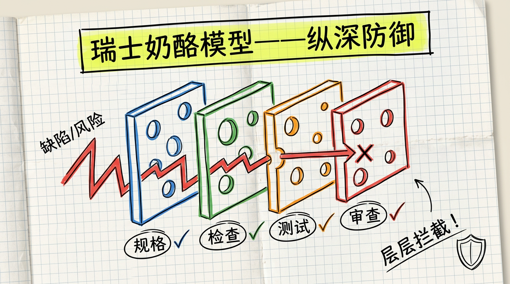

> 四层拦截的「漏斗」效应：每层都有漏网之鱼，但四层叠加后穿透率极低。没有哪一层是完美的，叠在一起就够了。

但外包有一个 AI 没有的东西：你可以追问设计意图。AI 生成的代码没有「为什么」，只有「是什么」。所以分层拦截覆盖的是表层和中层问题，但深层判断，这个设计方案合不合理、这个抽象分得对不对，四层拦截兜不住，还是得靠人。

这也是工程师角色转变的前提。低层拦截够可靠，你的精力从逐行审查释放到架构把控。从执行者变调度员，听起来是升级，但有个硬性门槛：你得有足够的技术深度去判断那些拦截机制兜不住的问题。机制帮你过滤噪声，识别信号的能力只能靠你自己。

先有安灯绳，再有信任链，然后才能谈下一步。因为验证闭环的成熟度，直接决定了下一章要讲的并发能不能成立。

---

## 五、单任务变慢不是问题，你不能并发才是

先承认一个不舒服的事实。

按完整 SDLC 流程走（explore, design, implement, verify），单任务确实比直接手写慢。不是慢一点点，而是慢 20% 到 100%。这是我一年实践下来的体感，METR 那个 RCT 实验测出的慢 19% 也在这个范围内。

别急。这个「慢」换来的不只是流程完整，还有返工率的大幅下降。第三章说过，跳过 Spec 直接让 AI 写，返工一次就把省的时间全吃回去。走完整流程单次慢了，但产出的代码质量更可控，综合算账反而更快。

2008 年金融危机后，全球贸易暴跌，集装箱船运力严重过剩。航运巨头马士基做了一个反直觉的决定：让船开慢一点。以前集装箱船以 24-25 节全速运行，马士基把航速降到 18-20 节，单程慢了大约 20%。但降速 20% 节省了 30%-40% 的燃油，省下来的钱部署更多船只，更多船只意味着更密集的班次。单艘船变慢了，但整个航运网络的总吞吐量反而更大了。

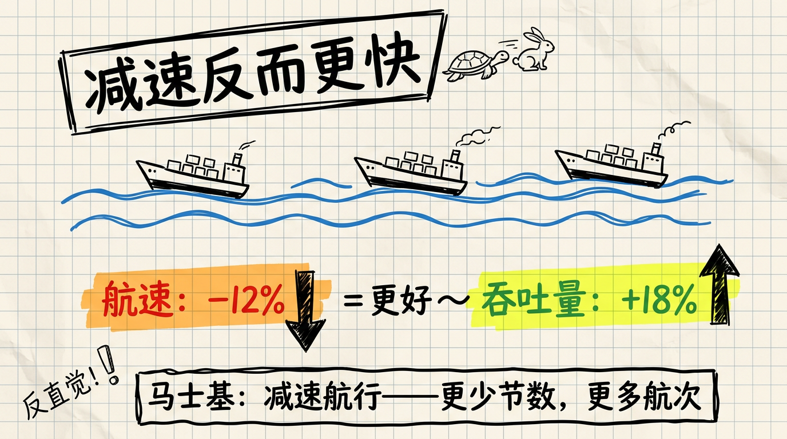

单艘船变慢，整个网络更大。这就是并发的逻辑。

这其实就是那道经典应用题的逻辑：同时洗衣烧水做饭，总时间等于最长的那个单任务。但写代码时我们经常忘了这个道理。你打开 Cursor，等 AI 生成完一个文件的代码，review 完，再开始下一个任务。全程串行。

回扣第一章的 NCX-10。Goldratt 约束理论的核心：系统产出由瓶颈决定，不由最快的环节决定。NCX-10 的问题不是机器慢，是只有一台。如果工厂有 5 台 NCX-10，每台分别处理不同工件呢？AI 的优势恰恰在于可复制性。你能同时开 5 个 Claude Code session，或者用 worktree（Git 的多工作目录功能）隔离工作区，每个跑一个独立任务。你在 review 任务 A 的时候，任务 B、C、D 在自动生成和自验证。你的角色从「写代码的人」变成「调度员」。

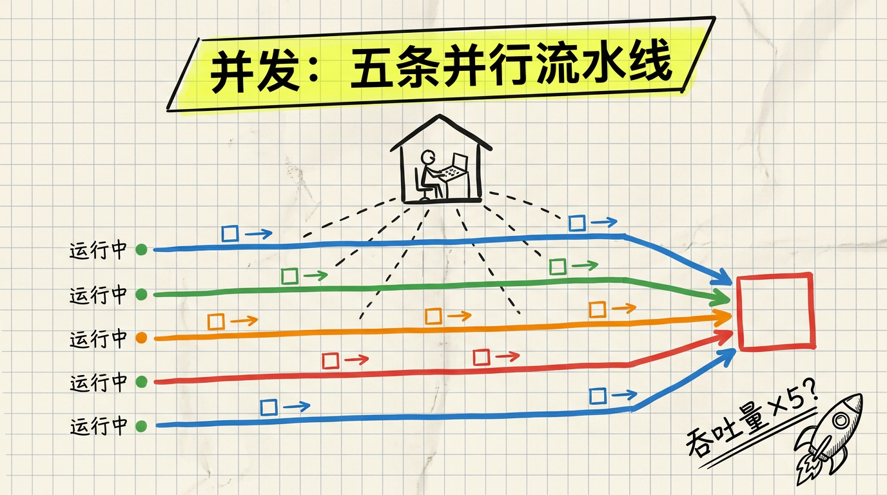

这里有一个关键依赖：上一章讲的验证闭环。

你敢同时开 5 个任务不盯着，前提是什么？前提是每个任务跑完之后你能快速判断它对不对。如果没有自动验证，你得逐个打开代码仔细读，那并发就毫无意义，因为你的 review 带宽成了新的瓶颈。验证闭环越可靠，你越敢脱手。能脱手的任务越多，可行并发度越大。先建闭环，再开并发。这个顺序不可逆。

最后，诚实地降低预期。

Anthropic 2026 年 1 月的报告显示，能完全托管给 AI 的任务占比只有 0-20%。理论上你可以开 5-10 个并行 session，实际上大部分任务还需要你在关键节点介入。实践中可行的并发度大概是 2-3。

但算一笔账。假设按完整流程走，单任务比手写慢 50%。并发 2 个任务，总产出就是单手写的 1.33 倍（2 / 1.5 = 1.33）。并发 3 个，就是 2 倍（3 / 1.5 = 2）。即使只有 2 倍并发，在单任务慢 50% 的情况下，你依然是正收益。这个计算假设任务完全独立。实际中任务间有依赖、切换有成本，倍率会打折扣，但只要并发度 >= 2，打完折扣仍然是正收益。而且这些产出经过了完整的 explore、design、verify 流程，质量比「手写一遍直接提交」更可控。

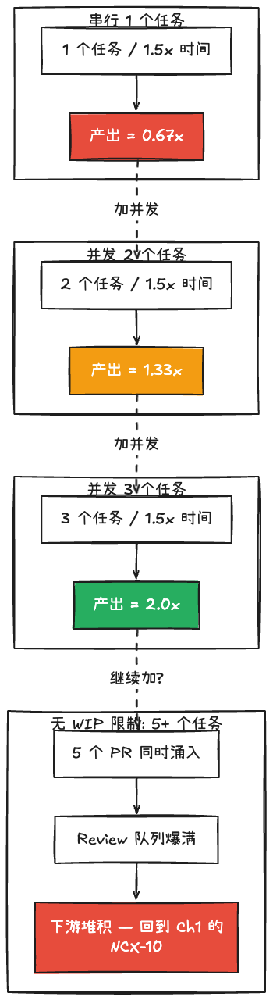

> 红色 = 负收益（串行），黄色 = 盈亏线附近（并发 2），绿色 = 明确正收益（并发 3）。但超过 WIP 限制又会回到 Ch1 的下游堆积问题。

但并发不是无脑开更多窗口。你同时开 5 个 session，产出 5 个 PR，reviewer 的队列立刻爆满，又回到了第一章说的下游堆积。所以并发要配合 WIP（在制品）限制：控制同时处于 review 阶段的 PR 数量，控制每个 PR 的体积。并发加速的是你的生成端，WIP 限制保护的是下游的 review 端。不限制在制品数量的并发，本质上就是把 NCX-10 的问题从一台变成了五台，堆积只会更严重。两者配合，系统吞吐才真的提升。

马士基的船变慢了，但它赢了。不是因为单艘船更快，而是因为它能部署更多的船。

**单个任务变慢不是问题，你不能并发才是问题。**

---

## 六、有了洗衣机，你在洗更多衣服

前面五章一直在解决具体问题：效率悖论的根源在哪里，框架焦虑怎么消除，Spec/Rule/Skill 怎么分清楚，验证闭环怎么搭，并发怎么做。这些都是「怎么用好 AI」的问题。

这一章换个角度。不谈怎么用，谈你用它来干什么。

1983 年，美国历史学家 Ruth Schwartz Cowan 出版了《More Work for Mother》。她研究了一个看起来理所当然的问题：20 世纪美国家庭陆续添置了洗衣机、吸尘器、冰箱、微波炉，这些「省力设备」应该大幅减少了家务劳动时间吧？

数据给了一个让人不舒服的答案：从 1920 年代到 1970 年代，美国家庭主妇每周花在家务上的时间几乎没有减少。

原因不复杂。技术提升了效率，同时也提升了标准。有了洗衣机，衣服从一周洗一次变成穿一次就洗。有了吸尘器，地板从一周扫一次变成每天吸。以前全家人分担的体力活，现在一个人用机器就能搞定，于是家务成了一个人的专职。

每件事更快了，总工作量不减反增。效率提升被更高的标准吃掉了。

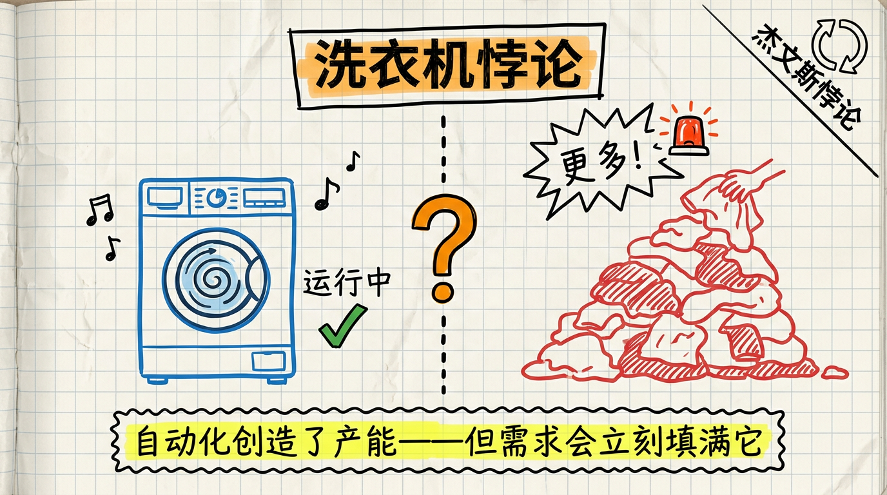

映射到 AI Coding 上几乎一一对应。

你用 AI 写代码更快了，省出来的时间去哪了？老板看到你这周产出了 5 个 feature，下周给你排了 8 个。你一天写 5 个 feature 的代码，但每个都需要 review、测试、修 bug。工作性质从「写代码」变成了「管理 AI 产出」。你没有更轻松，你在洗更多衣服。

SonarSource 的调查给了一个精确的数字锚点：开发者每周花在苦差事上的时间稳定在 23% 到 25%，不因 AI 使用频率变化。不管你是重度用户还是轻度用户，每周大约四分之一的时间在干你不想干的活。这个比例守恒了。

但苦差事的成分变了。88% 的开发者报告 AI 加剧了至少一项技术债维度。苦差事从「重复劳动」转向了「管理技术债」和「返工 AI 代码」。以前的苦是手写样板代码，现在的苦是读 AI 生成的代码、找那个「几乎正确但不完全对」的微妙 Bug、处理体积暴增的 PR。

一个行业故事完美诠释了这种规律。

1990 年代末，ATM 在美国大规模普及，全美最终部署了超过 40 万台。所有人都以为银行柜员这个职业要被消灭了。

经济学家 James Bessen 在 2015 年的研究中发现了相反的事实：从 2000 年到 2013 年，银行柜员数量以每年 2% 的速度增长，比整个劳动力市场增长还快。

逻辑链条是这样的：ATM 让单个网点运营成本降低，原来一个网点需要 21 个柜员，有了 ATM 只需要 13 个。成本降低后银行开设了更多网点，更多网点意味着更多柜员需求。总量反而增加了。

但柜员的工作内容彻底变了。旧苦差事是数钱、点钞、处理存取款，纯机械重复。新苦差事是销售理财产品、处理复杂业务咨询、维护客户关系。苦差事没有消失，换了形式。

回到代码世界。GitClear 的数据显示，Moved code（重构性代码移动）从 24.17% 降到了 9.47%，而 Copy/Paste 代码首次超过了 Moved code。同期代码搅动率上升 84%，commit comments 下降 27%。

翻译一下：代码量在增加，解释性注释在减少。重构在减少，复制粘贴在增加。AI 在帮你复制粘贴，不在帮你思考架构。

到这里图景清楚了：效率提升了，标准也提升了，苦差事换了形式但总量守恒，你并没有因为 AI 获得更多可支配时间。

那正确的用法是什么？

回到洗衣机的类比：洗衣机洗衣服，你去读书。

不是用省下来的时间洗更多衣服，而是做以前做不到的事。

举一个我自己的例子。写这篇文章之前，我需要系统性地理解 AI Coding 领域的真实现状。摆在面前的是 10 份行业报告，几百页内容，来自 METR、DORA、Stack Overflow、SonarSource、GitClear、Faros 等机构，每份报告都有自己的方法论、样本选择和利益立场。

以前我最多精读一两篇，其余只能读二手总结。现在我用 AI 设计了统一的分析框架，10 个 Agent 并行拆解每份报告，主 Agent 聚合并交叉验证。每份报告标注置信度和偏见方向，不只看「说了什么」，更看「怎么得出这个结论的」。

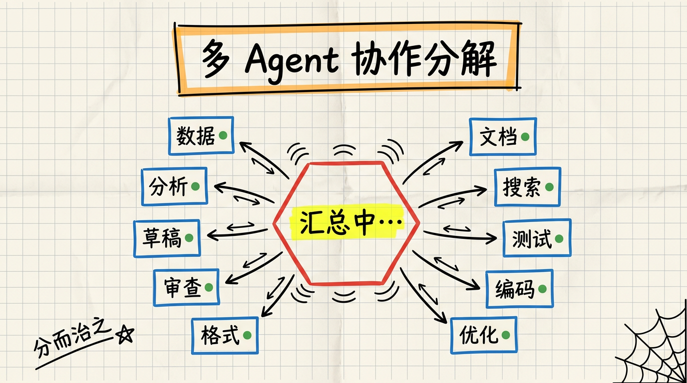

> 以前只能精读 1-2 篇报告，现在 10 个 Agent 并行拆解，主 Agent 聚合交叉验证。这不是效率提升，是能力进化。

这个过程解释了为什么「METR 说用 AI 慢 19%」和「DORA 说 85% 的开发者觉得有帮助」并不矛盾。前者测客观完成时间，后者测自报感受，测量维度不同，结论自然不同。以前我只会觉得「这两份报告矛盾了」，现在能通过方法论差异解释冲突根源。

这不是效率提升。以前做不到的事，不存在效率对比。这是能力进化。

反过来问一个不太舒服的问题：你用了 GitHub Copilot 之后，写了更多代码，但你上次完整读一个开源项目的源码是什么时候？

以前没有 AI，你遇到一个 bug，需要一行一行读框架源码。读完之后你对这个框架的理解深了一层。你知道了它的设计取舍，知道了某个看似奇怪的 API 背后的历史包袱。这些理解是复利，下次遇到类似问题你能直接跳过排查阶段。

现在呢？你把报错信息粘贴给 AI，它给你一段解决方案，你试了一下能跑，完事。问题解决了，但你对底层原理的理解没有增加一分。下次遇到类似问题，你还是得粘贴给 AI。你没有变得更强，你只是更依赖了。

工具让你更快地解决问题，但也剥夺了你通过解决问题来学习的机会。

效率提升是 AI 的基本盘，不需要否认。但如果你只追求效率，你就会陷入数据揭示的悖论中：个体觉得快了，组织没有变化。苦差事换了形式，总量守恒。代码量在增加，理解力在萎缩。

真正的 AI 红利不是「同样的事做得更快」，而是「用省出的时间去做以前做不到的事」。前者是线性回报，后者是复利。

---

## 七、保底秘籍：找甜点区 + 自动化日常

道理讲完了，最后一件事：如果你只打算做一个改变，做什么？

一个思维框架，按出错影响面分三档。

**第一档：跟钱相关的逻辑。** 支付、结算、账单、金额计算。这类任务别让 AI 独立完成。出错一次的代价可能大于 AI 帮你省的所有时间之和。

**第二档：出错影响不大、可以重试、可以用 best-of-N 策略（让 AI 生成多个版本，挑最好的）筛选质量的任务。** 文档、测试用例初稿、代码注释、技术方案草稿。数据说得很清楚：文档是唯一一个「采用率等于有效性」的用例，74% 的人在用，74% 的人觉得有效。容错率高、不直接影响生产，AI 的「差不多对」就够用了。

**第三档：不得不做、重复度高、你每次都不想干但又不能不干的任务。** 这是自动化的最佳候选。

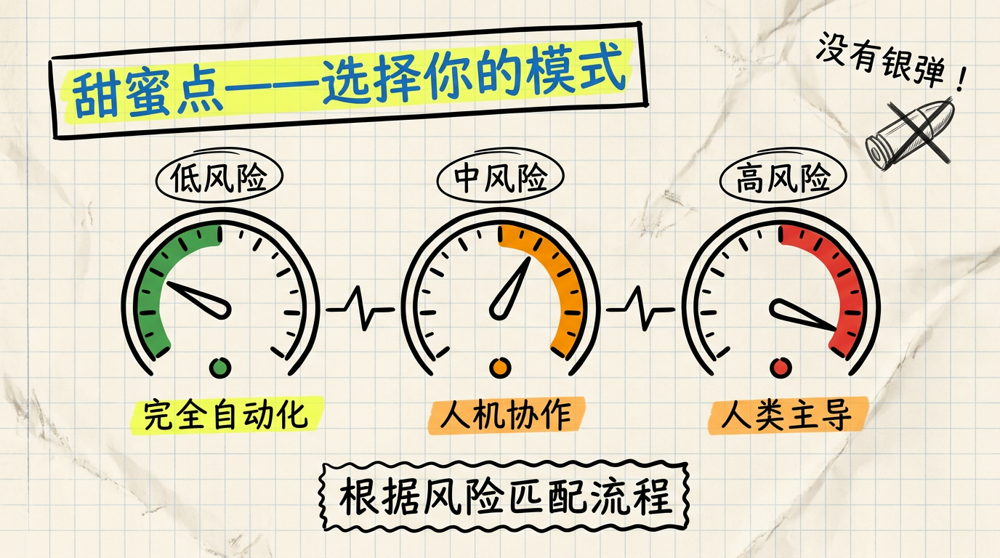

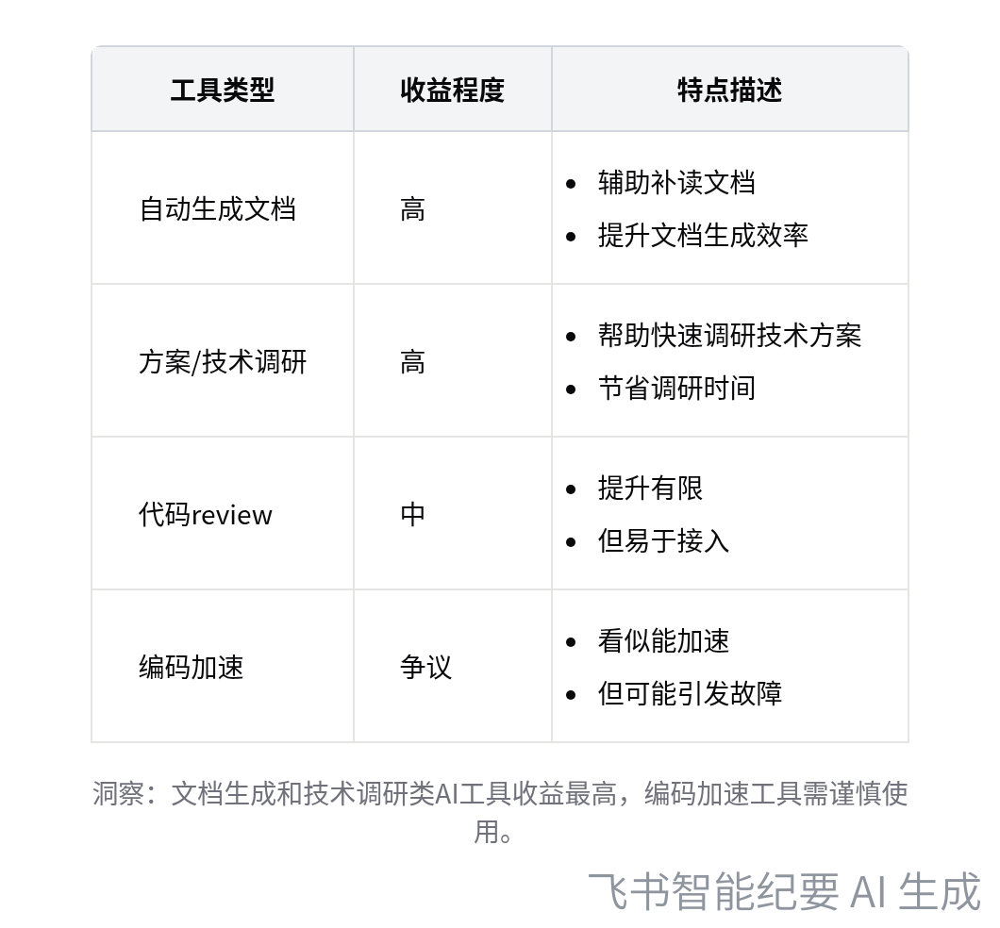

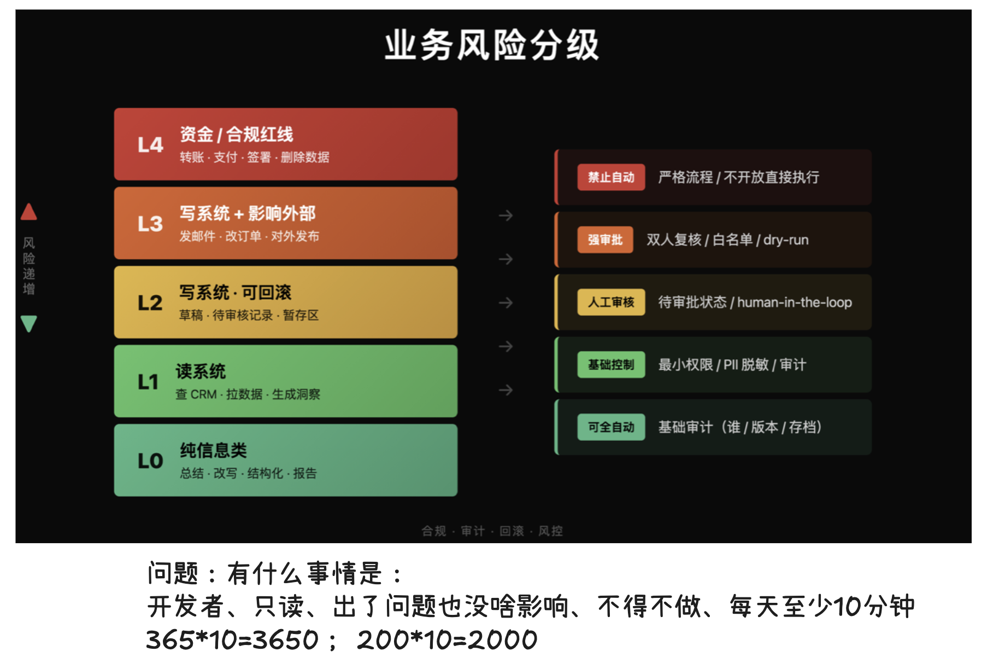

第三档的两个具体例子。

第一个，自动化 Git Commit。团队有 Conventional Commits 规范要求，每次提交要写清楚 type、scope、描述。以前你知道应该写详细，但赶进度的时候一行「fix bug」就提了。现在 AI 自动读 diff，生成规范且详细的 commit message。三个月后有人要查一个线上问题的引入点，你的 commit 历史就是最好的文档。

第二个，自动化日报。很多团队要求每天写日报或站会更新。你每天花 5 到 10 分钟回忆今天干了什么、怎么组织语言、贴上 JIRA 链接。这个活完全可以自动化：从 git log 和 JIRA 状态变更自动聚合，生成格式化的日报草稿，你扫一眼确认就发。

算一笔账。每天省 10 分钟，200 个工作日，一年省 2000 分钟，大约 33 个小时。33 个小时够精读 5 到 6 篇论文。不是泛读摘要，是逐段精读、做笔记、验证方法论那种。

这就是前一章说的：洗衣机洗衣服，你去读书。自动化日常苦差事省出来的时间，如果投入到能力进化上，这 33 个小时的回报会在未来几年持续兑现。

回到开篇那个数字。16 个资深开发者，用 AI 慢了 19%，自己觉得快了 20%。

这篇文章拆解了「为什么」：瓶颈不在编码而在审查，框架选择不重要但概念区分很重要，验证闭环是质量的底线，并发才是效率的真正杠杆。

但更重要的是拆解了「然后呢」：效率提升有天花板，苦差事会守恒，省出来的时间如果只是用来写更多代码，你就是那个有了洗衣机却洗更多衣服的人。

AI Coding 的本质不是让你更快，而是让你重新定义「做什么」和「怎么做」的边界。省出来的时间投资到能力进化上，复利才开始滚。

